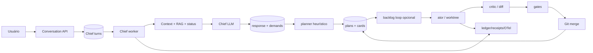
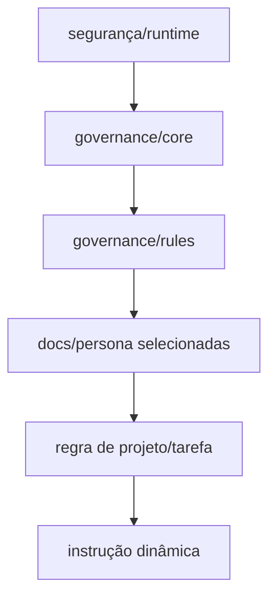

# Auditoria arquitetural da Bruna — relatório final

Data de corte: 2026-07-30. Branch auditada: `develop`.

## 1. Resumo executivo

A Bruna atual é uma Chief LLM conversacional que transforma uma mensagem em resposta tipada, demandas e ações de equipe. Um planner determinístico decompõe cada demanda; um board e máquinas de estado persistem trabalho; um loop local opcional despacha agentes externos em worktrees, solicita crítica por diff e integra o resultado.

Ela possui autonomia **parcial**. O núcleo não é apenas prompt: há contratos tipados, SQLite/Postgres, outbox, ledger, leases/fencing, scope claims, worktrees, ator/crítico, workflow phases e OpenTelemetry. Essas são forças substanciais.

As garantias, porém, não formam uma cadeia end-to-end:

- o turno é concluído antes de o plano ser materializado;
- o plano é marcado como materializado antes de todos os cards;
- o checkpoint implementado não conduz o run real;
- o merge altera Git antes de confirmar o banco;
- a sandbox pode ser declarada ativa sem existir e tool calls internas não passam pelo PEP;
- o loop/recovery considera somente o primeiro tenant e não possui fairness;
- contexto longo pode selecionar as 200 mensagens mais antigas, enquanto notas são gravadas e nunca recuperadas;
- review não coleta testes automaticamente e não existe validação semântica independente da entrega global.

Maturidade geral: **1,92/5 — parcial e frágil**. Foram registrados **3 riscos críticos, 12 altos, 8 médios e 3 baixos/informativos**.

Prioridades: corrigir atomicidade de materialização, mediar efeitos do executor, reconciliar Git↔DB, conectar workflow/checkpoint ao core, tornar QA baseada em evidence e só então ampliar autonomia/multiprojetos.

## 2. Respostas diretas

| Pergunta | Resposta | Evidência |
|---|---|---|
| Existe busca vetorial? | Parcial; cosseno sobre JSON varrido em memória | `SqliteVectorIndex.cs:13-104`; `PostgresVectorIndex.cs:12-130` |
| Qual banco vetorial é utilizado? | Nenhum | coluna `embedding_json`; cálculo em C#, sem pgvector/sqlite-vec |
| Existe RAG? | Sim, parcial e conectado à Chief/runs; corpus quase só snippets de anexos | `HybridRagAndContextBuilder.cs:92-150,214`; Chief worker |
| Existe GraphRAG? | Não | nenhum pipeline/knowledge graph de recuperação encontrado |
| Existem embeddings? | Sim, feature hashing determinístico, não modelo treinado | `DeterministicLocalEmbedding.cs:19-56`, 256 dimensões |
| Existe MCP? | Apenas catálogo/API; não existe runtime MCP | stores/endpoints `mcp_servers`; ausência de client/transports/negociação |
| Existem Transformers locais? | Não | executores chamam CLIs/provedores externos; hashing não é Transformer |
| Existe `AGENTS.md`? | Sim, somente na raiz | `AGENTS.md`; manifesto provider `codex` |
| Existe `CLAUDE.md`? | Sim, somente na raiz | `CLAUDE.md`; manifesto provider `claude-code` |
| Existe harness? | Parcial e real, mas não end-to-end | stores, leases, worktrees, gates, ledger e OTel; lacunas nos handoffs |
| A Bruna aprende com o tempo? | Não operacionalmente | learning candidates são manuais e não alteram prompt/router |
| Existe memória de longo prazo? | Histórico/notas/vetores persistem; memória adaptativa confiável não | messages, externalized notes, vector store; notes não são relidas |
| Como a janela de contexto é gerenciada? | Manifesto, precedência, budget e truncamento; estratégia Chief default off | `ContextBundleBuilder`; `GovernanceFeatureSettings` |
| Como projetos longos preservam contexto? | Sessão do provedor + DB/digest; opcional composer com defeitos | oldest-200 e notes write-only; replay incompleto |
| Como vários projetos são isolados? | tenant/project no DB/RLS e roots/worktrees; scheduler/quota incompletos | repo path tenant/project; `profiles[0]` no loop/recovery |
| Como agentes paralelos evitam colisões? | scope claims, leases/fencing e worktrees; overlap/merge multi-Host permanecem | workspace stores, Git manager, `SemaphoreSlim` local |
| Como falhas são recuperadas? | retry/reconcile/reexecução e branch preservada; não checkpoint do core | recovery worker; `ExecutionCheckpointService` sem caller |
| Como cotas são gerenciadas? | provider DB, ledger JSON e circuit/capacity em memória | múltiplas fontes; Unknown honesto; fallback não executado |
| Como outro agente retoma o trabalho? | nova attempt recebe card/findings/branch; não retoma estado interno do modelo | continuation/review flow; checkpoint desconectado |
| Quem valida a Bruna? | schema, validadores estruturais, gates locais e humanos; ninguém semanticamente end-to-end | FreshContextEvaluator; LLM judge sem transport |

Não existe `CODEX.md`.

## 3. Arquitetura atual

### Arquitetura cognitiva

Padrão híbrido: supervisor LLM + planner-executor parcial + blackboard/board + state machines persistentes + polling event/outbox. O próximo passo é decidido de forma híbrida. Não há ReAct contínuo, reflexão formal, votação, consenso ou grafo cognitivo durável.

### Entrada e requisitos

Texto simples é processado. Upload aceita texto, PDF, imagens, CSV, XLSX, DOCX e ZIP com bons limites de formato/tamanho, mas só texto é extraído. Binários viram marcador; não há OCR/chunk/parser Office. A Bruna não produz uma `ProjectSpecification` versionada e não distingue explicitamente fato de inferência.

### Planejamento

Demandas e acceptance criteria são estruturadas. `DemandDecompositionPlanner` cria slices e dependências por heurística. Há cycle checks/promotions, mas não coverage de requisito, caminho crítico, estimativa, versão de plano ou change impact. A materialização tem uma falha crítica de ordem.

### Agentes/modelos

Há 25 personas canônicas e nove especialidades. Papéis dinâmicos podem ser criados, mas sem tools/model/skills. Claude Code, Codex, GLM e Antigravity têm executores; Kimi está declarado sem implementação. Nenhum modelo local. Router e executor usam fontes de conta diferentes; fallback não forma cadeia de execução.

### Estado/persistência

SQLite pessoal e Postgres servidor são stores reais; há RLS, outbox, ledger, receipts, versions, leases e fencing. Não é event sourcing completo. Contexto exato e efeitos Git não são transacionalmente reconciliados com o estado factual.

### Contexto/memória

Bundles usam manifesto/checksum/budget. RAG artesanal participa do fluxo. Histórico persistido não é aprendizado. A memory feature é insuficiente para projetos longos: default off, mensagens antigas selecionadas e notes sem leitura.

### Concorrência/multiprojetos

Worktrees e claims protegem paths declarados. Não há lock distribuído de merge; scopes reais só são conhecidos depois do diff. Dados têm tenant/project, mas loop/recovery operam primeiro tenant, limites fixos e sem fairness/backpressure por projeto.

### Review/QA

Ator e crítico têm contas distintas; o crítico recebe diff e critérios. Não recebe repo/tools e o pipeline não coleta automaticamente teste/build/lint/SAST. Parecer LLM alimenta múltiplos gates, reduzindo independência.

### Segurança

Há PEP, capabilities, redaction, env allowlist e RLS. A fronteira principal é fraca: o PEP autoriza o executável, não cada efeito. Indirect prompt injection e host access variam por CLI. Audit detail não é sanitizado centralmente.

### Observabilidade

OpenTelemetry, OTLP condicional, metrics, traces, model invocations, tokens/cost quando disponíveis, ledger, outbox e receipts são reais. É possível correlacionar tenant/project/conversation/turn/agent/model. Não é possível reconstruir exatamente prompt/contexto/tool calls ou explicar semanticamente uma decisão.

As convenções oficiais de atributos GenAI do [OpenTelemetry](https://opentelemetry.io/docs/specs/semconv/registry/attributes/gen-ai/) são uma referência útil para completar model/retrieval/tool spans, sem transformar convenção experimental em regra de domínio.

### Precedência de instruções

Essa precedência existe no manifesto/builder. A aplicação real é incompleta: `docs/agents/bruna.md`, `AGENTS.md` e `CLAUDE.md` não são comprovados no receipt da plataforma pelos identificadores usados. O fallback embutido da Chief cria outra fonte.

## 4. Problemas encontrados

### Críticos

1. Plano marcado antes de cards, sem reparo de materialização parcial.
2. Tool/sandbox enforcement não cobre os efeitos internos do executor.
3. Merge sem lease distribuído e sem reconciliação Git↔DB.

### Altos

Conclusão antes do plano; lease Chief sem renew; perda de contexto; requisitos sem provenance; mudança sem impacto; first-tenant/starvation; checkpoint desconectado; QA sem prova; indirect injection; audit secret; drift de fontes.

### Médios/baixos

Fallback/quota parcial, RAG de baixa relevância, agente dinâmico não executável, LLM judge desconectado, catálogo MCP sem runtime, replay incompleto, scope real não validado e diff limitado.

O registro completo está em [BRUNA-RISCOS-ARQUITETURAIS.md](BRUNA-RISCOS-ARQUITETURAIS.md).

## 5. Maturidade

| Grupo | Nota síntese |
|---|---:|
| intenção/planejamento/delegação | 2,0 |
| contexto/memória/RAG/vector | 1,25 |
| estado/persistência/recuperação | 2,67 |
| concorrência/multiprojetos | 1,5 |
| review/QA/qualidade | 1,67 |
| segurança | 2,0 |
| observabilidade/governança | 3,0 |
| aprendizado | 1,0 |
| **geral, 25 eixos** | **1,92/5** |

A tabela completa e as 25 justificativas estão em [BRUNA-AVALIACAO-DE-MATURIDADE.md](BRUNA-AVALIACAO-DE-MATURIDADE.md).

## 6. Recomendações

### Prioridade 0

1. Materialização outbox/idempotente/reconciliável.
2. Sandbox attestada e broker de ferramentas por chamada.
3. Merge intent, lease por repo e reconciliador Git↔DB.
4. Sanitização antes da persistência.

### Prioridade 1

5. Workflow durável único no caminho real.
6. Evidence pipeline obrigatório.
7. Scheduler multiprojeto paginado/fair.
8. Effective agent configuration e context envelope versionados.

### Prioridade 2

9. Especificação com provenance e DAG de plano versionada.
10. Actor-critic calibrado.
11. Memória episódica curada e RAG avaliado.

MCP, GraphRAG, consenso e fine-tuning não são prioridades: nenhum deles corrige os três riscos críticos. Detalhes e critérios em [BRUNA-RECOMENDACOES-TO-BE.md](BRUNA-RECOMENDACOES-TO-BE.md).

## 7. Roadmap

1. Fase 0 — integridade e contenção.
2. Fase 1 — workflow durável.
3. Fase 2 — spec e plano.
4. Fase 3 — contexto, tools e QA.
5. Fase 4 — memória, RAG e evals.
6. Fase 5 — escala multiprojeto.
7. Fase 6 — capacidades avançadas condicionais.

Dependências, métricas e gates estão em [BRUNA-ROADMAP-ARQUITETURAL.md](BRUNA-ROADMAP-ARQUITETURAL.md).

## 8. Conclusão

> A arquitetura atual permite que a Bruna conduza com confiabilidade projetos grandes, complexos, longos e simultâneos?

**Ainda não.**

Ela pode interpretar pedidos textuais, gerar demandas, persistir um board e — quando configurada — coordenar atores/críticos em worktrees. Entretanto, não há prova técnica suficiente de preservação de requisitos/contexto por longos períodos, retomada exata após crash, scheduler justo multiprojeto, QA objetiva nem contenção uniforme de ferramentas. Os dois handoffs mais importantes podem divergir: conversa→cards e Git→DB.

O sistema possui uma base promissora e vários mecanismos maduros isoladamente. Para mudar a classificação para “sim, com limitações”, precisa primeiro provar integridade, durabilidade e gates no **mesmo caminho end-to-end da Bruna**.

## Índice dos documentos

- [BRUNA-CORE-ARQUITETURA-AS-IS.md](BRUNA-CORE-ARQUITETURA-AS-IS.md)
- [BRUNA-FLUXO-END-TO-END.md](BRUNA-FLUXO-END-TO-END.md)
- [BRUNA-INVENTARIO-ARQUIVOS.md](BRUNA-INVENTARIO-ARQUIVOS.md)
- [BRUNA-CONTEXTO-E-MEMORIA.md](BRUNA-CONTEXTO-E-MEMORIA.md)
- [BRUNA-ESTADO-E-RECUPERACAO.md](BRUNA-ESTADO-E-RECUPERACAO.md)
- [BRUNA-CONCORRENCIA-E-MULTIPROJETOS.md](BRUNA-CONCORRENCIA-E-MULTIPROJETOS.md)
- [BRUNA-SEGURANCA.md](BRUNA-SEGURANCA.md)
- [BRUNA-RISCOS-ARQUITETURAIS.md](BRUNA-RISCOS-ARQUITETURAIS.md)
- [BRUNA-AVALIACAO-DE-MATURIDADE.md](BRUNA-AVALIACAO-DE-MATURIDADE.md)
- [BRUNA-RECOMENDACOES-TO-BE.md](BRUNA-RECOMENDACOES-TO-BE.md)
- [BRUNA-ROADMAP-ARQUITETURAL.md](BRUNA-ROADMAP-ARQUITETURAL.md)

## Escopo de evidência e limites

Foram analisados 2.014 arquivos rastreados, com 1.152 classificados como relevantes e 315 diretamente relacionados a Bruna/Chief. O rastreamento seguiu entry points, composition root, interfaces, implementações SQLite/Postgres, consumers e testes. Os testes focados de recuperação (12/12) passaram; eles foram classificados conforme o caminho que realmente exercitam.

Não foram executadas migrations destrutivas, provedores pagos, comandos de agentes autônomos ou alterações no comportamento da Bruna. A única mudança fora dos relatórios é o allowlist do manifesto para que estes documentos de auditoria fechada não sejam confundidos com normas canônicas.

O gate oficial terminou com exit code 0. Como observação não bloqueante, `npm audit` reportou duas ocorrências altas no `react-router` (`GHSA-qwww-vcr4-c8h2`) e o lint mostrou um warning de Fast Refresh; a explorabilidade não foi estabelecida e esses itens não foram promovidos artificialmente a risco do core.
