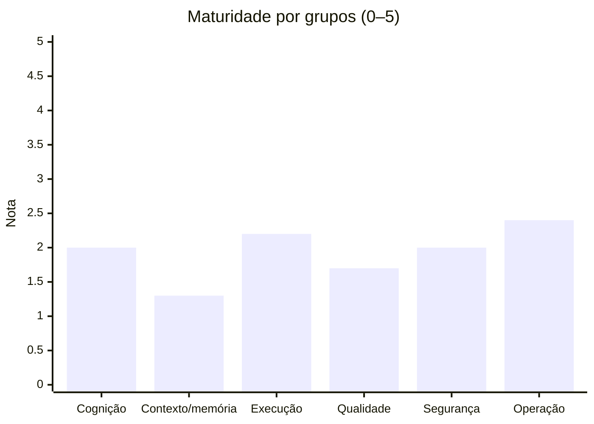

# Avaliação de maturidade da Bruna

Data de corte: 2026-07-30.

Escala: 0 inexistente; 1 conceitual/manual; 2 parcial/frágil; 3 funcional com limitações; 4 robusto/integrado; 5 maduro/mensurável/resiliente.

## Resultado

**Maturidade geral: 1,92/5 (parcial e frágil).**

| Eixo | Nota | Evidência e justificativa |
|---|---:|---|
| entendimento de requisitos | 2 | output tipado em demandas/criteria; sem extração real de PDF/Office/imagem, spec ou provenance |
| planejamento | 2 | plano estruturado/dependências; heurística, uma versão, sem impacto/caminho crítico |
| delegação | 2 | cards, resolver, attempts; autonomia default off e dynamic roles incompletos |
| seleção de agentes | 2 | 25 personas/9 specialties/capacity; roteamento por regras e SoTs concorrentes |
| context engineering | 2 | manifesto, budget, checksum, receipt e RAG; oldest-200, defaults e replay incompleto |
| memória | 1 | histórico durável/notas/vetores; notes não lidas e nenhuma adaptação |
| RAG | 1 | participa do runtime, mas corpus de snippets e retrieval não avaliado |
| busca vetorial | 1 | JSON + scan/cosseno em memória; nenhum índice/modelo semântico |
| ferramentas e MCP | 1 | integrações fixas e catálogo MCP; nenhum cliente MCP/tool broker end-to-end |
| estado | 3 | estados tipados por domínio, leases/fencing/versions; não há máquina cognitiva unificada |
| persistência | 3 | SQLite/Postgres, outbox, ledger, RLS; handoffs Git/DB/plan não atômicos |
| recuperação | 2 | detecção/retry/branches e engines robustos isolados; core não retoma checkpoint |
| concorrência | 2 | worktrees/claims/fencing; scope/merge/multi-Host frágeis |
| multiprojetos | 1 | IDs e paths isolados; first-tenant, limits, quota/fairness ausentes |
| code review | 2 | critic account separado/diff/findings; sem repo completo nem modelo diverso obrigatório |
| QA | 1 | diagnóstico e parecer; nenhuma evidência automática obrigatória de build/test/SAST |
| segurança | 2 | PEP, redaction, env allowlist, RLS; tool effects e sandbox não uniformes |
| observabilidade | 3 | OTel, metrics, invocations, ledger/receipts; decisão/contexto/tool calls não reconstituíveis |
| governança | 3 | manifesto/checksum/precedência/verify; selectors e docs divergem do runtime |
| aprendizado | 1 | candidates manuais desconectados; nenhum feedback loop operacional |
| controle de custos | 2 | records e routing declarados; métricas Unknown, lease duplica e fallback não executa |
| reprodutibilidade | 2 | IDs/hashes/model metadata; prompt dinâmico/ambiente/seed ausentes |
| autonomia | 2 | loop implementado; default off, local e sem garantias compostas |
| supervisão humana | 3 | gates/modos/approvals existem; cobertura varia e merge pode ser automático |
| qualidade da entrega | 2 | contracts/gates/review reais; falsa conclusão permanece possível |

Média aritmética: 48 pontos / 25 eixos = **1,92**.

## Radar conceitual

## Leitura do resultado

A pontuação não significa ausência de engenharia. Estado, persistência, governança e observabilidade têm bases funcionais. A maturidade cai porque as garantias não compõem um único fluxo: a transação da conversa não garante cards; o checkpoint não dirige o attempt; o parecer não garante testes; o PEP não medeia ferramentas internas; e o scheduler não cobre todos os tenants com fairness.

## Quem valida a Bruna

Hoje:

1. JSON schema/parser valida formato;
2. `CommunicationDisciplineValidator` valida comunicação;
3. `FreshContextEvaluator` valida propriedades estruturais;
4. cards e critic validam trabalho delegado;
5. phase obligations e gates humanos validam partes do workflow.

Não há um avaliador independente que compare intenção/spec versionada com o conjunto final entregue. A classe LLM judge não é instanciada com transporte. Portanto a Bruna é validada por invariantes locais e, quando configurado, por humanos; ninguém valida semanticamente o supervisor como um todo.

## Harness engineering

**Classificação: parcial (2/5 como conjunto).**

Há ambiente controlado, contratos, stores, leases, worktrees, evidence, gates e tracing. Não é apenas prompt. Porém não há:

- prova end-to-end reproduzível;
- sandbox/tool broker uniforme;
- gates de execução inescapáveis para testes e segurança;
- retomada exata do workflow central;
- evals semânticas contínuas;
- scheduler multiprojeto resiliente;
- trilha completa requisito→decisão→modelo→tool→commit→teste.

Um agente não consegue simplesmente gravar `completed` ignorando stores, mas pode produzir um commit sem teste objetivo e obter aprovação pelo parecer limitado. A Bruna não pode burlar invariantes tipadas diretamente, mas os critérios que alimentam essas invariantes podem ser incompletos.
