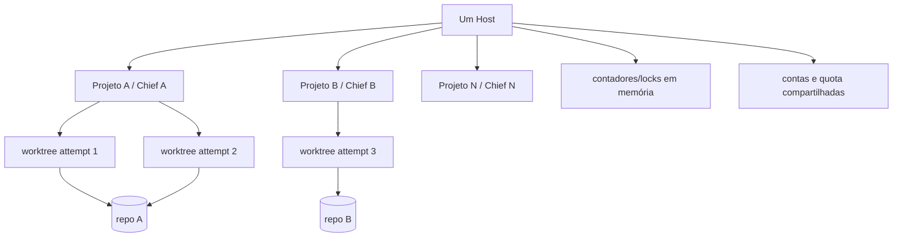
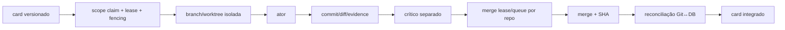
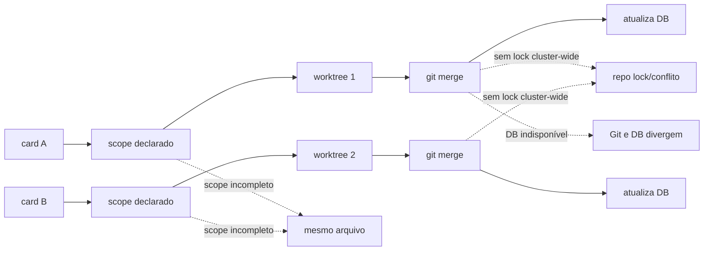

# Concorrência e multiprojetos

Data de corte: 2026-07-30.

## Modelo atual

Há uma Chief associada a cada projeto (`Project.ChiefAgentId`), um conjunto global de workers no Host e uma frota de contas compartilhada. O isolamento factual usa tenant/project IDs; o repositório local usa `<controlled-root>/<tenant>/<projectKey>` e cada attempt recebe branch/worktree.

## Execução paralela segura pretendida

Scope claims, worktrees, fencing, crítica separada e branches já existem. Merge lease distribuído, queue real e reconciliação Git↔DB não existem.

## Execução paralela real e colisões

## Respostas sobre colisões

1. Dois agentes podem alterar o mesmo arquivo: sim, se o scope declarado não capturar o overlap.
2. O sistema impede overlap de claims conhecidos e detecta conflitos Git; não intercepta toda escrita.
3. Ownership: scope claims por paths, não ownership organizacional completo por módulo.
4. Mapa de dependências: code graph C# parcial e dependências explícitas de cards.
5. Worktree: sim, por attempt.
6. Criação/limpeza: automática best effort; órfãos são possíveis.
7. Branch policy: develop/proteções documentadas e branches de attempt; enforcement local não é cluster-wide.
8. Merge: `TaskIntegrationService` sob coordenação do backlog loop.
9. Conflito: merge aborta; correção/humano resolve.
10. Crítico antes do merge: sim no fluxo autônomo.
11. QA: critic/gates antes; não há suite obrigatória completa.
12. CI: pipeline de repo existe; merge local do loop não espera uma CI externa comprovada.
13. Merge queue: não; há store serializado em processo, não fila distribuída do Git.
14. Rollback: merge abort para conflito; sem rollback automático pós-merge.
15. Task→commit: branch/attempt/diff/merge record permitem rastreio parcial.
16. Branch errada: worktree reduz risco; `git merge` ainda depende da raiz correta.
17. Fora de escopo: prompt/claims/diff; sem enforcement de syscall para todos os executores.
18. Código sobreposto: scope/code graph/Git, com lacunas.
19. Duplo dispatch: leases/claims/idempotência reduzem; locks locais deixam risco multi-Host.
20. Idempotência: presente em comandos/stores, incompleta para provider/Git effects.

## Multiprojetos

| Dimensão | Controle atual | Limite |
|---|---|---|
| estado | tenant/project em tabelas; RLS Postgres | alguns workers usam apenas `profiles[0]` |
| memória/RAG | tenant/project metadata/filtros | disponibilidade por alias é global |
| arquivos | diretório tenant/project + worktrees | Host possui filesystem compartilhado |
| processos | working directory por worktree; env allowlist | contadores e locks apenas em processo |
| portas | run-target/launcher possuem detecção | reserva/fairness global não comprovada |
| logs | tags tenant/project/task/agent | nem todo detalhe interno de tool tem tags |
| segredos | referências/accounts e env filtrado | aliases/availability não tenant-scoped |
| agentes | catálogo por tenant/global | contas físicas compartilhadas |
| scheduler | global max 2 e prioridade por projeto/card | primeiro tenant, até 50 projetos, ordem estável |
| backpressure | max concurrent/capacity/circuit | não cluster-global; sem quota por projeto |
| pause/archive | estados de projeto | retomada depende do loop/configuração |

`ChiefBacklogLoopService` usa `profileList[0]`, lista no máximo 50 projetos e 50/100 cards sem paginação completa. Ao iterar projetos em ordem estável e preencher o máximo global, os primeiros podem ocupar a capacidade repetidamente. Não há weighted fairness, aging, reserva de capacidade, limite por projeto ou prevenção comprovada de starvation.

`AttemptRecoveryBackgroundService` também escolhe o primeiro tenant. Portanto o isolamento de dados é razoável, mas a **cobertura operacional multiprojeto/multitenant não é completa**.

## Falhas em múltiplos Hosts

- `ScaleGate`, `_live`, semáforos do Git manager e parte da capacidade são locais.
- `AccountProfileProvisioner` documenta que o lock é in-process.
- Workspace leases no banco são a defesa forte compartilhada.
- `SerializedMergeWorkChainStore` usa `SemaphoreSlim` e serializa mutações do store, não o efeito Git externo.
- Dois Hosts podem iniciar merges no mesmo repositório; locks internos do Git podem causar falha, não ordenação justa.

## Classificação

**Concorrência: 2/5 — parcial e frágil.** Worktree/claims/fencing são uma base boa, mas scopes declarativos, merge e multi-Host deixam colisões.

**Multiprojetos: 1/5 — conceitual com isolamento de dados parcial.** A modelagem tenant/project é real; scheduler, recovery, quota e fairness não operam de forma completa para todos os projetos/tenants.

## Controles mínimos recomendados

1. Scheduler paginado, tenant-aware, com quota por projeto, aging e weighted fairness.
2. Leases distribuídos por `repository_id` e `merge_intent_id`.
3. Merge queue durável; somente um reconciliador executa efeitos Git por repo.
4. Scope derivado/verificado pelo diff antes do review e merge; violation bloqueia.
5. Reconciliador de branches/worktrees/attempts em todos os tenants.
6. Capacity/availability tenant-account scoped e, quando compartilhada, explicitamente global com reservas.
7. Testes multi-Host reais para duplo dispatch, overlap, merge e crash.
