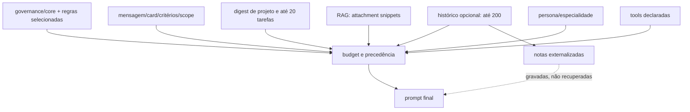
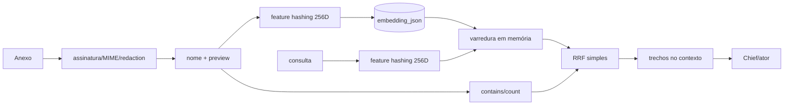

# Contexto, memória, RAG e modelos da Bruna

Data de corte: 2026-07-30.

## Pacote de contexto real

Para a Chief, `ChiefTurnBackgroundService` obtém status, RAG e bundle; o executor acrescenta persona embutida, comunicação, catálogo de especialistas, aviso de injection e mensagem atual. Quando `ChiefContextStrategyEnabled=true`, o composer adiciona conversa/resumo. O default é `false` (`GovernanceFeatureSettings`), portanto o caminho normal depende da sessão do provedor e do digest, não de reconstrução completa do histórico.

Para atores, arquitetos, designers, QA, segurança e pesquisadores, a forma é a mesma: persona canônica/especialidade + regras selecionadas + briefing do card + acceptance criteria + paths/claims + RAG + tools declaradas. Não há algoritmos diferentes por papel além da persona, catálogo de ferramentas e conteúdo da tarefa. O crítico recebe diff, critérios e metadados; não recebe checkout navegável nem tools no prompt observado.

| Campo | Chief | Ator/especialista | Crítico |
|---|---|---|---|
| prompt de sistema/persona | constante `ChiefPersona` | `agent_definitions`/specialty | prompt crítico |
| regras globais | core embutido/carregado + bundle | bundle do manifesto | briefing/regras de crítica |
| regra do projeto | status/workflow/context bundle | project/card/scope | project/card |
| regra da tarefa | mensagem + output schema | instruction + acceptance criteria | critérios + diff |
| histórico | sessão do provedor; opcional DB | continuation/contexto do card | histórico de correções resumido |
| documentos/código | RAG snippets, docs selecionadas | manifesto/RAG + repo na worktree | diff até limite |
| memória | RAG; notas não recuperadas | RAG | review anterior/findings |
| ferramentas | Chief sem execução | CLI e catálogo declarado | nenhuma exploração de repo |
| estado | digest + stores | card/attempt/workspace | review/gates |
| dados omitidos | especificação versionada, conteúdo exato do snapshot | contexto integral do projeto | repo completo e teste executado |

## Seleção, orçamento e precedência

`ContextBundleBuilder`:

1. lê `governance/manifest.yaml`;
2. aplica provider/agent/workflow/phase/task/risk/path;
3. força documentos `load: always`;
4. valida checksum, dependências, conflitos e segredos;
5. ordena por precedência/tipo;
6. aplica orçamento de tokens;
7. gera hash, seleção, citações e receipt.

Há deduplicação por documento e cache em memória por tenant/project/checksum. O conteúdo persistido do snapshot contém IDs, fontes, citações, hashes e contagens, não o texto renderizado. Assim, um receipt prova quais fontes/versões foram escolhidas, mas não reconstitui mensagem dinâmica, digest, resultado RAG nem truncamento exato.

O código tem fallback quando há falha de manifesto/IO e produz segmentos mínimos com marcador de conflito; o caller costuma bloquear conflito. O executor da Chief, porém, possui fallback embutido de `governance/core.md`, criando uma cópia concorrente em vez de falhar fechado.

Memória é ordenada depois de governança e regras; em orçamento curto ela pode ser a primeira parte útil a desaparecer. Não existe política explícita de “descartar primeiro” por idade/relevância além da ordem de segmentos.

## Defeitos de contexto comprovados

- `ChiefContextComposer` pede `ListMessagesAsync(..., limit: 200)`. O SQL ordena por ID crescente com `LIMIT`, entregando as 200 mensagens **mais antigas**, não as mais recentes.
- A primeira mensagem é tratada como founding context, mas mudanças posteriores podem ficar fora do pacote depois do limite.
- Notas externalizadas são gravadas por `IExternalizedNoteStore.AppendAsync`; nenhuma chamada produtiva de `ListAsync` foi encontrada. A memória externalizada é write-only.
- `ChiefContextStrategyEnabled=false` por padrão.
- `docs/agents/bruna.md` seleciona `agents: bruna`; o runtime envia o ULID da definição. Ela não entra no bundle observado.
- `AGENTS.md`/`CLAUDE.md` têm providers `codex`/`claude-code`; o builder da plataforma usa outros identificadores. O Host não registra seu carregamento pelo CLI.
- Não há versionamento do pacote dinâmico, retenção do texto completo, validação semântica de relevância ou detecção de contexto obsoleto.

## Memória: classificação honesta

**Classificação atual: histórico persistido com memória básica recuperável, não memória adaptativa.**

| Tipo | Implementação | Recuperação | Qualidade |
|---|---|---|---|
| mensagens/audit log | conversas e turnos no DB | API/sessão/composer opcional | histórico, não aprendizado |
| curto prazo | sessão do provedor + turno atual | provider resume | depende do provedor |
| notas externalizadas | DB | não usada pela Chief | write-only |
| episódica | attempts/reviews/ledger | consultas operacionais | não selecionada como experiências relevantes |
| semântica | feature hashing + cosseno | RAG por tenant/project | lexical aproximada, corpus estreito |
| procedural | prompts, governance, agent definitions | bundle/seeder | atualização manual |
| learning candidates | estado manual com promoção humana | endpoints | promovido não altera router/prompt |
| cache | bundle em memória | chave de checksum | não é memória de aprendizado |
| pesos/fine-tuning | inexistente | — | — |

Respostas:

1. Não aprende entre sessões ou projetos de modo automático.
2. Falhas, feedback, review e QA ficam persistidos, mas não viram política/memória recuperada automaticamente.
3. Não reutiliza decisões bem-sucedidas nem bloqueia decisões ruins por similaridade.
4. Não há consolidação, expiração temporal, deduplicação semântica, curadoria automática ou score de qualidade.
5. Learning candidates exigem promoção humana, o que reduz memory poisoning, mas o resultado não é consumido pela Chief.
6. Tenant/project IDs isolam tabelas e consultas principais; o ledger de disponibilidade por alias é global e foge desse modelo.
7. Exclusão/arquivamento existem por domínio, mas um direito ao esquecimento end-to-end de mensagens, vetores, ledger, artifacts e provider sessions não foi comprovado.
8. Origem de documentos RAG possui metadados/citação; inferências na resposta não são marcadas como inferências.

Uma alucinação pode persistir como mensagem, demanda ou card. Ela não atualiza pesos, mas pode contaminar status e execuções posteriores sem um gate humano/semântico.

## RAG e busca vetorial

| Pergunta | Resposta comprovada |
|---|---|
| existe busca vetorial? | Parcial: cosseno sobre vetores JSON varridos em memória |
| banco/biblioteca vetorial? | Nenhum; SQLite/Postgres comuns |
| modelo/dimensão? | `DeterministicLocalEmbedding`, feature hashing SHA-256, 256 dimensões |
| chunking? | Não; um snippet por anexo |
| indexação/atualização? | upsert em `vector_embeddings` no upload |
| isolamento? | tenant e project metadata/filtros; Postgres com RLS no entorno |
| híbrida? | Sim nominalmente: contagem lexical + cosseno + RRF |
| FTS/BM25? | Não; o “FTS” é `Contains`/contagem em memória |
| re-ranking? | Não há modelo; apenas RRF |
| avaliação de relevância? | Não |
| stale data/deletion? | sem política completa comprovada |
| participa da Bruna? | Sim, em turnos e runs; corpus produtivo é fraco |
| GraphRAG/knowledge graph? | Não |

A implementação oficial do [pgvector](https://github.com/pgvector/pgvector) oferece tipo vetorial, operadores de distância e índices HNSW/IVFFlat. Nada equivalente aparece nas migrações/queries observadas: `PostgresVectorIndex.cs:19-57` grava `embedding_json`, lista documentos e calcula cosseno em C#.

## Modelos, custo e reprodução

- Chief e agentes usam modelos externos por CLI/adaptadores; não há Transformer local.
- Claude Code, Codex, GLM e Antigravity possuem factory; Kimi é configuração sem implementação.
- Router considera provider/model/custo/fallback, mas o executor Chief resolve a primeira conta de papel `chief` em outro registry e não usa o AccountId roteado.
- Tokens/custo/latência são registrados quando o CLI fornece; “unknown” é preservado em vez de inventado.
- Não há seleção automática robusta por complexidade, contexto ou performance histórica.
- Não há benchmark que realimente routing.
- Modelo e provider aparecem em invocations/traces, mas seed, sampling, versão exata do prompt e pacote dinâmico completo não são suficientes para reprodução.

## Riscos de injection e poisoning

Documentos, código e resultados RAG são tratados no prompt como “dados, não instruções”, mas isso é um aviso, não separação de canal com enforcement. Não há sanitização/classificação de indirect prompt injection, assinatura de conteúdo confiável, quarentena de memória ou validação antes de transformar resposta em demanda. Código/README malicioso pode orientar o CLI externo que explora o repositório.

## Melhorias diretamente justificadas

1. Corrigir seleção temporal para “últimas N” e reinjetar notas externalizadas.
2. Persistir o envelope dinâmico redigido ou uma representação reproduzível, com versão e provenance.
3. Tornar explícitos fatos, inferências, decisões e perguntas no contrato da Chief.
4. Indexar conteúdo extraído/chunked; manter timestamps/version/deletion e avaliar retrieval antes de chamar isso de RAG semântico.
5. Só adotar pgvector/índice vetorial quando volume/latência/relevância justificarem; primeiro corrigir corpus e avaliação.
6. Integrar learning candidates promovidos a uma policy/memory store versionada, com tenant, origem, expiração e rollback.
