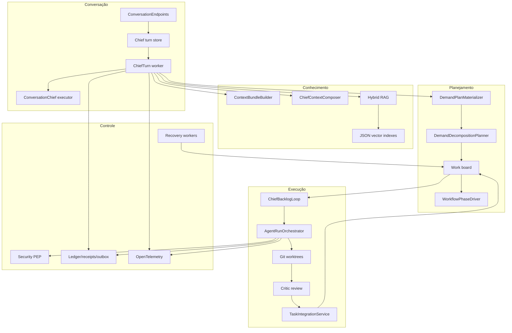

# Arquitetura as-is do core da Bruna

Data de corte: 2026-07-30.

## Classificação

A Bruna é uma **arquitetura híbrida de supervisor LLM, planner determinístico, board persistente, state machines por domínio e loop local opcional de execução**.

Ela não é um ReAct contínuo, um grafo cognitivo durável nem um workflow único de planner-executor. A decisão sobre intenção e demandas é probabilística; decomposição, transições, routing básico, leases e gates são determinísticos; execução e crítica voltam a ser probabilísticas.

```mermaid
flowchart LR
    U[Usuário] --> API[Conversation API]
    API --> QT[(chief_turns)]
    QT --> CW[ChiefTurnBackgroundService]
    CW --> CB[Context bundle + digest + RAG]
    CB --> LLM[Chief LLM]
    LLM --> OC[Output tipado]
    OC --> DB[(mensagem + demands)]
    DB -. após concluir turno .-> DP[Planner heurístico]
    DP --> WB[(demand_plans + cards)]
    WB --> LOOP[ChiefBacklogLoop opcional]
    LOOP --> ACT[Agente ator em worktree]
    ACT --> REV[Crítico por diff]
    REV --> GATE[Gates determinísticos]
    GATE --> MERGE[Git merge]
    MERGE --> WB
```

O `Program.cs` inicia `HostApplication.Build`; `HostApplication.cs:208-745` compõe seeders, stores duais, workers, contexto, RAG, Git, modelos, telemetria e o loop. `AgentRunSettings.Enabled` e `AutoDispatch` são `false` por padrão; logo a experiência autônoma depende de configuração externa não presente em `appsettings.json`.

## Quem decide o próximo passo

| Decisão | Decisor real | Natureza | Evidência |
|---|---|---|---|
| aceitar/enfileirar turno | endpoint + regras de readiness | determinística | `ConversationEndpoints.StartTurn`, linhas 438–556 |
| interpretar intenção/criar demandas | modelo da Chief | probabilística, schema restringido | `ConversationChiefAgentExecutor.cs:204-395` |
| criar slices do plano | `DemandDecompositionPlanner` | determinística por palavras-chave | planner chamado por `DemandPlanMaterializer` |
| escolher papel | Chief sugere specialty; resolver aplica catálogo/regras | híbrida | `ChiefCardResolver`, `ChiefTeamManager` |
| despachar/priorizar | `ChiefBacklogLoopService` | determinística/local | fila e `ScaleGate` do serviço |
| executar | CLI/modelo externo | probabilística | `AgentRunOrchestrator` |
| aprovar criticamente | conta crítica separada por diff | probabilística + contrato | critic executor/review store |
| integrar/avançar fase | gates + workflow driver + modo do projeto | determinística/humana | `TaskIntegrationService`, `WorkflowPhaseDriver` |

## Respostas sobre a arquitetura cognitiva

1. **Máquina de estados explícita?** Sim, várias: turnos, cards, attempts, reviews, fases, learning candidates e durable executions.
2. **Grafo de estados único da Bruna?** Não.
3. **Workflow durável?** Parcial. Estados duráveis existem, mas o caminho Chief → plano → run → review → merge não é uma única execução transacional/checkpointada.
4. **Loop deliberativo?** Não na Chief conversacional. Existe um polling loop de backlog, desabilitado por padrão, que aplica regras fixas.
5. **Revisa as próprias decisões/reflexão?** Não há reflexão formal do plano. Há reparo de schema, correção após crítica e instrução fixa após falhas repetidas.
6. **Crítico separado?** Sim por alias/account e papel; não necessariamente por família de modelo/provedor.
7. **Ator aprova o próprio trabalho?** A política e o store impedem a mesma conta de criticar; integração requer review quando o fluxo está habilitado.
8. **Avaliador externo/LLM-as-a-judge?** Avaliação estrutural determinística existe. A classe de LLM judge está desconectada no composition root.
9. **Votação/consenso?** Não.
10. **Escalonamento humano?** Sim em modos manual/semi, gates, riscos e bloqueios; não é universalmente obrigatório.
11. **Encerramento objetivo?** Cards/fases possuem estados e obrigações. A conversa só exige schema; “projeto completo” não possui uma prova semântica global.
12. **Prevenção de loop infinito?** retries limitados, circuit breaker, timeout e falha terminal. Não há detector semântico abrangente de progresso.
13. **Agente improdutivo?** timeout, lease, ausência de commit/evidência, falhas repetidas e stuck detector parcial.
14. **Desvio do objetivo?** acceptance criteria, diff critic e phase obligations; não existe comparação semântica contínua com uma especificação versionada.

## Componentes e responsabilidades

## Forças comprovadas

- Contratos tipados e validação estrita do output da Chief.
- Persistência SQLite/Postgres com isolamento por tenant/project e RLS no modo servidor.
- Leases, fencing e scope claims no workspace de tentativas.
- Worktree/branch por tentativa e preservação do branch em falhas.
- Separação estrutural ator/crítico por conta.
- Estados de workflow, obrigações e gates humanos.
- Ledger, outbox, receipts, model invocation records e OpenTelemetry.
- Redaction de processo/ambiente, allowlist de variáveis e kill de árvore de processos.

## Fragilidades comprovadas

### Critical path não atômico

`ChiefTurnBackgroundService.cs:433` completa e publica o turno; somente em `:466` tenta materializar os planos. Exceções por demanda são capturadas em `:606`. O usuário pode receber uma promessa persistida sem cards correspondentes.

Dentro da materialização, `DemandPlanMaterializer.cs:56` marca o plano como materializado antes de `:75-80` criar cada card. Uma queda parcial torna o retry idempotentemente inerte e deixa o plano incompleto.

### Durabilidade fragmentada

O engine genérico de durable execution e o orquestrador isolado possuem bons testes, mas não dirigem o turno da Chief nem o `AgentRunOrchestrator`. `ExecutionCheckpointService` não tem consumidor produtivo. Após crash, o sistema reconcilia e recomeça; não retoma a próxima instrução exata de um modelo/processo.

### Autonomia configuracional e local

`AgentRunSettings.Enabled=false`, `AutoDispatch=false`, máximo global padrão de dois runs. Se ligado, o loop usa o primeiro perfil/tenant, paginações fixas e sem fairness global. Seus semáforos e contadores são por processo.

### Cognição sem especificação versionada

O contrato da Chief produz texto e demandas com acceptance criteria, mas não uma especificação formal com versão, origem de cada requisito, distinção fato/inferência, impacto de mudança ou matriz requisito→card→commit→teste.

### Qualidade superficial

O crítico recebe diff truncável e critérios; o próprio prompt informa que evidência de testes não é coletada automaticamente. Os gates “behavioral” e “intent” reutilizam essencialmente o mesmo parecer. Não há build/test/lint/SAST/SBOM obrigatórios no caminho de merge.

## Fontes de verdade

| Fato | Fontes concorrentes | Consequência |
|---|---|---|
| identidade/persona Chief | constante embutida, `agent_definitions`, `docs/agents/bruna.md` | drift de missão e limites |
| modelo/conta | provider catalog DB, model routing, account registry local, disponibilidade JSON | seleção validada pode não ser a executada |
| quota | DB, JSON por alias, circuit/capacity em memória | comportamento diferente por processo |
| workflow | docs/manifesto, workflow definitions DB, regras do backlog loop | alvo e runtime divergem |
| contexto/memória | sessão do provedor, mensagens, notas, RAG, bundle/receipts | replay incompleto |
| integração | branch Git e estados DB/work-chain | merge pode existir sem transição factual |

Pela precedência canônica, o banco é a fonte factual e Git a fonte versionada. A implementação quebra essa hierarquia ao efetuar `git merge` antes de confirmar a mutação factual em banco.

## Modelos e transformers

Não há Transformer local, fine-tuning, LoRA, modelo de embeddings treinado ou reranker. A plataforma invoca provedores/CLIs externos (Claude Code, Codex, GLM e Antigravity); Kimi aparece em configuração, mas não tem factory implementada. O “embedding” local é feature hashing determinístico de 256 posições (`DeterministicLocalEmbedding.cs:19-56`).

O modelo da Chief é roteável por configuração, mas o executor resolve a conta real em um registro diferente e ignora o `AccountId` selecionado pelo router. Fallbacks são validados/persistidos, não executados como cadeia de retry. Não há garantia de reprodução bit a bit: temperatura/seed e conteúdo exato do contexto não são registrados de modo suficiente.

## Conclusão

A arquitetura implementa um control plane real, muito além de “um conjunto de prompts”, mas ainda não forma um harness end-to-end com garantias compostas. As garantias fortes existem em ilhas; os handoffs entre Chief, plano, agente, crítica e integração contêm as maiores lacunas.
