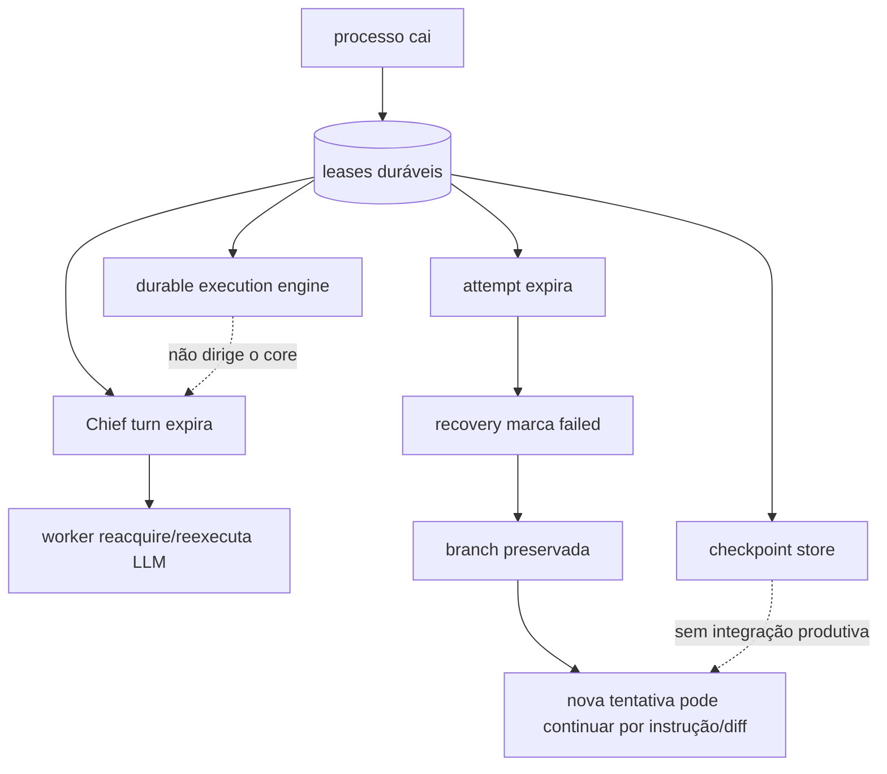

# Estado, persistência e recuperação da Bruna

Data de corte: 2026-07-30.

## Mapa de estado

| Estado | Armazenamento | Escopo | Escritor | Leitor | Durabilidade/consistência | Recuperação |
|---|---|---|---|---|---|---|
| Chief/project owner | projects DB | tenant/projeto | project service | Chief/endpoints | durável/transacional | reload |
| conversa/mensagem | conversation tables | tenant/projeto/sessão | endpoints/worker | UI/composer | durável | reload/provider resume |
| turno Chief | `chief_turns`, `chief_states` | conversa | endpoint/worker | worker/UI | lease + fencing | reacquire/retry ≤3 |
| demanda/plano | demands/`demand_plans` | projeto | Chief worker/materializer | board/loop | durável, handoff não atômico | incompleta |
| card/dependência | work-board tables | projeto | materializer/services | loop/API | optimistic/version/hash | state transitions |
| agente/catálogo | `agent_definitions`, specialties | tenant/global | seed/API/Chief | resolver | durável | reseed |
| conta/modelo | provider DB + registry local | tenant/global | APIs/config | router/executors | fontes concorrentes | fallback parcial |
| quota/disponibilidade | DB + JSON home + memória | alias/processo | collectors/ledger | scheduler | fragmentada | cooldown/probe |
| attempt/run | attempt/workspace stores | card/agente | orchestrator | recovery/loop | lease/fencing | marca failed, preserva branch |
| checkpoint | checkpoint tables | attempt | serviço sem caller | serviço sem caller | durável mas desconectado | não efetiva |
| processo | `_live`, process handle | Host | orchestrator | orchestrator | efêmero | kill/restart |
| branch/worktree | Git/filesystem + workspace row | attempt | Git manager | recovery/integration | durável local | branch preservada/cleanup |
| review/QA | review/gate tables | card | critic/gates | loop/integration | durável | re-review |
| workflow/fase | workflow/project phase tables | projeto | phase driver | API/loop | versionado/rebaseline | reload |
| aprovação | gates/human decisions | card/fase | critic/humano | integration | durável | novo gate |
| RAG/context | vector JSON + snapshot metadata | tenant/projeto/turno | ingest/context builder | Chief/agents | parcialmente reproduzível | rebuild limitado |
| ledger/evidence | append ledger/receipts | tenant/projeto | serviços | audit/API | append-only/hash | replay parcial |
| outbox | outbox DB | transação | stores | publisher | at-least-once | retry/DLQ |
| notificações/canais | channel/outbox tables | tenant/projeto | channel workers | providers | idempotência por mensagem | retry |
| integração | Git merge + DB board/work-chain | projeto | integration service | Git/API | não atômico | manual/reconciliação ausente |

SQLite é a fonte factual no modo pessoal e Postgres no modo servidor. Git é a fonte versionada de código. Receipts/ledger são evidência. Esse modelo é coerente na documentação, mas a integração executa Git antes do commit factual do banco.

## Leases, locks, idempotência e transações

- Turno Chief: lease/fencing/idempotency, mas sem heartbeat/renew; duração configurada de dois minutos.
- Attempt workspace: lease, fencing, heartbeat, conflito de scopes e terminal transitions.
- Account lock: proteção local/DB conforme caminho, mas há comentários reconhecendo limite in-process no provisioner.
- Cards/stores: versions/hashes e transações por store.
- Outbox: real e at-least-once.
- Ledger: append-only/hash encadeado.
- Event sourcing: não; eventos/evidências coexistem com modelos mutáveis.
- Saga: não no handoff Chief→plan nem Git→DB.
- Reconciliação: disponível para durable engine/attempts, não para todas as fontes concorrentes.

## Recuperação observada

Os 12 testes focados de `Harness.RecoveryTests` passaram em 2026-07-30, incluindo SIGKILL para o durable engine SQLite/Postgres e estágios do isolated attempt. Isso prova esses componentes, não prova a retomada end-to-end da Bruna porque o core não os usa como workflow unificado.

## Vinte cenários de falha

| # | Cenário | Comportamento/detecção/recuperação atual | Duplicidade/perda/intervenção | Risco e evidência |
|---:|---|---|---|---|
| 1 | Chief cai durante delegação | lease expira e turno pode ser readquirido | LLM pode duplicar; fencing evita stale complete | Alto; Chief store/worker, sem renew |
| 2 | agente cai no meio da alteração | heartbeat cessa; attempt falha; branch/worktree preserváveis | trabalho não commitado pode ficar no worktree; nova tentativa/manual | Alto; orchestrator/recovery |
| 3 | computador desliga | DB/Git sobrevivem; processos somem | reconciliação parcial no boot; não retoma token/instrução | Alto |
| 4 | SIGKILL | igual ao anterior | durable engine passa teste, core reinicia atividade | Alto |
| 5 | banco indisponível | chamadas falham; workers logam/retry no próximo ciclo | estado externo/Git pode ter mudado antes do erro | Crítico no merge |
| 6 | provedor IA indisponível | invocation falha; retry/cooldown/circuit parcial | fallback declarado não é executado pela Chief | Alto |
| 7 | cota termina | availability ledger/cooldown; alguns status Unknown | projeto aguarda; outro account só se router/loop o escolher | Alto |
| 8 | rede cai | CLI/HTTP timeout/falha e processo encerrado | operação externa pode ter ocorrido sem confirmação | Alto |
| 9 | resposta inválida | repair prompt + schema; depois fail/retry | controlado; custo duplicado possível | Médio |
| 10 | agente entra em loop | timeout de run, circuit/stuck parcial | não há progresso semântico contínuo | Alto |
| 11 | agente abandona tarefa | lease/heartbeat expira | card pode ser reaberto; branch preservada | Médio/alto |
| 12 | dois agentes mesmo arquivo | scope claims bloqueiam overlap declarado | scope incompleto permite colisão; Git detecta no merge | Alto |
| 13 | branch removida | attempt/DB pode apontar branch ausente | reconciliação automática específica não comprovada | Alto/manual |
| 14 | worktree órfã | cleanup/recovery best effort | branch pode sobreviver; varredura global incompleta | Médio |
| 15 | merge falha | `git merge --abort`; card não integra | conflito requer nova correção/humano | Médio |
| 16 | teste trava | se agente o iniciou, timeout global mata árvore | resultado de teste não é coletado tipadamente | Alto |
| 17 | worker duplica tarefa | workspace claim/idempotência/fencing ajudam | contadores/locks locais não protegem cluster inteiro | Alto |
| 18 | mensagem processada duas vezes | idempotency/outbox keys e unique constraints | side effects externos podem permanecer at-least-once | Médio |
| 19 | Chief perde contexto | provider session + composer opcional; oldest-200 bug | decisões recentes podem sumir; notes não retornam | Alto |
| 20 | agente conclui sem evidência | critic/gates exigem diff/parecer, mas testes são declaração | falsa conclusão ainda possível | Alto |

## Respostas diretas

- **Retomada real ou reinício?** Para o core, predominantemente detecção + reinício/reexecução. O durable engine retoma checkpoints, mas não orquestra o core.
- **Último checkpoint?** Não no `AgentRunOrchestrator`; `ExecutionCheckpointService` está desconectado.
- **Próxima ação conhecida?** O estado do board permite inferir regra seguinte; não há program counter do raciocínio/modelo.
- **Agente anterior conhecido?** Sim, por attempt/account/agent IDs.
- **Arquivos alterados conhecidos?** Diff/branch/artifacts quando coletados; alterações não salvas dependem do worktree.
- **Parcialmente concluída?** Branch e output ajudam; não há checkpoint semântico obrigatório.
- **Cold-start reconciliation?** Parcial e limitada ao primeiro tenant no worker observado.
- **Órfãos/fantasmas/duplicatas?** Possíveis em worktrees, materialização parcial, merge Git sem DB e leases duplicados.

## Falhas críticas de atomicidade

### Turno → plano/cards

1. transação completa mensagem, turno e demandas;
2. resposta já é observável;
3. materialização do plano acontece depois;
4. exceção é capturada;
5. marker do plano precede criação dos cards.

Critério de correção: outbox/command durable criado na mesma transação do turno; materialização idempotente por card; marker final somente quando conjunto e dependências estão completos; reconciliador detecta gaps.

### Git → board

1. `git merge` modifica branch;
2. store tenta aprovar/completar work-chain/card;
3. falha de DB deixa código integrado e estado factual antigo.

Critério de correção: merge intent durável, lease distribuído por repositório, precondition versionada, commit SHA registrado, reconciliador Git↔DB e compensação explícita; não fingir atomicidade entre Git e SQL.
