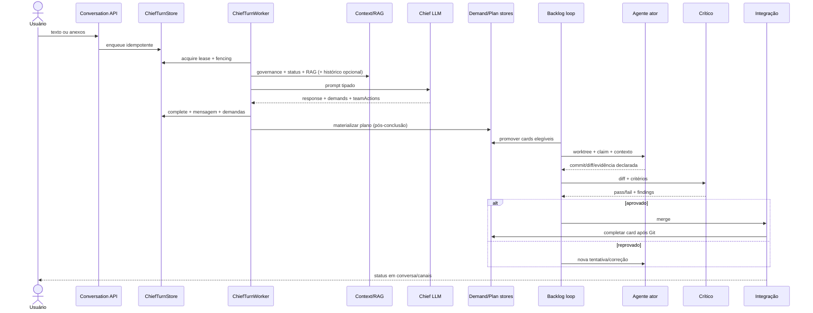
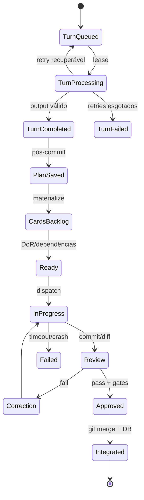

# Fluxo end-to-end da Bruna

Data de corte: 2026-07-30.

## Fluxo observado

## Matriz de etapas

| Etapa | Responsável/prompt | Entrada → saída | Estado/evento/próximo | Falha, retry, recuperação, telemetria e conclusão | Evidência |
|---|---|---|---|---|---|
| descrição | `ConversationEndpoints` | mensagem → turno | mensagem + `chief_turn` enfileirado | idempotency key; bloqueia sem projeto/modelo/workflow; span/correlation | `ConversationEndpoints.cs:438-556` |
| documento | attachment endpoints + `MultimodalIntakeService` | bytes → metadados/snippet | blob/anexo; snippet indexado | assinatura/MIME/zip limits; não há OCR/parser real; conclui ao persistir | `AttachmentIngestPolicy.cs:24-211`; `MultimodalIntakeService.cs:67-99` |
| ingestão | endpoint/store | turno → lease | `queued→processing` | até 3 retries; lease expira; sem renew de Chief | stores de Chief + `ChiefTurnWorkerOptions` |
| interpretação | prompt Chief principal | mensagem, core, digest, RAG → `ChiefTurnOutput` | thought run/model invocation/response | repair de JSON/schema; timeout do provider; completion tipada | `ConversationChiefAgentExecutor.cs:204-395` |
| extração de requisitos | Chief LLM | intenção → até 20 demands | `demands`, acceptance criteria | sem schema de especificação; avaliador apenas estrutural | `ChiefTurnOutputContract` |
| lacunas/perguntas | Chief LLM | contexto incompleto → resposta/demandas | somente texto/demand risk | não há coleção tipada de ambiguidades, assumptions ou answers | ausência no output contract |
| planejamento | `DemandDecompositionPlanner` | demand → slices/deps | `demand_plans` | heurística; save idempotente, sem versionamento de plano | planner/materializer |
| decomposição | `DemandPlanMaterializer` | slices → cards | cards em backlog | marca plano antes dos cards; crash parcial não repara | `DemandPlanMaterializer.cs:56-80` |
| seleção de agente | `ChiefCardResolver` + team catalog | card/specialty → account/papel | assignment/dispatch | regra, disponibilidade e claims; dynamic role pode ser não executável | resolver/team manager |
| construção de contexto | `ContextBundleBuilder`, RAG, run briefing | manifest, task, diff, memória → prompt | snapshot/receipt/hash | budget/checksum; snapshot sem conteúdo; fallback com marker | context modules |
| delegação | `AgentRunOrchestrator.StartAsync` | card/account/scope → attempt | workspace lease, worktree, process | bloqueia overlap declarado; timeout/heartbeat; OTel | agent orchestrator/workspace store |
| execução | executor externo | prompt + repo → commit/output | branch, artifacts, terminal state | mata process tree; crash perde processo; branch preservada | external executors/Git manager |
| acompanhamento | backlog loop | cards/attempts → ações | polling e metrics | default off; limites 50/100; primeiro tenant | `ChiefBacklogLoopService` |
| revisão | critic prompt | diff + critérios → parecer | review record/gates | alias distinto; sem repo/tools; diff max.; sem testes coletados | critic executor |
| QA | critic + code graph | parecer/diagnóstico → gates | gate evidence | não executa suíte obrigatória; sem navegador/SAST integrado | review pipeline |
| correção | backlog loop | findings → continuation instruction | nova attempt/branch | retries/circuit; não é replanejamento semântico | correction flow |
| aprovação | workflow/card gates | evidências → approved | card/workflow transition | humano conforme modo; Bruna não pode dispensar store invariants | workflow driver/stores |
| integração | `TaskIntegrationService` | branch aprovada → merge | Git, depois DB | conflito aborta; DB failure após merge diverge; sem distributed merge lock | integration/Git manager |
| entrega | fase/deliverable/card | estados aprovados → conclusão | projeto/fase/notificação | critérios globais incompletos; status reconstruível parcialmente | workflow/project stores |
| memória/aprendizado | mensagens, notes, vector, candidates | histórico/evidência → persistência | DB/JSON | notes write-only; learning manual e desconectado; não há atualização de pesos | context/learning modules |

## Ingestão de requisitos

São aceitos `.md`, `.txt`, `.pdf`, `.png`, `.jpg`, `.jpeg`, `.csv`, `.xlsx`, `.docx` e `.zip`, até 10 MB, com validação de assinatura, traversal e zip bomb. Apenas texto/JSON é decodificado. PDF, Word, Excel e imagens viram marcador como `[application/pdf binary payload, N bytes]`. “SecurityScanStatus=passed” representa validação da política de ingestão, não antivírus.

O upload indexa `fileName: previewSnippet` em `SolicitationAttachmentEndpoints.cs:239-261`. Portanto:

- não há OCR;
- não há parser PDF/Word/planilha;
- não há chunking documental;
- não há extração de entidades/atores/regras;
- não há classificação formal de requisitos funcionais/não funcionais;
- não há versionamento da especificação;
- não há distinção persistida entre requisito explícito e inferido.

A rastreabilidade disponível é parcial: solicitação/conversa → demanda → plano/card → attempt/review/merge. Falta requisito versionado → decisão/assumption → teste.

## Planejamento e mudança

O plano é estruturado no banco, mas produzido por heurística e sem schema externo/versionamento evolutivo. Há dependências estáveis, validação básica de ciclos e promoção quando dependências concluem. Não há épico/história formal, estimativa, caminho crítico, milestone, detecção semântica de duplicata ou prova de cobertura integral.

Mudança de escopo cria novas mensagens/demandas; não existe análise automática de impacto sobre planos/cards já criados. Uma demanda materializada não recebe nova versão. Tarefas órfãs podem ser percebidas pelo board, mas não comparadas contra uma especificação completa.

## Máquina de estados observada

A aresta `TurnCompleted → PlanSaved/CardsBacklog` não é transacional. A aresta `Approved → Integrated` também cruza Git e DB sem atomicidade. São os dois cortes mais perigosos.

## Recuperação por etapa

- **Turno Chief:** store reoferece lease expirado com fencing; pode duplicar chamada cara porque não existe renew durante inferência.
- **Plano:** save/materialização são idempotentes nominalmente, mas a ordem do marker impede completar materialização parcial.
- **Attempt:** leases/heartbeat detectam abandono; recovery marca falha e preserva branch, porém não retoma processo/modelo do checkpoint.
- **Crítica:** pode ser refeita a partir do diff persistido/branch.
- **Merge:** conflito faz abort; falha DB após merge exige reconciliação humana porque não há saga/compensação.
- **Cold start:** reconcilia parte dos attempts do primeiro tenant; não há varredura global paginada nem engine único que saiba “a próxima ação” cognitiva.

## Execução conceitual versus conectada

| Capacidade descrita | Situação |
|---|---|
| intake multimodal com extração | conceitual; runtime só extrai texto simples |
| especificação formal antes de implementar | não implementada |
| planner inteligente/versionado | planner heurístico, plano de uma versão |
| execução autônoma contínua | implementada mas desabilitada por padrão |
| checkpoint/retomada exata | stores/serviço existem, não conectados ao run central |
| RAG semântico com vector DB | RAG artesanal em runtime, sem vector DB/modelo semântico |
| crítico independente | implementado por conta distinta, contexto limitado |
| QA objetiva | parcial; testes não coletados automaticamente |
| aprendizagem com resultados | apenas workflow manual de candidatos, desconectado |
| MCP dinâmico | somente catálogo/API |

## Critério de conclusão real

O runtime consegue provar transições e algumas evidências, não provar que “todo o sistema pedido foi entregue”. A ausência de uma especificação versionada e de uma matriz requisito→teste torna a conclusão global dependente do conjunto de cards produzido inicialmente e do parecer do mesmo pipeline que os executa. Esse é um limite cognitivo, não apenas de UI.
