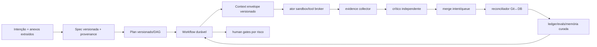

# Recomendações arquiteturais to-be para a Bruna

Data de corte: 2026-07-30. Estas propostas partem de falhas comprovadas; não são arquitetura aprovada.

## Princípio de desenho

Preservar os ativos bons — contratos tipados, stores duais, ledger/outbox, scope claims, worktrees, critic e OTel — e conectá-los por uma execução durável única. Não é necessário substituir .NET, SQLite/Postgres, Git ou os provedores.

## Correções críticas

### C1 — Materialização atômica e reconciliável

- **Problema/evidência:** BR-001/004; marker antes dos cards e turno concluído antes do comando de materialização.
- **Solução:** gravar `PlanMaterializationRequested` na outbox na mesma transação da demanda; upsert idempotente por `(plan_id,slice_key)`; verificar cardinalidade/dependências; só então `materialized_at`.
- **Alternativa:** criar tudo na transação do turno, rejeitada porque aumenta duração/acoplamento.
- **Complexidade/impacto/risco:** média / crítico / baixo.
- **Ordem:** 1.
- **Aceite:** SIGKILL em cada aresta converge exatamente para o mesmo conjunto de cards, sem duplicata nem marker prematuro.

### C2 — Broker de ferramentas e sandbox attestada

- **Problema/evidência:** BR-002/013; capability valida o CLI, não seus efeitos; `SandboxActive=true` fixo.
- **Solução:** tool gateway por chamada com capability/fencing/path/network, perfis de papel, sandbox real ou execução negada, resultados tipados/redigidos.
- **Alternativas:** confiar no sandbox nativo de cada CLI (inconsistente); container por attempt (mais simples, menos flexível).
- **Complexidade/impacto/risco:** alta / crítico / médio.
- **Ordem:** 2, antes de autonomia irrestrita.
- **Aceite:** testes adversariais provam negação de path escape, secret read, rede não allowlisted e tool sem capability.

### C3 — Merge intent durável e reconciliação Git↔DB

- **Problema/evidência:** BR-003; Git precede DB e lock é local.
- **Solução:** fila/lease distribuído por repositório, preconditions de SHA, merge intent no DB, execução única, registro do commit e reconciliador de estados.
- **Alternativas:** serviço Git externo/PR queue; adequado em modo servidor, mais caro no pessoal.
- **Complexidade/impacto/risco:** alta / crítico / médio.
- **Ordem:** 3.
- **Aceite:** dois Hosts e falhas antes/depois do merge convergem sem duplo merge nem card falso.

### C4 — Sanitização antes de persistir

- **Problema/evidência:** BR-014.
- **Solução:** sanitizer central no audit/receipt/model/artifact boundary; structured secret fields; canary secrets e fail-closed para payload de risco.
- **Complexidade/impacto/risco:** média / alto / baixo.
- **Ordem:** paralela a C1.
- **Aceite:** nenhum canary aparece em DB, logs, exports ou backups de teste.

## Melhorias estruturais

### S1 — Workflow durável unificado

Ligar turno, spec, plano, dispatch, attempt, review, correction, merge e delivery ao engine durável existente ou a uma state machine equivalente. Checkpoint deve registrar próxima ação, input hash e effect idempotency key. Não basta guardar estado de cada tabela.

Aceite: crash matrix E2E em SQLite/Postgres e dois Hosts; nenhum efeito externo duplicado sem registro; DLQ e intervenção visíveis.

### S2 — Scheduler multiprojeto

Substituir `profiles[0]` e listas fixas por paginação de todos os tenants, weighted fair queue, aging, limites por projeto/tenant/provedor, backpressure e reservas.

Aceite: carga com projetos grandes/pequenos prova ausência de starvation e respeita quotas.

### S3 — Fonte de configuração efetiva única

Resolver persona, model, account, fallback, tools, quotas e policies num `EffectiveAgentConfiguration` versionado e persistir seu digest por decisão. Remover fallback embutido divergente ou torná-lo um artefato gerado/checksummed.

Aceite: receipt mostra exatamente agente/modelo/conta/policies/tools usados; docs e DB têm drift detectado no verify.

### S4 — Evidence pipeline obrigatório

Coletores executam build, typecheck, lint, tests, coverage, secret scan, SAST/SCA e testes de navegador conforme surface/risk. Evidência tem comando normalizado, tool version, exit code, hash e log redigido. Critic lê evidência, não afirmação do ator.

Aceite: merge API rejeita qualquer tier sem evidence schema exigido; teste demonstra impossibilidade de bypass.

### S5 — Context envelope reproduzível

Persistir envelope redigido: IDs/versões de segmento, dynamic inputs, truncation decisions, retrieval hits/scores, modelo/config, prompt hash e output hash. Corrigir últimas N mensagens e reinjetar notas.

Aceite: replay offline reconstrói byte/hash do prompt redigido e explica cada segmento.

## Melhorias cognitivas

### G1 — Especificação versionada com provenance

Antes de implementar, produzir entidade `ProjectSpecification` com atores, requisitos funcionais/não funcionais, restrições, riscos, ambiguidades, assumptions e decisões. Cada item carrega `source`, `explicit|inferred`, confidence, author e approval. Mudanças geram nova versão e impact set.

Aceite: todo card e teste aponta para ao menos um requirement; inferência de alto impacto exige confirmação ou política explícita “decida você”.

### G2 — Plano como DAG versionado e validado

Adicionar phases/epics/slices, dependencies, milestones, risk, acceptance/evidence types e plan version. Validar ciclo, órfão, vagueza, cobertura de requirement, arquitetura-before-implementation e change impact. Caminho crítico só quando estimativas confiáveis existirem.

Aceite: schema e invariants bloqueiam card sem requisito/critério/evidence; replan preserva histórico.

### G3 — Actor-critic independente e calibrado

Manter contas distintas, exigir diversidade de contexto/modelo para alto risco quando justificado e permitir ao crítico checkout read-only/tooling. Um evaluator determinístico mede gates; LLM judge, se usado, é advisory/calibrado por golden set, nunca único gate.

Aceite: benchmark mede precisão/recall de defeitos, disagreement e falso positivo por versão.

### G4 — Memória episódica curada

Converter outcomes validados em episódios versionados: problema, contexto, decisão, evidence, resultado, validade, tenant/project e expiração. Promoção humana/policy; retrieval só de itens aprovados; correção/tombstone e provenance.

Aceite: poisoned episode não entra; exclusão remove índices; eval demonstra benefício versus baseline.

### G5 — RAG orientado por avaliação

Primeiro extrair PDF/Office/imagem em sandbox, chunk por estrutura, versionar corpus e criar dataset de retrieval. Só então escolher embedding/modelo/index. Se escala justificar, Postgres + pgvector reduz scan; a referência oficial do [pgvector](https://github.com/pgvector/pgvector) mostra operadores e HNSW/IVFFlat. Para baixo volume, busca textual bem avaliada pode ser suficiente.

Aceite: recall@k/nDCG, freshness e cross-tenant isolation superam baseline com custo máximo definido.

## Melhorias futuras

- GraphRAG apenas se relações entre requisitos, decisões, componentes e evidências não forem atendidas por tabelas/grafo tipado atual.
- MCP runtime somente quando houver necessidade real de descoberta/interoperabilidade; implementar host/client, auth, consent, schema validation e conformance, não apenas catálogo.
- semantic routing por desempenho/custo quando existir histórico de eval confiável.
- consensus/voting apenas para decisões raras de alto risco; custo e correlação entre modelos podem não compensar.
- prompt caching após envelope/versionamento; nunca como substituto de memória.
- aprendizagem contínua controlada sem atualização de pesos no início; fine-tuning só com dataset, eval e rollback.

## Comparação com arquiteturas de referência

| Alternativa | Atual | Problema resolvido/benefício | Complexidade/risco | Vale? |
|---|---|---|---|---|
| supervisor hierárquico | Chief + catálogo, sem líderes executivos reais | delegação de programas muito grandes | alta; mais coordenação | depois, se escala exigir |
| planner-executor | Chief + planner heurístico | plano sem cobertura/replan | média | sim, com spec/DAG tipado |
| actor-critic | contas distintas, QA limitada | falsa aprovação | média | sim, fortalecer |
| workflow durável | ilhas de estado | crash/duplicidade/próxima ação | alta | sim, prioritário |
| event-driven + outbox | outbox parcial | handoffs não atômicos | média | sim |
| state graph | várias state machines | visão/composição do workflow | média | sim como modelo explícito, sem framework obrigatório |
| blackboard | board já atua como blackboard | compartilhar fatos/evidências | baixa | manter e versionar |
| ledger/checkpoints | ledger real, checkpoint desconectado | replay/auditoria | média | sim |
| worktrees isoladas | já existem | colisões | baixa | manter; completar merge lease |
| policy engine | PEP nominal | tool effects | alta | sim, no broker |
| OTel LLM | OTel forte, spans incompletos | custo/loops/decisão | média | sim incremental |
| human-in-loop | modos/gates | alto risco/ambiguidades | baixa | manter por tier |
| MCP | catálogo somente | interoperabilidade de tools | alta | não prioritário |
| GraphRAG | inexistente | relações complexas | alta | não comprovadamente necessário |

## Ordem global

1. C1 e C4.
2. C2.
3. C3.
4. S1 e testes de crash do core.
5. S4.
6. S2.
7. G1/G2 e S5.
8. G3.
9. G4/G5.
10. futuras somente após métricas.
