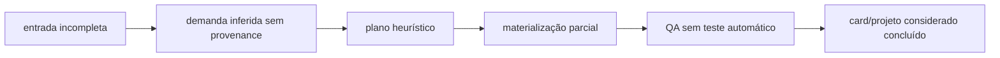
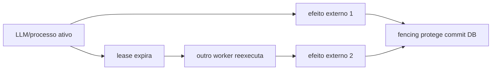
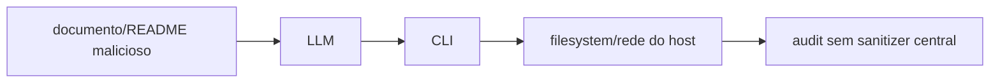

# Registro de riscos arquiteturais da Bruna

Data de corte: 2026-07-30. Probabilidade e impacto: baixa, média, alta. Severidade considera também detectabilidade e possibilidade de recuperação.

## Resumo

| Severidade | Quantidade |
|---|---:|
| Crítico | 3 |
| Alto | 12 |
| Médio | 8 |
| Baixo/informativo | 3 |
| **Total** | **26** |

## Registro

| ID | Risco | Evidência | Prob. | Impacto | Severidade | Mitigação |
|---|---|---|---|---|---|---|
| BR-001 | plano marcado antes de todos os cards; crash cria lacuna permanente/false completion | `DemandPlanMaterializer.cs:56` precede criação em `:75-80` | Alta | Alta | Crítico | marker final transacional; card upsert idempotente; reconciliador de cardinalidade/deps |
| BR-002 | executor produz efeitos no host sem mediação real por tool call | capability só cobre binário; `SandboxActive:true` hardcoded; modo isolado default off | Alta | Alta | Crítico | broker de tools + sandbox attestada + network/filesystem policy |
| BR-003 | Git e DB divergem ou dois Hosts colidem no merge | `TaskIntegrationService` faz Git antes do store; `SemaphoreSlim` local | Média | Alta | Crítico | merge intent/lease distribuído/reconciliador Git↔DB |
| BR-004 | resposta da Chief concluída sem plano/cards | `ChiefTurnBackgroundService.cs:433`, materializa em `:466`, captura em `:606` | Alta | Alta | Alto | outbox durável no commit do turno; estado `planning_pending` visível |
| BR-005 | chamada Chief duplicada e custo dobrado | lease de 2 min, sem renew; store readquire processing expirado | Alta | Média/alta | Alto | heartbeat/renew + timeout coerente + provider idempotency quando houver |
| BR-006 | projetos longos perdem decisões recentes | composer default off, oldest 200, notes write-only | Alta | Alta | Alto | latest-N correto, summary versionado, notes retrieval e provenance |
| BR-007 | requisitos alucinados tornam-se demandas sem rótulo | output não distingue explícito/inferido e evaluator é estrutural | Alta | Alta | Alto | spec tipada com source/assumption/confidence/approval |
| BR-008 | alteração de escopo não replaneja trabalho existente | um plano idempotente por demand, sem versão/impact graph | Alta | Alta | Alto | spec/plan versions, change set e impact analysis |
| BR-009 | outros tenants/projetos não são despachados/recuperados | `profiles[0]`, limits fixos e ausência de paginação no loop/recovery | Alta | Alta | Alto | scheduler tenant-aware paginado e reconciliation global |
| BR-010 | starvation: primeiro projeto consome slots globais | iteração estável + global max, sem quota/aging/fairness | Média/alta | Alta | Alto | weighted fair queue, quotas e reservas |
| BR-011 | crash não retoma trabalho no checkpoint semântico | `ExecutionCheckpointService` sem caller; recovery marca failed | Alta | Alta | Alto | workflow durável ligado a turn/run/review com checkpoint consumido |
| BR-012 | QA aprova sem executar provas objetivas | critic diz `TestEvidence` não coletado; sem build/test/SAST obrigatório | Alta | Alta | Alto | evidence collector assinado e gates por risk tier |
| BR-013 | indirect prompt injection causa exfiltração/alteração | docs/repo entram como dados no mesmo prompt; CLI não mediado | Média/alta | Alta | Alto | trust labels, sandbox, broker, approvals e adversarial evals |
| BR-014 | segredo persiste em audit detail/backup | store não redige centralmente; redaction ocorre em bordas | Média | Alta | Alto | sanitizer antes de persistir + encrypted fields + canary tests |
| BR-015 | source-of-truth drift altera comportamento | persona embutida vs DB vs `docs/agents/bruna.md`; modelo DB vs registry | Alta | Média/alta | Alto | resolver único versionado e receipt da configuração efetiva |
| BR-016 | fallback/cota deixa projeto parado apesar de alternativa declarada | fallback validado mas não executado; Kimi sem factory; quota fragmentada | Alta | Média | Médio | state machine de fallback e capability probe antes de dispatch |
| BR-017 | RAG recupera contexto irrelevante/obsoleto | snippet apenas, feature hash 256D, scan/RRF sem avaliação | Alta | Média | Médio | extraction/chunk/version/delete + retrieval eval; índice só se necessário |
| BR-018 | contexto de projeto vaza via recurso global | availability JSON por alias, Host/processo compartilhado | Média | Alta | Médio | namespace tenant/account e teste cross-tenant |
| BR-019 | agente dinâmico existe mas não executa | team role criado sem model, skills ou tools | Alta | Média | Médio | provisioning contract/ready state antes de seleção |
| BR-020 | “LLM-as-a-judge” oferece falsa confiança documental | factory sem transport; deterministic judge superficial | Alta | Média | Médio | remover claim ou ligar judge independente com eval/calibração |
| BR-021 | MCP “enabled” induz falsa percepção de tools seguras | CRUD/catalog sem client/protocol runtime | Média | Média | Médio | estado `catalogued` distinto de `connected/healthy`; conformance tests |
| BR-022 | execução não é reproduzível | snapshot só metadata/hash; sem prompt dinâmico/seed/config completa | Alta | Média | Médio | envelope redigido versionado + artifact/model/tool digests |
| BR-023 | scope incompleto permite dois atores no mesmo arquivo | claims dependem de path previsto; diff pode exceder scope | Média | Alta | Médio | validar diff real contra claim antes de review/merge |
| BR-024 | engine durável testado mascara core não durável | recovery tests cobrem engine/isolated path separado | Média | Média | Baixo | teste E2E de crash no fluxo real e matriz de cobertura |
| BR-025 | documentação canônica não é realmente entregue ao agente | agent/provider selectors não coincidem; CLI discovery não auditada | Alta | Média | Baixo | receipt pós-executor com arquivos efetivamente carregados |
| BR-026 | limite de diff reduz capacidade do crítico | critic recebe diff limitado e sem navegação | Média | Média | Informativo | revisão incremental por arquivos/AST e acesso read-only controlado |

## Cadeias de risco

### Conclusão falsa

### Duplicidade após falha

Fencing evita parte da corrupção do banco; não desfaz custo ou efeitos externos.

### Vazamento/escape

## Prioridade imediata

BR-001, BR-002 e BR-003 são bloqueadores de uma alegação de execução autônoma confiável. BR-004, BR-006, BR-009, BR-011 e BR-012 impedem afirmar que projetos longos, simultâneos e recuperáveis são conduzidos previsivelmente.
