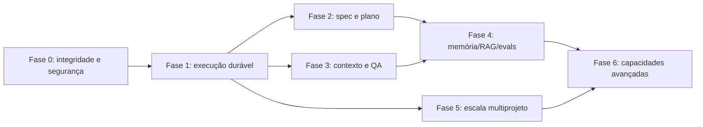

# Roadmap arquitetural proposto para a Bruna

Data de corte: 2026-07-30. O roadmap é uma proposta de auditoria, não um compromisso aprovado.

## Dependências

## Fase 0 — Integridade e contenção

Objetivo: remover riscos de perda, falsa conclusão, efeito não autorizado e segredo persistido.

- materialização via outbox/upsert/marker final;
- merge intent + lease por repo + reconciliação mínima;
- `SandboxActive` derivado de realidade; negar critical tools sem sandbox;
- sanitizer pré-persistência;
- corrigir latest-N e leitura de notas;
- tornar status “planejamento pendente/falhou” explícito.

Critérios de saída:

- fault injection em todos os pontos do plan materializer sem gap;
- dois processos não integram simultaneamente o mesmo repo;
- canary secret ausente em todos os stores/logs;
- teste de escape filesystem/network negado;
- nenhum turno aparece “completo” com materialização pendente invisível.

## Fase 1 — Workflow durável do core

Objetivo: saber sempre a próxima ação e retomar sem duplicar efeitos.

- modelar state machine Chief→plan→dispatch→review→merge;
- conectar checkpoints existentes ou consolidá-los;
- heartbeat/renew de turno Chief;
- effect IDs/idempotency para providers/Git/channels;
- DLQ, retry policy e intervenção humana;
- reconciliador paginado para todos tenants;
- matriz E2E SQLite/Postgres, SIGKILL, rede e DB outage.

Critérios de saída:

- restart retoma do checkpoint lógico, não apenas recomeça;
- cada efeito tem owner/lease/fencing/idempotency;
- zero attempt fantasma após reconciliação;
- operação mostra estado, próxima ação e razão do bloqueio.

## Fase 2 — Intenção, especificação e plano

Objetivo: impedir perda/alucinação de requisito e permitir mudança controlada.

- parsers sandboxed para PDF, DOCX, XLSX e OCR;
- `ProjectSpecification` versionada;
- fato/inferência/pergunta/decisão com provenance;
- confirmação humana por risco e “decida você” registrado;
- DAG versionada com coverage, cycle/orphan/vagueness validators;
- change impact/replan e trace requirement→card→test.

Critérios de saída:

- corpus de intake prova extração e rejeição segura;
- 100% dos cards têm requisito, critério e evidence type;
- mudança de requisito lista cards/tests afetados;
- nenhum implementation card passa antes das obrigações arquiteturais aplicáveis.

## Fase 3 — Contexto, tools e qualidade

Objetivo: contextos reproduzíveis e conclusão baseada em prova.

- effective agent configuration única;
- context envelope versionado/replay;
- tool broker por call com role profiles;
- collectors reais de build/test/lint/a11y/security;
- critic read-only com diff incremental e evidências;
- LLM judge apenas advisory e calibrado;
- OpenTelemetry para model/retrieval/tool/workflow com redaction.

Como referência de atributos de GenAI, usar as convenções oficiais do [OpenTelemetry](https://opentelemetry.io/docs/specs/semconv/registry/attributes/gen-ai/) sem acoplar o domínio a uma versão experimental.

Critérios de saída:

- replay reconstrói hash do envelope;
- merge sem evidence exigida é impossível;
- tool call sem capability é negada/auditada;
- dashboards exibem custo, latência, retries, blocked time e qualidade por projeto/agente/modelo.

## Fase 4 — Memória, RAG e avaliação

Objetivo: aprender operacionalmente sem transformar alucinação em verdade.

- episódios curados com provenance, validade, TTL, tombstone e tenant;
- candidates promovidos passam a uma policy/memory versionada e consumida;
- extração/chunk/index update/delete;
- benchmark de retrieval e resposta;
- embedding/pgvector somente se benchmark/volume justificar;
- evals de planejamento, completion, recovery, injection e reviewer;
- experimentos controlados de routing/custo.

Critérios de saída:

- memória não aprovada nunca entra em contexto;
- delete/tombstone remove recuperação;
- cross-tenant retrieval = zero;
- ganho de qualidade versus no-memory/no-RAG medido e custo limitado;
- rollback de prompt/memory/model version comprovado.

## Fase 5 — Escala multiprojeto

Objetivo: operar vários projetos/tenants com fairness e isolamento.

- scheduler paginado weighted-fair;
- quota/reserva por tenant/project/provider;
- backpressure e admission control;
- state/locks cluster-wide;
- cleanup de worktree/branch/processo órfão;
- capacity planning e SLOs;
- pause/archive/close formal e direito ao esquecimento.

Critérios de saída:

- carga concorrente não produz starvation;
- um projeto não excede sua quota nem consome reserva alheia;
- failover de Host não duplica dispatch/merge;
- isolamento de filesystem, logs, secrets, RAG e DB passa teste adversarial.

## Fase 6 — Capacidades avançadas condicionais

- MCP host/client conforme especificação, se interoperabilidade justificar;
- roteamento semântico por desempenho;
- hierarquia de supervisores para programas grandes;
- knowledge graph/GraphRAG se consultas relacionais comprovarem lacuna;
- consenso multi-modelo para decisões raras e críticas;
- prompt caching e otimização de contexto.

Critério de entrada: fases anteriores com métricas estáveis e problema mensurado. Critério de saída: benefício estatisticamente demonstrado e rollback.

## Métricas de programa

| Métrica | Baseline necessária | Alvo antes de declarar maturidade 4 |
|---|---|---|
| recovery success | crash matrix atual | ≥99% sem intervenção nos casos recuperáveis |
| duplicate effects | instrumentar effect IDs | 0 não conciliados |
| requirement coverage | criar spec trace | 100% cards/tests rastreados |
| false completion | golden projects | <1%, nenhum crítico |
| merge divergence | reconciliador | 0 aberto além do SLO |
| retrieval quality | dataset | threshold por domínio |
| review defect recall | golden diffs | threshold calibrado por tier |
| cross-tenant leakage | adversarial suite | 0 |
| starvation | load test | 0 além do SLO |
| cost/project | model/tool accounting | orçamento e alerta por projeto |

## Regra de avanço

Não habilitar autonomia ampla apenas porque um componente isolado passa testes. Cada fase exige prova no caminho real da Bruna, incluindo falhas, dois processos e efeitos externos.
