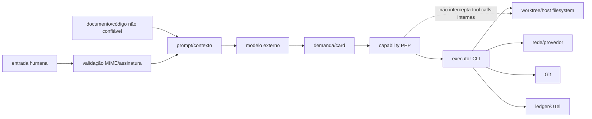

# Segurança do sistema multiagente da Bruna

Data de corte: 2026-07-30.

## Modelo de confiança observado

## Controles comprovados

- `SecurityPolicyEnforcementPoint` emite capabilities ligadas a tenant/project/card/attempt/fencing/tool/path, audita allow/deny e revoga.
- Workspace store aplica lease, fencing e conflito de scope declarado.
- Worktrees reduzem colisão e mantêm alterações fora da branch base durante execução.
- Policy de anexos valida allowlist, tamanho, assinatura, ZIP traversal/compression ratio e extensões.
- Ambientes de processos externos são limpos/reconstruídos por allowlist; prompt passa por stdin; output é redigido; árvore de processos é encerrada no timeout.
- Secret references e permissões de arquivos locais evitam colocar credenciais diretamente em configuração versionada.
- Postgres aplica RLS em tabelas relevantes.
- Bruna/Chief não recebe ferramentas de execução direta; ela delega.
- Ator e crítico usam aliases distintos.

## Lacunas críticas

### Enforcement da ferramenta não acompanha o efeito

`AgentRunOrchestrator.AuthorizeExecutionAsync` emite, verifica e revoga uma capability para o **binário executor** antes de iniciá-lo. Chamadas de Bash, leitura, rede, package manager ou ferramentas internas feitas pelo CLI não passam novamente pelo PEP. O framework tipado de `IToolExecutor` não possui uso produtivo que intercepte o CLI.

`AuthorizeRequiredToolsAsync` informa `SandboxActive: true` de forma fixa, mesmo quando `IsolatedExecution.Mode=Disabled`. Isso permite que uma política acredite existir sandbox inexistente. Claude Code usa modo `acceptEdits`; a worktree define o cwd, não uma fronteira de filesystem/rede. Codex possui sandbox próprio, mas a garantia varia por executor.

**Severidade: crítica.** Um agente ou indirect prompt injection pode executar efeitos no host fora do scope que o control plane pensa ter autorizado.

### Dados e instruções não são separados tecnicamente

O prompt instrui a tratar conteúdo como dado. Não há parser/classificador de prompt injection, labels de trust por segmento, quarantine, policy de origem ou approval antes de ações derivadas de documentos/repo. README/código/documento malicioso chega ao modelo no mesmo canal semântico.

**Severidade: alta.**

### Auditoria não redige centralmente

Process output e alguns exporters têm redaction, mas o audit store serializa `Detail` recebido sem sanitizer central. O teste de integração demonstra que um detalhe bruto pode existir internamente e só ser redigido na exportação.

**Severidade: alta.** Segredo pode persistir em ledger/DB/backups.

## Registro de ameaças

| Ameaça | Controle | Lacuna | Severidade |
|---|---|---|---|
| prompt injection direta | schema, persona, discipline validator | intenção maliciosa ainda pode virar demanda | Alto |
| indirect injection em docs/código | aviso no prompt | sem trust boundary/enforcement | Alto |
| tool poisoning | catálogo/PEP nominal | schema/resultados do CLI não validados por call | Crítico |
| context poisoning | citações/hash | inferência não rotulada; stale memory | Alto |
| memory poisoning | promoção humana de candidates | mensagens/demandas falsas já persistem e realimentam status | Alto |
| exfiltração | env allowlist/redaction | CLI pode acessar filesystem/rede conforme executor | Crítico |
| cross-project leak | tenant/project, RLS, roots | availability global e processo compartilhado | Alto |
| segredo em Git/log | rules, secret refs, redaction | audit detail sem redaction central; agent pode commit | Alto |
| comando destrutivo | PEP/capability, prompt | tool interna não interceptada | Crítico |
| alteração de regras | Git/governance checksum | agente com escrita pode modificar docs; gate posterior não obrigatório | Alto |
| escalação | role/tool catalogs | executor autônomo herdando host permissions | Alto |
| dependência maliciosa | review/code graph | sem SCA/SBOM obrigatório | Alto |
| código inseguro | critic | sem SAST/DAST obrigatório | Alto |
| MCP malicioso | nenhum MCP runtime | risco futuro; catálogo “enabled” pode induzir falsa confiança | Médio |
| documento malicioso | MIME/zip validation | sem malware/OCR sandbox; conteúdo texto não sanitizado | Alto |
| próprio guardrail alterado | checksum de governance | fallback embutido e merge local podem criar drift | Alto |

## MCP

Há tabela, stores, seed e endpoints para catálogo `mcp_servers`. Não foi encontrado cliente JSON-RPC, negociação de capabilities, transports stdio/HTTP, lifecycle, resource/prompt/tool discovery, sessão, auth ou dispatcher MCP. Portanto:

- uso de MCP: **parcial, catálogo/protótipo somente**;
- descoberta dinâmica: não;
- tools reais: integrações fixas/adaptadores externos;
- allowlist por agente: catálogo/policy próprio, não MCP;
- timeouts/auditoria: no process runner, não no protocolo MCP;
- rollback/idempotência de tool effects: não geral.

A especificação oficial descreve hosts, clients e servers com negociação e isolamento de segurança na [arquitetura MCP](https://modelcontextprotocol.io/specification/2025-06-18/architecture), além de autorização HTTP própria na [especificação de authorization](https://modelcontextprotocol.io/specification/2025-06-18/basic/authorization). O CRUD observado não satisfaz esses requisitos.

## Segredos, criptografia e isolamento

- Segredos usam referências e materialização local/ambiente; regras proíbem exposição.
- Redaction existe em output/telemetria/export.
- Não foi comprovada criptografia de aplicação para mensagens, prompts, artifacts ou ledger em repouso; depende do storage/OS.
- Rotação está vinculada ao provedor/secret store, não há prova end-to-end na Bruna.
- Diretório controlado e worktrees existem; não são sandbox OS quando modo isolado está desligado.
- Não há aprovação humana universal para package install, network POST ou comandos destrutivos internos ao CLI.

## Critérios de segurança necessários

1. `SandboxActive` deve ser derivado de attestation real, nunca hardcoded.
2. Todo efeito deve passar por broker de ferramentas tipado com capability por chamada, argumentos normalizados, timeout, output limit e audit redigido.
3. Perfis por papel: read-only critic; ator sem rede por padrão; allowlist de domínios/comandos quando necessária.
4. Segmentos de contexto devem carregar `trust`, `origin`, `version`, `instruction=false`; conteúdo não confiável deve ser delimitado e ações de alto risco exigirem confirmação.
5. Scanner central pré-persistência para ledger, receipts, model output e artifacts.
6. Suite de adversarial evals para indirect injection, exfiltração, path escape, poisoned tools e cross-tenant.
7. Merge bloqueado por secret scanning, SAST/SCA conforme risco e prova de testes.

## Classificação

**Segurança do core multiagente: 2/5.** A plataforma tem políticas e controles de borda substanciais, mas a fronteira decisiva — efeitos produzidos dentro do executor autônomo — não está mediada de forma uniforme e a flag de sandbox pode declarar proteção inexistente.

Durante o gate final, `npm audit` também reportou duas ocorrências de severidade alta no `react-router` (advisory `GHSA-qwww-vcr4-c8h2`). O gate não falhou e a aplicabilidade ao modo usado pela aplicação não foi demonstrada nesta auditoria; por isso o achado não foi contado como risco do core sem uma análise de explorabilidade, mas deve ser triado pelo owner do frontend.
