# 01 — O fluxo end-to-end REAL

> Auditoria macro do Poseidon — 2026-08-03. Branch `develop`, HEAD `520dd71e`.
> Cada afirmação aqui foi verificada em **código, banco ou log**. Onde só existe documento,
> está escrito `DOCUMENTADO (não verificado)`.

---

## Legenda de estados de maturidade

| Estado | Significa |
|---|---|
| **DOC** | Existe documento afirmando o comportamento |
| **IMPL** | Existe código que implementa |
| **TEST** | Existe teste automatizado que exercita |
| **E2E** | Aconteceu de verdade, com id rastreável, num projeto real |

Estes estados **não são equivalentes**, e a maior parte dos achados desta auditoria vive
exatamente na distância entre `TEST` e `E2E`.

---

## O fluxo, como ele realmente acontece

```mermaid
flowchart TD
    U([Humano escreve no chat]) --> CTB[ChiefTurnBackgroundService<br/>fila durável chief_turn_mailbox]
    CTB --> CCE[ConversationChiefAgentExecutor<br/>monta prompt e chama a CLI]
    CCE --> CLI[[claude -p --output-format stream-json<br/>conta chief-claude-primary]]
    CLI --> SCHEMA{ChiefTurnOutput<br/>schema JSON obrigatório}
    SCHEMA -->|inválido| REPAIR[1 tentativa de reparo<br/>na mesma sessão]
    REPAIR --> UNMATCHED[degrada para 'unmatched':<br/>responde, mas não age]
    SCHEMA -->|válido| INTENT{ChiefIntentGate<br/>o que este turno PODE fazer}

    INTENT --> DEMANDA[(solicitations / demands)]
    DEMANDA --> PLANMAT[DemandPlanMaterializer<br/>+ PlanMaterializationService]
    PLANMAT --> CARDS[(work_tasks — cards<br/>nascem em 'backlog')]

    CARDS --> DOR{CardReadinessEvaluator<br/>DoR determinística}
    DOR -->|reprova| CARDS
    DOR -->|aprova + dependências entregues| READY[card 'ready']

    READY --> LOOP[ChiefBacklogLoopService<br/>ciclo a cada 10s]
    LOOP --> POL[ChiefBacklogPolicy<br/>ordena, limita, adia]
    POL --> SCHED{AgentAccountScheduler<br/>9 filtros fail-closed}
    SCHED -->|scheduler.no_eligible_account| DEFER[adiado com reason code]
    DEFER --> LOOP
    SCHED --> ROUTE[ProviderRoutingCoordinator<br/>escolhe modelo]
    ROUTE --> ORCH[AgentRunOrchestrator]

    ORCH --> PATH{AgentPathScopePolicy<br/>claim dentro do papel?}
    PATH -->|não| REJ[Rejected/agent_path_scope_denied]
    ORCH --> TOOLS{SecurityPolicyEnforcementPoint<br/>allowlist da persona}
    TOOLS --> WT[Git worktree isolada<br/>branch task/agent-run-attemptId]
    WT --> EXEC[[CLI do executor externo]]

    EXEC --> CLASS[AgentRunOutcomeClassifier<br/>ExternalFailureKind tipado]
    CLASS -->|Quota/Auth/Transient| LOOP
    CLASS -->|entregou| AWAIT[card 'awaiting_review']

    AWAIT --> CRITIC{SelectCriticAliases<br/>conta critic ≠ produtora}
    CRITIC -->|vazio| ESC[critic.none_available<br/>4 adiamentos → ESCALADO]
    CRITIC --> REVIEW[Crítico read-only<br/>--tools sem Edit/Write/Bash]
    REVIEW -->|reprova| CORR[instrução corretiva → ready]
    REVIEW -->|aprova| DONE[card 'done'/'merged']

    DONE --> DRIVER[WorkflowPhaseDriver]
    DRIVER --> OBJ[(workflow_objective_runs<br/>document → validated)]
    OBJ --> GATE{PhaseGatePolicy<br/>Default-FAIL + modo do projeto}
    GATE -->|fase 4| COUNCIL[AgentCouncilPolicy<br/>Conselho de Agentes]
    COUNCIL --> GATE
    GATE -->|ChiefApproves| NEXT[próxima fase]
    GATE -->|AwaitHuman| HUMAN([decisão do dono])

    classDef prob fill:#4c1d95,stroke:#a78bfa,color:#fff
    classDef det fill:#0f766e,stroke:#5eead4,color:#fff
    classDef dado fill:#1e293b,stroke:#64748b,color:#e2e8f0
    classDef bad fill:#7f1d1d,stroke:#fca5a5,color:#fff
    class CCE,CLI,EXEC,REVIEW,COUNCIL prob
    class DOR,SCHED,PATH,TOOLS,CLASS,GATE,INTENT,POL det
    class CARDS,DEMANDA,OBJ,WT dado
    class ESC,REJ,UNMATCHED bad
```



---

## Cada seta, respondida

### 1. HUMANO → INTAKE

| Pergunta | Resposta |
|---|---|
| Quem dispara | O usuário, escrevendo numa conversa (`conversations` / `conversation_messages`), ou um canal externo (Telegram/e-mail/Teams/WhatsApp) |
| Quem decide | Ninguém ainda — a mensagem vira uma linha na fila durável `chief_turn_mailbox` |
| Código | `src/Harness.Host/Workers/ChiefTurnBackgroundService.cs`, `src/Harness.Host/Conversations/*ChannelService.cs` |
| Estado | SQLite: `conversations`, `conversation_messages`, `chief_turn_mailbox`, `chat_turns` |
| Natureza | **Determinística** |
| Configuração | `Harness__Channels__Telegram__BotToken` (env, do Keychain) |
| Falha possível | Canal sem token → o poller não sobe |
| Evidência | `chat_turns`, `chief_turn_blocks`, `chief_turn_intents` |
| Maturidade | IMPL + TEST + **E2E** (a prova limpa nasceu por esse caminho) |

### 2. INTAKE → BRUNA

| Pergunta | Resposta |
|---|---|
| Quem dispara | `ChiefTurnBackgroundService` desenfileira |
| Quem decide | `ConversationChiefAgentExecutor.ResolveChiefAccount()` escolhe a conta |
| Código | `src/Modules/Harness.Modules.Agents/Infrastructure/Conversation/ConversationChiefAgentExecutor.cs` |
| Natureza | **Probabilística** (é a chamada ao modelo), com envelope determinístico |
| Configuração | `~/.harness/agent-accounts.json` — papel `chief-orchestrator` |
| Falha possível | Nenhuma conta com o papel → `AgentExecutorUnavailableException` (falha honesta, nunca texto fabricado) |
| Recuperação | **NENHUMA** — ver [07-SCHEDULER-COTAS-E-FAILOVER](07-SCHEDULER-COTAS-E-FAILOVER.md), achado `F-01` |
| Evidência | `model_invocations` com `account_alias` |
| Maturidade | IMPL + TEST + **E2E** |

### 3. BRUNA → PLAYBOOK / PLANO

A Bruna **não escolhe** a sequência de passos. Ela classifica o turno (`intent`) e o resto é tabela:

- `ChiefIntentGate` (`src/Modules/Harness.Modules.Agents/Application/Execution/ChiefIntentGate.cs`)
  decide o que aquele `intent` tem permissão de fazer;
- `WorkflowTemplateSeeder` semeia as 9 fases a partir de `CanonicalWorkflowTemplates.PlaybookStandard()`;
- `ProjectWorkflowLinker` / `ProjectWorkflowConvergenceSeeder` ligam o projeto ao template.

O playbook é **código C# compilado**, não arquivo de configuração — ver
[04-PLAYBOOK-E-GATES](04-PLAYBOOK-E-GATES.md).

**Maturidade:** IMPL + TEST + **E2E** (fases 1→4 ativadas por id em `workflow_phase_runs`).

### 4. PLANO → CARDS

| Item | Valor |
|---|---|
| Código | `src/Harness.Host/WorkBoard/DemandPlanMaterializer.cs`, `PlanMaterializationService.cs`, `PlanMaterializationReconciliationBackgroundService.cs` |
| Estado | `work_tasks` (nascem em `board_state='backlog'`) |
| Natureza | Determinística — com um compromisso durável e reconciliador (o plano materializa mesmo se o Host cair no meio) |
| Evidência | 36 cards no projeto de prova (`01KZ24JCFRHN2RGP8NHGP75JMK`): 30 `completed/done`, 6 `escalated/blocked` |
| Maturidade | IMPL + TEST + **E2E** |

### 5. CARDS → PROFISSIONAIS (despacho)

Este é o coração e está detalhado em [07-SCHEDULER-COTAS-E-FAILOVER](07-SCHEDULER-COTAS-E-FAILOVER.md).
Resumo da cadeia real:

```
ChiefBacklogLoopService (10s)
  → ChiefCardResolver.Resolve(título, instrução)  → papel lógico + persona + scope claims
  → ChiefBacklogPolicy                            → ordem, teto de concorrência, adiamentos
  → AgentAccountScheduler.Select()                → 9 filtros, devolve alias + reason code
  → ProviderRoutingCoordinator.RouteAndAuditAsync → modelo
  → ChiefTeamManager/EnsureProjectAgentAsync      → instancia o "profissional" (linha em `agents`)
  → AgentRunOrchestrator.StartAsync               → path scope, tool policy, worktree, CLI
```

**Maturidade:** IMPL + TEST + **E2E**.

### 6. EXECUÇÃO

| Item | Valor |
|---|---|
| Isolamento | Uma **git worktree por tentativa**, em `<ControlledRoot>/worktrees/<attemptId>`, branch `task/agent-run-<attemptid>` |
| Contenção | `Harness__IsolatedExecution__Mode=Disabled` **nesta instalação** (decisão do dono em 03/08: o contêiner cegava a frota porque o Keychain do macOS não existe lá dentro) |
| Ferramentas | `SecurityPolicyEnforcementPoint` + allowlist da persona; o crítico roda com `--tools` sem `Edit/Write/Bash` |
| Estado | `work_attempts`, `attempt_workspaces` (com `last_heartbeat_at`), `attempt_events`, `attempt_scope_claims` |
| Natureza | **Probabilística** dentro de um envelope determinístico |
| Maturidade | IMPL + TEST + **E2E** |

### 7. CLASSIFICAÇÃO DE FALHA

| Item | Valor |
|---|---|
| Código | `ExternalFailureKind` (enum fechado), `AgentRunOutcomeClassifier` |
| Tipos | `QuotaExhausted`, `AuthenticationRequired`, `AccountModelUnsupported`, `Transient`, `Cancelled`, `Timeout`, `Permanent`, `Unknown` |
| Quem declara | O **adaptador do fornecedor** — quem conhece as frases da CLI |
| Estado atual | **PARCIAL.** Claude Code e Codex declaram o tipo. **Antigravity e GLM não** — caem em `Unknown` e voltam à heurística de substring legada. Ver achado `F-06`. |
| Maturidade | IMPL + TEST + E2E parcial (provado ao vivo para Claude Code em 13:18Z de 03/08) |

### 8. REVIEW

Ver [08-CONSELHO-DE-AGENTES](08-CONSELHO-DE-AGENTES.md) e achados `F-02`/`F-03`.
A regra em código: o crítico é uma **conta diferente** da que produziu — invariante do scheduler
(`account.actor_cannot_be_critic`) e do agregado de domínio (`WorkChainErrors.IndependentReviewerRequired`).

**Maturidade:** IMPL + TEST + **E2E** (29 cards revisados por par distinto), com **defeito ativo**
quando o elenco de críticos fica com uma conta só.

### 9. GATES → FASE

| Item | Valor |
|---|---|
| Código | `src/Modules/Harness.Modules.Workflows/Application/PhaseGatePolicy.cs`, `src/Harness.Host/Workflows/WorkflowPhaseDriver.cs` |
| Regra | `Default-FAIL` — sem evidência, reprova. **Default-FAIL ≠ humano obrigatório**: quem decide, havendo evidência, é o modo do projeto (`Autonomous` / `SemiAutonomous` / `Manual`) |
| Estado | `workflow_phase_runs`, `workflow_objective_runs`, `workflow_gate_runs`, `phase_obligations` |
| Natureza | **Determinística** |
| Evidência medida | Fase 4 da prova limpa: 3 documentos `validated`, gate `pending` |
| Maturidade | IMPL + TEST + **E2E até a fase 4** |

### 10. DESENVOLVIMENTO → TESTES → HOMOLOGAÇÃO → RELEASE → SUSTENTAÇÃO

**Maturidade: IMPL + TEST, E2E = NÃO.**

Medido no banco em 2026-08-03:

```
phase_order  name               state
1            1-Triagem          completed
2            2-Descoberta       completed
3            3-Arquitetura      completed
4            4-Planejamento     active     ← travada no Conselho
5            5-Desenvolvimento  pending
6            6-Testes           pending
7            7-Homologação      pending
8            8-Release          pending
9            9-Sustentação      pending
```

**Nenhuma linha de código de produto foi escrita pela frota ainda.** O repositório do projeto de
prova tem apenas `docs/`. A fase 5 é o primeiro teste real de escrita de código — e ela nunca foi
alcançada. Este é o fato mais importante desta auditoria.

---

## Tabela-resumo do fluxo

| Etapa | Natureza | Quem decide | Maturidade |
|---|---|---|---|
| Interpretar o pedido | Probabilística | Modelo (Bruna) | E2E |
| Classificar o turno (`intent`) | Probabilística → validada por schema | Modelo + `ChiefIntentGate` | E2E |
| Materializar plano em cards | Determinística | `PlanMaterializationService` | E2E |
| Aprovar card (DoR) | Determinística | `CardReadinessEvaluator` | E2E |
| Escolher a conta | Determinística | `AgentAccountScheduler` | E2E |
| Escolher o modelo | Determinística | `ProviderRoutingCoordinator` | E2E (mas ver `F-05`) |
| Autorizar path e ferramentas | Determinística | `AgentPathScopePolicy`, `SecurityPolicyEnforcementPoint` | E2E |
| Produzir o trabalho | Probabilística | Modelo (especialista) | E2E |
| Classificar a falha | Determinística | Adaptador do fornecedor | PARCIAL |
| Julgar a qualidade | Probabilística | Modelo (crítico distinto) | E2E |
| Fechar a fase | Determinística | `PhaseGatePolicy` | E2E até fase 4 |
| Fechar o projeto | Determinística | `CompletionGate` | Não exercitado |

> A afirmação de venda — *"o modelo opina, o código decide"* — **se sustenta na leitura do código**.
> Todas as transições de estado relevantes passam por regra determinística. O que **não** se
> sustenta ainda é a cobertura: metade da esteira nunca rodou.
