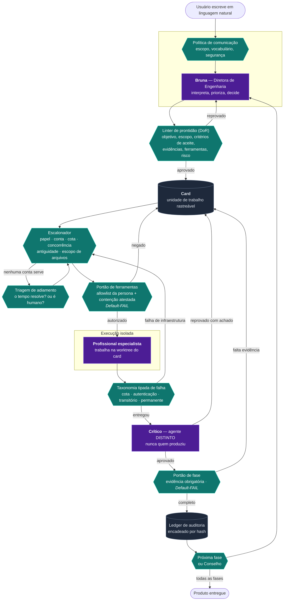
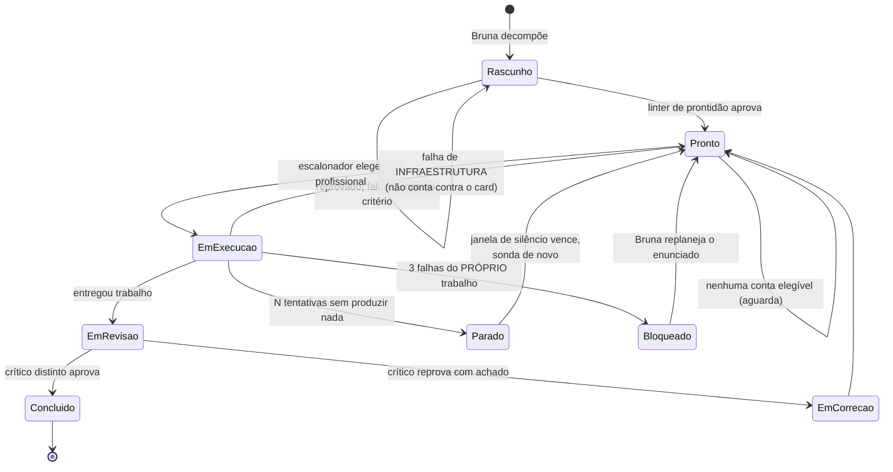
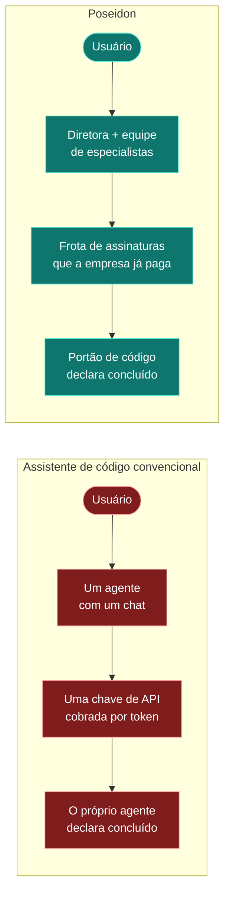

# Poseidon — o fluxo do núcleo

> Como um pedido em linguagem natural vira software entregue, e **quem decide o quê** ao longo do caminho.

---

## A ideia em uma frase

A maioria dos assistentes de código é **um agente com um chat**. O Poseidon é uma **empresa de engenharia**: uma diretora que recebe o pedido, decompõe em trabalho, contrata profissionais, exige revisão por um segundo par de olhos e só declara pronto quando um **portão de código** — não o julgamento de um modelo — autoriza.

A consequência prática, e é ela que se vende: **o modelo nunca é a autoridade final sobre o próprio trabalho.**

---

## O fluxo completo

**Roxo = probabilístico (modelo de IA) · Verde = determinístico (código) · Cinza = estado durável**

---

## Quem decide o quê

Esta é a tabela que responde a pergunta mais importante que um comprador técnico faz — *"e quando a IA errar?"*

| Etapa | Natureza | Quem decide |
|---|---|---|
| Interpretar o pedido do usuário | **Probabilística** | Modelo (Bruna) |
| Validar o que ela pode dizer e fazer | Determinística | Código — política de comunicação |
| Aprovar um card para execução | Determinística | Código — linter de prontidão |
| Escolher qual profissional executa | Determinística | Código — escalonador por papel, cota, antiguidade |
| Autorizar ferramentas e contenção | Determinística | Código — *Default-FAIL* |
| Produzir o trabalho | **Probabilística** | Modelo (especialista) |
| Classificar por que algo falhou | Determinística | Código — adaptador tipado por fornecedor |
| Julgar a qualidade do trabalho | **Probabilística** | Modelo (crítico distinto) |
| Decidir se a fase pode fechar | Determinística | Código — portão com evidência |
| Decidir se o projeto terminou | Determinística | Código — portão de conclusão |
| Manter a fábrica viva | Script | Supervisor + launcher |

> **O ponto de venda:** o modelo opina, propõe e produz. **O código decide.** Toda transição de estado que importa passa por uma regra determinística, auditável e testada.

---

## O ciclo de vida de um card

**A distinção que quase ninguém faz:** falhar por cota do fornecedor e falhar por trabalho ruim são coisas diferentes. O Poseidon separa as duas — a primeira devolve o card à fila sem puni-lo; só a segunda abre o circuito e exige replanejamento.

---

## As perguntas que este tipo de sistema precisa responder

| Pergunta | Resposta do Poseidon |
|---|---|
| *Quem garante que a IA não aprova o próprio trabalho?* | Invariante de código: o crítico é sempre uma conta **diferente** da que produziu. Não é convenção — é recusado no despacho. |
| *E se o modelo disser que fez algo e não tiver feito?* | Afirmação de efeito exige **efeito durável correspondente**. Sem o registro, a fala é recusada. |
| *Como sei que terminou de verdade?* | Um portão de conclusão em código avalia eixos objetivos. O modelo **não pode** declarar conclusão. |
| *E quando o fornecedor de IA cair ou acabar a cota?* | O adaptador traduz para tipo (`cota`, `autenticação`, `transitório`), o sistema lê o horário de reset declarado, espera e reelege sozinho. Cota nunca vira problema do usuário. |
| *O que impede um agente de mexer onde não deve?* | Cada card carrega escopo de arquivos; a execução acontece em *worktree* isolada; ferramentas passam por allowlist da persona. |
| *Como eu audito o que aconteceu?* | Ledger encadeado por hash, evidência por card, e cada decisão registra o motivo tipado. |
| *E se travar e ninguém perceber?* | Vigia determinístico compara o tempo sem entrega contra a **mediana histórica do próprio projeto** e faz a Bruna avisar. |

---

## Diferença para os concorrentes

Os três eixos que sustentam a diferença:

**1. Economia.** O concorrente consome API cobrada por token. O Poseidon orquestra **as assinaturas que a empresa já paga** — e sabe eleger entre várias contas, respeitando cota e janela de cada uma.

**2. Governança.** O concorrente entrega um agente produtivo e confiável *na média*. O Poseidon entrega **processo**: card com critério de aceite, revisão por par distinto, portão com evidência, trilha auditável. É a diferença entre um desenvolvedor talentoso e um departamento com controles.

**3. Autoridade.** O concorrente pergunta ao modelo se terminou. O Poseidon pergunta ao **código**. Isso não é detalhe filosófico: é o que impede um relatório final otimista sobre um trabalho incompleto.

---

## Nota de honestidade para a apresentação

*Revisada em 2026-08-03 pela auditoria macro, com os números medidos no banco. Ver
`00-RESUMO-EXECUTIVO.md`.*

Este documento descreve o **núcleo que existe e roda**. Para não haver surpresa numa pergunta do cliente:

- O fluxo das fases está exercitado de ponta a ponta até o **Planejamento** (fases 1 a 3 fechadas; a 4 com os documentos prontos). As fases de construção e entrega estão **implementadas e cobertas por testes, e ainda não foram executadas** — nenhuma linha de código de produto foi escrita pela frota até agora. Se a pergunta vier, esta é a resposta.
- A frota multi-conta, os portões, o ledger, a taxonomia de falha e o vigia estão em produção e cobertos por testes automatizados. A **reeleição automática por cota** foi provada em produção para Claude Code e Codex; o adaptador da Antigravity ainda não classifica falha por tipo.
- Índice semântico e memória vetorial estão **arquitetados e integrados**, com uso ainda incipiente — 13 documentos indexados. A recuperação estruturada é que sustenta o trabalho hoje, e isso é escolha de projeto, não lacuna.
- A garantia que sustenta o discurso — **o modelo não declara o próprio trabalho pronto** — foi auditada nos três níveis (card, fase e projeto) e **nenhuma brecha foi encontrada**.
- Um ponto aberto, dito antes que o cliente pergunte: a **diretora depende hoje de uma única conta**. Se a assinatura dela esgota, a operação para. O mecanismo de múltiplas contas por papel existe; a direção ainda não o usa.
