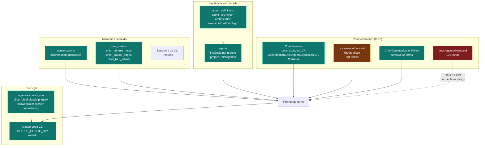

# 02 — Bruna: o que ela é, de verdade

> **A pergunta que motivou esta seção:** Bruna é uma persona lógica ou está acoplada
> fisicamente à conta principal do Claude?
>
> **Resposta curta: ela é uma persona lógica, mas o acoplamento à conta é real — e ele não
> está no conceito de persona, está no `agent-accounts.json` e na resolução da conta do Chefe.**

---

## 1. O modelo real de "Bruna"

Bruna **não é uma entidade única**. Ela é a soma de cinco coisas que vivem em lugares diferentes,
e nenhuma delas se chama "Bruna" no banco:



### Tabela: onde cada parte da Bruna vive

| Componente | Onde | É consumido em runtime? |
|---|---|---|
| Nome, tom, princípios | `ConversationChiefAgentExecutor.cs:672` (`const string ChiefPersona`) | **SIM** — recompilar é obrigatório para mudar |
| Governança | `governance/core.md` lido de `<ControlledRoot>/governance/core.md` | **NÃO nesta instalação** — ver achado `F-04` |
| Forma da resposta | `ChiefCommunicationPolicy.BuildInstructions()` | SIM |
| Papel/effort declarados | `agent_definitions` (`chief-orchestrator`, `default_effort='high'`) | Parcialmente — ver `F-05` |
| Instância por projeto | `agents` (`projects.chief_agent_id`) | SIM |
| Conta executora | `~/.harness/agent-accounts.json` → `chief-claude-primary` | SIM |
| Autonomia | `projects` → modo (`autonomous`/`semiautonomous`/`manual`) | SIM (`PhaseGatePolicy`) |
| Memória conversacional | `conversations`, `chief_states`, `chief_context_notes` + `SessionId` da CLI | SIM |
| **`docs/agents/bruna.md`** | Arquivo de 136 linhas, declarado no `governance/manifest.yaml` como `sourceOfTruth` | **NÃO** — nenhum código o abre |

> **`docs/agents/bruna.md` é DECORATIVO / NÃO CONSUMIDO.** Ele é a especificação de comportamento
> mais completa que existe (autonomia em classes A/B/C, a escada antes de escalar, política de
> espera), e **nada disso chega ao modelo**. O que chega são as 21 linhas do `const ChiefPersona`.
> Achado `F-04-B`.

---

## 2. A montagem REAL do prompt da Bruna

Ordem literal em `ConversationChiefAgentExecutor.BuildPrompt()` (linha 222):

| # | Bloco | Origem | Tamanho |
|---|---|---|---|
| 1 | `ChiefPersona` | const C# | ~21 linhas |
| 2 | Governança | `governance/core.md` **ou** `GovernanceFallback` | 104 linhas **ou 6** |
| 3 | Camada de comunicação | `ChiefCommunicationPolicy.BuildInstructions(contexto, instruções)` | variável |
| 4 | Defesa contra prompt injection | literal | 6 linhas |
| 5 | **Contexto do projeto** (`StatusDigestJson`) — marcado como DADO | montado do banco | variável |
| 6 | **Catálogo de especialistas** — marcado como DADO | `agent_definitions` do tenant | variável |
| 7 | Mensagem do usuário | `conversation_messages` | variável |
| 8 | Instrução de classificação (`intent`) | literal | ~20 linhas |
| 9 | Schema JSON de saída obrigatório | `ChiefTurnOutputContract.JsonSchema` | variável |

**Precedência:** quem vem antes é AUTORIDADE (persona, governança, política); quem vem depois é
DADO explicitamente rotulado. A defesa contra injeção é textual e está posicionada **antes** de
qualquer conteúdo de repositório — o desenho está correto.

**Orçamento / truncation / compaction:** não há orçamento de tokens explícito neste caminho. O
turno de conversa é "leve": não passa por `ContextBundleBuilder` nem por RAG obrigatório. O que
limita o tamanho é o `StatusDigest`, que é montado por consulta e não por varredura. **Não existe
compactação de histórico**: a continuidade vem do `--resume <sessionId>` da CLI, ou seja, o
histórico é mantido **pelo Claude Code, fora do Poseidon**. Achado `F-08` (risco: a memória
conversacional da Bruna é propriedade do fornecedor, não do produto).

**Retrieval:** `IRagContextProvider` está injetado no `ChiefTurnBackgroundService` e no
`AgentRunOrchestrator`. Ver [09-CONTEXTO-MEMORIA-RAG](09-CONTEXTO-MEMORIA-RAG.md).

---

## 3. Contrato de saída

A resposta da Bruna **não é texto livre**. É um JSON validado contra `ChiefTurnOutputContract`.
Se não valida:

1. uma tentativa de reparo na mesma sessão;
2. se ainda falhar, aceita a saída **sem** o campo `intent` e marca o turno como `unmatched`
   (responde, mas **não tem permissão de agir**);
3. se nem isso, `AgentOutputValidationException` — falha honesta, nunca resposta fabricada.

Isto é um controle real e bem construído. **IMPL + TEST + E2E.**

---

## 4. O que a Bruna NÃO pode fazer (verificado em código)

| Restrição | Onde é imposta |
|---|---|
| Não escreve código/documento | Não tem worktree nem claim: o turno de conversa roda no caminho LEVE (`HostApplication.cs:570`) |
| Não aprova o próprio gate | `PhaseGatePolicy` avalia `PhaseGateEvidence` medida, não a fala dela |
| Não declara card/fase/projeto pronto por afirmação | Transições exigem mutação na `WorkChain` com evidência |
| Não amplia o próprio escopo | Turno de conversa é somente leitura, declarado no prompt e imposto pela ausência de claim |
| Não age fora do `intent` classificado | `ChiefIntentGate` |

---

## 5. Autonomia: o que está implementado

`ProjectOperationMode` = `Autonomous` | `SemiAutonomous` | `Manual`, com fallback conservador
(valor desconhecido → `Manual`). `PhaseGatePolicy` devolve `NotReady` / `ChiefApproves` /
`AwaitHuman`.

A decisão de arquitetura do dono (homologação de 2026-07-26) — *"Default-FAIL ≠ humano
obrigatório"* — **está implementada em código** e documentada no próprio comentário da classe.
**IMPL + TEST.** E2E parcial: as fases 1→3 fecharam sem clique humano, o que prova o caminho
`ChiefApproves`.

---

## 6. Criação dinâmica de profissionais

`ChiefTeamManager` (`src/Harness.Host/Agents/ChiefTeamManager.cs`) instancia agentes de projeto a
partir de `agent_definitions` (`EnsureProjectAgentAsync`) e sabe derivar rota (conta + modelo +
effort) e risco a partir da persona.

**O que existe:** instanciar um profissional a partir de uma definição de persona já catalogada,
por projeto, sob demanda. Isso é E2E — os 6 assentos do Conselho geraram 6 linhas em `agents`.

**O que NÃO existe:** a Bruna identificar uma competência ausente e **criar uma persona nova**
(com capabilities e ferramentas próprias) que não estivesse no catálogo. O catálogo é
`CanonicalAgentDefinitions.cs` — código compilado — semeado por
`BuiltInAgentDefinitionSeedHostedService`. Há endpoints de CRUD de `agent_definitions`
(`AgentEndpoints.cs`), então o caminho técnico existe; **não há evidência de que a Bruna o use**.

**Classificação:** `DOCUMENTADO + IMPL parcial`, **E2E = NÃO**. Achado `F-11`.

---

## 7. Achados desta seção

| ID | Severidade | Tipo | Título |
|---|---|---|---|
| `F-04` | **HIGH** | DEFECT + OBSERVABILITY GAP | A Bruna nunca recebe `governance/core.md`: o caminho lido é `<ControlledRoot>/governance/core.md` = `/Users/mateus/Documents/governance/core.md`, que **não existe**. Ela roda com o `GovernanceFallback` de 6 linhas, silenciosamente. |
| `F-04-B` | **MEDIUM** | TECH DEBT | `docs/agents/bruna.md` é declarado `sourceOfTruth` no manifesto de governança e não é consumido por código nenhum. |
| `F-08` | **MEDIUM** | ARCHITECTURAL RISK | A continuidade conversacional da Bruna depende do `SessionId` da CLI do fornecedor. Trocar de provedor perde o histórico do modelo (o histórico do produto, em `conversation_messages`, sobrevive). |
| `F-11` | **LOW** | FUTURE FEATURE | Criação dinâmica de persona nova pela Bruna: caminho existe, uso não comprovado. |

### Evidência de `F-04`

```
HostApplication.cs:583  new ConversationChiefExecutorOptions(Path.GetFullPath(agentRunSettings.ControlledRoot!))
~/.harness/poseidon.env  Harness__AgentRuns__ControlledRoot="/Users/mateus/Documents"
ConversationChiefAgentExecutor.cs:622  Path.Combine(_options.RepositoryRoot, "governance", "core.md")

$ ls /Users/mateus/Documents/governance/core.md
ls: No such file or directory

$ wc -l /Users/mateus/Documents/harness-poseidon-backend/governance/core.md
104
```

O `catch` cobre `IOException`/`UnauthorizedAccessException`, mas o caso real é `File.Exists == false`,
que **nem loga**. A degradação é invisível.
