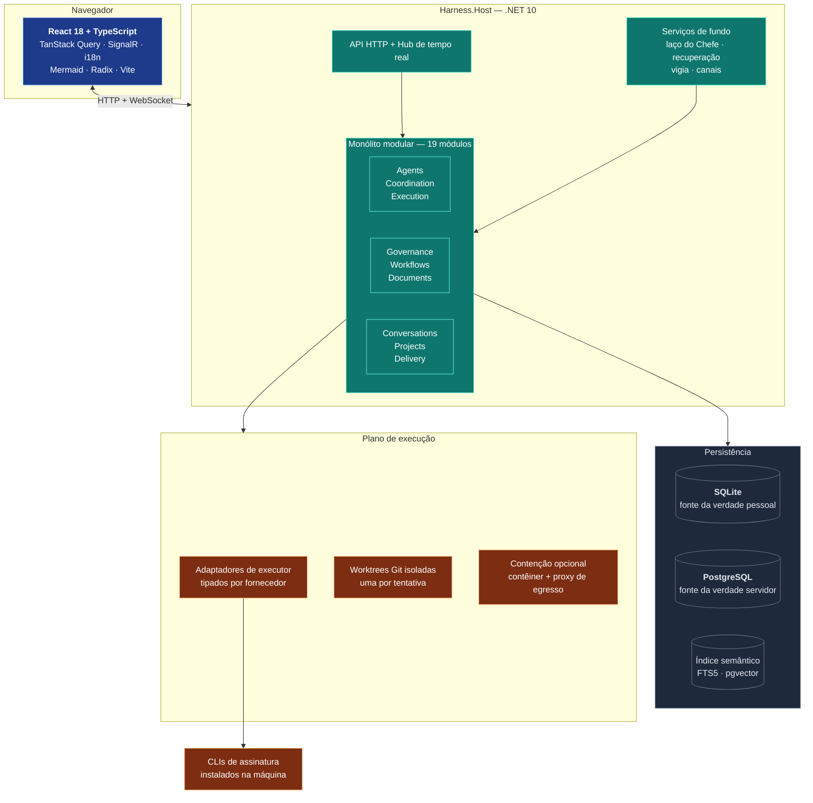
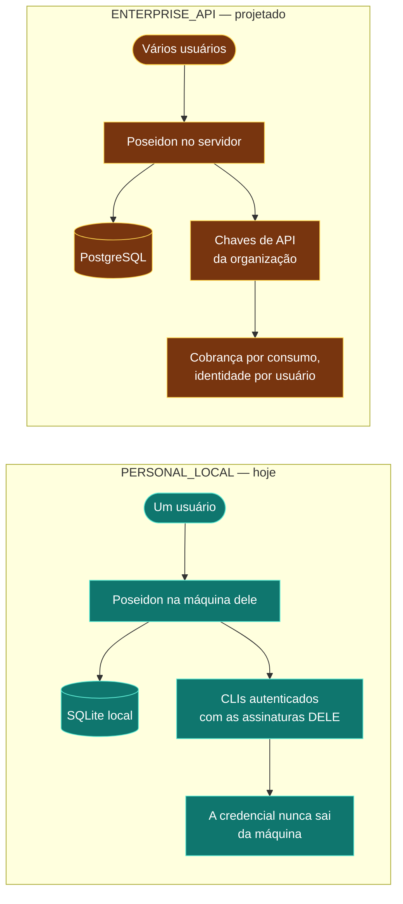
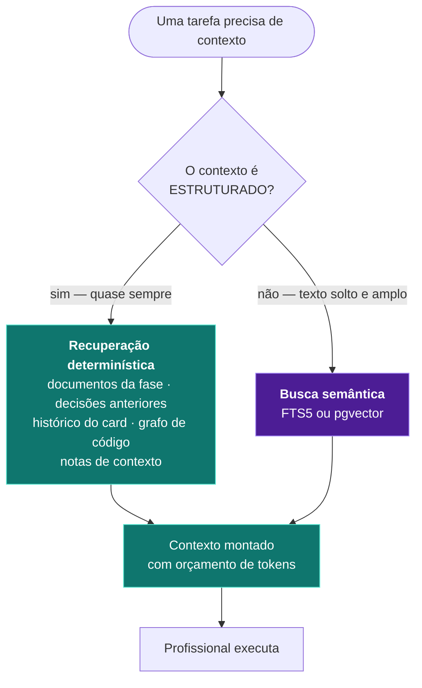
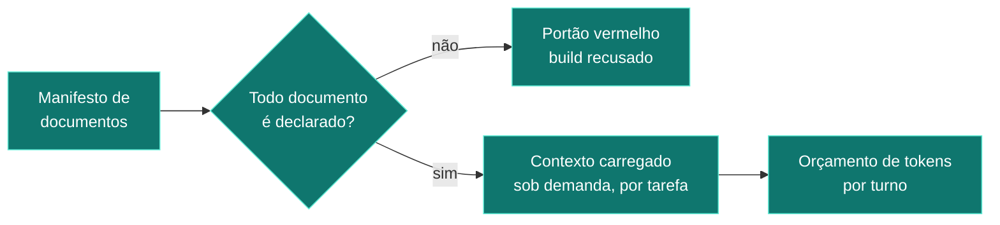

# Poseidon — arquitetura

> Tecnologias, fronteiras, e a diferença entre o modo pessoal e o modo servidor.

---

## Visão macro

---

## Stack, por camada

| Camada | Tecnologia | Por que |
|---|---|---|
| Interface | React 18, TypeScript, Vite | Compilada **dentro do binário** — não há servidor de front separado para instalar |
| Estado e sincronia | TanStack Query + SignalR | O quadro atualiza por evento, não por recarga de página |
| API | .NET 10, ASP.NET Core | Monólito modular: 19 módulos com fronteiras explícitas, um processo só |
| Persistência pessoal | SQLite | Zero serviço obrigatório: o produto roda sem instalar banco |
| Persistência servidor | PostgreSQL | Mesmo domínio, mesma migração, outro adaptador |
| Busca semântica | FTS5 (SQLite) / pgvector (Postgres) | Índice **derivado** — nunca fonte da verdade |
| Execução | Git worktrees + CLIs de assinatura | Isolamento por tentativa; a IA trabalha num clone, não no repositório |
| Contenção | Docker + proxy de egresso *(opcional)* | Configurável por instalação |
| Auditoria | Ledger encadeado por hash | Cada evento aponta para o anterior |

**Uma decisão que vale destacar numa apresentação técnica:** é um **monólito modular**, não microsserviços. A fronteira entre módulos é de compilação, não de rede. Isso mantém o produto instalável com um duplo-clique e ainda assim organizado — e permite extrair um módulo para serviço no dia em que houver razão medida para isso.

---

## Modo pessoal × modo servidor

| | Pessoal *(construído)* | Servidor *(projetado)* |
|---|---|---|
| Instalação | Duplo-clique, sem serviço externo | Implantação gerenciada |
| Banco | SQLite no diretório do usuário | PostgreSQL |
| Identidade | Perfil local | Multiusuário por organização |
| Modelos de IA | **Assinaturas que o usuário já paga** | Chaves de API da organização |
| Credenciais | Só no chaveiro do sistema, nunca em disco do produto | Cofre da organização |
| Custo marginal | Zero — a assinatura já está paga | Por consumo |

**O ponto comercial mais forte, e o mais delicado:** no modo pessoal, o Poseidon usa as assinaturas que o cliente **já tem**. Não há custo por token. Isso muda a proposta de "mais uma ferramenta que consome créditos" para "o orquestrador do que você já paga".

> **Cuidado jurídico que deve ser verificado antes de vender o modo servidor:** usar credenciais de assinatura pessoal de terceiros dentro de um produto hospedado tem restrição contratual em alguns fornecedores. O desenho de dois modos existe justamente para separar essas realidades — o modo servidor usa chave de API da organização, não assinatura pessoal.

---

## RAG, embeddings e memória

A pergunta aparece em toda apresentação. A resposta honesta do Poseidon é **contraintuitiva e defensável**:

**Por que a maior parte do contexto NÃO passa por embeddings:** num sistema de engenharia, o contexto relevante quase sempre é **conhecido por estrutura**, não por similaridade. Quando um agente vai escrever a modelagem de dados, o que ele precisa não é "os cinco trechos mais parecidos" — é o PRD daquela demanda, os ADRs daquela fase e o esquema atual. Isso é uma consulta, não uma busca vetorial.

Embeddings entram onde a estrutura não alcança: encontrar decisões antigas relacionadas, achar trabalho anterior parecido, recuperar conhecimento sem endereço conhecido.

**Estado atual, para não haver surpresa:** a interface de índice vetorial está implementada nos dois bancos e integrada ao produto. O volume indexado ainda é pequeno — a maior parte do valor tem vindo da recuperação estruturada. Isso é uma escolha de projeto, e é defensável em uma apresentação: *"não usamos busca vetorial onde uma consulta responde melhor"*.

---

## Governança da informação

Nada de "carregar tudo e torcer". Cada documento canônico é declarado num manifesto com dono, validade e checksum; o contexto de cada tarefa é montado a partir do que aquela tarefa exige, dentro de um orçamento. Um documento fora do manifesto **reprova a verificação** — foi assim que se evitou a erosão silenciosa da base de conhecimento.

---

## Resiliência

| Risco | Mecanismo | Estado |
|---|---|---|
| Processo morre no meio da execução | Recuperação de tentativas órfãs a cada 2 min | Em produção — **provado ao vivo** (3 reinícios com trabalho em voo, zero card punido) |
| Fornecedor sem cota | Tipo declarado + horário de reset + reeleição automática | Em produção para Claude Code e Codex — **provado ao vivo** em 03/08 13:18Z. Antigravity ainda não classifica falha por tipo |
| Agente trava sem morrer | Teto de silêncio dentro do run + vigia com limiar aprendido | Em produção |
| Trabalho repetido contra a mesma parede | Circuito por card + parada por não-progresso com sondagem | Em produção |
| Reinício do sistema | Estado durável; nada relevante vive em memória | Em produção |
| Operação para e ninguém percebe | Diretora avisa na transição para "parado" | Em produção |

---

## Números reais desta instalação

*Medidos no banco em 2026-08-03 pela auditoria macro, não estimados.
Ver `00-RESUMO-EXECUTIVO.md` e `12-ESTADO-ATUAL-DO-E2E.md`.*

- **30 projetos** na solution: 19 módulos de domínio, 9 de hospedagem e persistência, 7 suítes de teste
- **1.646** testes unitários, **307** de integração, **28** de recuperação, **783** de frontend — **2.764 no total**, todos verdes
- Fases 1 a 3 do processo completas de ponta a ponta; fase 4 com os três documentos prontos e o portão aguardando o Conselho
- **30 cards** entregues e revisados por par distinto no projeto de validação; **6** impedidos no Conselho
- Mediana real de entrega por tarefa: **5,8 minutos**
- Custo medido: **US$ 302,96** em 963 invocações — dos quais **73% é retrabalho**, com taxa de aceite de primeira de **33%**
- **80.490** eventos no ledger encadeado de auditoria

> **Ressalva de medição:** o adaptador da Antigravity ainda não reporta consumo, e ela executou
> os seis pareceres do Conselho. O custo real é maior que os US$ 302,96 acima.
