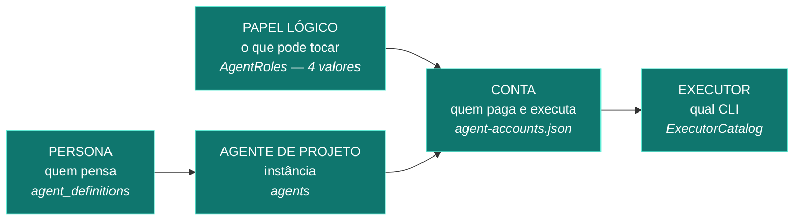

# 05 — Personas, colaboradores e a matriz real

---

## 1. Onde as personas são definidas

**Fonte da verdade:** `src/Harness.Host/Agents/CanonicalAgentDefinitions.cs` (1.291 linhas, C#).
Semeadas por `BuiltInAgentDefinitionSeedHostedService` na tabela `agent_definitions`.
Há endpoints CRUD (`AgentEndpoints.cs`) que permitem criar/editar personas em runtime.

Cada persona (`AgentDefinitionContent`) declara, de verdade e por escrito:

| Campo | Exemplo (`playbook-product-owner`) |
|---|---|
| `agent_key`, nome, papel, especialidade | `playbook-product-owner`, "Product Owner", `specialist` |
| Descrição de atuação | "Conduz Triagem e Descoberta…" |
| Filosofia | "Valor de negócio antes de funcionalidade…" |
| Missão | "Transformar intenção difusa em backlog refinável…" |
| Princípios (4 itens) | "Qualificar valor ANTES de discutir solução…" |
| Entregáveis (3 itens) | "Ficha de Demanda Qualificada com decisão Build/Buy/…" |
| Critérios de qualidade | "Toda história é testável e rastreável…" |
| Estilo de comunicação | "Linguagem de negócio, sem termo técnico" |
| **Limites explícitos** | "Não decide arquitetura"; "Não aprova o próprio PRD" |
| Tags, `default_effort`, modelos | `["requisitos","descoberta","backlog"]`, `high`, model = `null` |
| Time, `actor_critic`, risco | `Playbook`, `actor`, `medium` |
| **`AllowedScopes` / `DeniedScopes`** | permite `docs/product/**`, `docs/**`; nega `src/**`, `tests/**`, `governance/**`, `infra/**` |
| **`ActivationCriteria` / `NonActivationCriteria`** | quando entra e — igualmente importante — **quando NÃO entra** |

> Esta é uma das partes mais bem-feitas do produto. Declarar `NonActivationCriteria` é raro e é o
> que impede o "especialista que opina sobre tudo".

---

## 2. Inventário real — 35 personas em 5 famílias

| Família | Personas | `actor_critic` |
|---|---|---|
| **Núcleo** (5) | `chief-orchestrator`, `product-requirements-analyst`, `software-architect`, `software-engineer`, `critic-qa`, `technical-writer` | 1 critic |
| **Delivery** (8) | tech-lead-copilot, daily-intelligence, risk-dependency-analyst, forecast-analyst, quality-release-auditor, documentation-steward, executive-reporting, benefits-analyst | 1 critic |
| **Architecture** (10) | chief, discovery, solution-architect, enterprise, integration, data, security, infrastructure, rationalization-analyst, critic, adr-writer | 1 critic |
| **Playbook** (9) | product-owner, arquiteto, tech-lead, qa, devops, sre-sustentacao, security, dba-dados, dev-executor | **4 critics** (tech-lead, qa, security) |
| **Outros** (1) | accessibility-auditor | — |

### Matriz por persona (campos que efetivamente existem)

| Campo pedido na auditoria | Existe? | Onde | Observação |
|---|---|---|---|
| Nome / Persona / Papel | ✅ | `agent_definitions` | |
| Provider | ❌ **não pertence à persona** | — | **Por desenho.** A persona é provider-agnostic; o provider vem da conta eleita pelo scheduler |
| Conta / profile | ⚠️ indireto | `agents.account_id` (instância por projeto) | Hoje **todas** as instâncias apontam para `chief-claude-primary` |
| Modelo | ⚠️ | `agent_definitions.default_model_id` = **vazio em todas**; `agents.model_id` = `opus` | **Não aplicado** — `F-05` |
| Modo | ✅ | `Access` (`Workspace` para ator, read-only para crítico) | |
| Effort / reasoning | ⚠️ | `default_effort` (`high` em 22, `medium` em 9) | **Não aplicado** — `F-05` |
| Context window | ❌ | `ExecutorCatalog` declara `MaxContextTokens: null` para **todos** | Nunca medido |
| Capabilities | ✅ | do **executor**, não da persona (`ExecutorCatalog`) | |
| Tool permissions | ✅ | `persona.ToolIds` → `SecurityPolicyEnforcementPoint` | `null` é fail-closed deliberado |
| Pode ser actor? | ✅ | `actor_critic` | |
| Pode ser critic? | ✅ | `actor_critic` | Mas o que decide de fato é o **papel da conta**, não a persona |
| Pode ser Chief? | ✅ | `role='chief'` (só `chief-orchestrator`) | |
| Concorrência | ✅ | **da conta**, não da persona (`concurrencyLimit`) | |
| Quota source | ✅ | da conta | |
| Fallback | ✅ | `fallback_model_ids_json` (vazio na prática) | |
| Configuração | `CanonicalAgentDefinitions.cs` + CRUD | | |
| Source of truth | **código C#** | | |

---

## 3. A distinção que o produto faz (e que importa)



- **35 personas** (rico, expressivo, provider-agnostic) mapeiam para
- **4 papéis lógicos** (`chief-orchestrator`, `backend-specialist`, `frontend-specialist`, `critic`)
  que mapeiam para
- **7 contas** que mapeiam para
- **5 executores** (4 implementados).

O afunilamento de 35 → 4 é intencional (o papel carrega o escopo de arquivos), mas é onde mora um
achado: **a granularidade de segurança é de 4 valores para 35 personas.**
`AllowedScopes`/`DeniedScopes` da persona são declarados e **não são o que a
`AgentPathScopePolicy` avalia** — ela avalia o `AgentPathScopeKind` do papel.
Achado `F-17` — MEDIUM, TECH DEBT: dois sistemas de escopo, um declarado por persona e outro
imposto por papel, e só o segundo é vinculante.

---

## 4. Toda delegação é card? (§18)

**Verificação factual: SIM, com uma exceção legítima.**

| Caminho de delegação | Gera card? | Evidência |
|---|---|---|
| Trabalho comum | ✅ | `work_tasks` |
| **Conselho** | ✅ | Os 6 pareceres são `work_tasks` reais (ids listados no doc 08) |
| **Revisão (crítico)** | ❌ **não gera card** | É uma `work_reviews` ligada à `work_attempts`, executada por um `AgentRunOrchestrator.ReviewAsync` |
| Correção após reprovação | ✅ | Nova `instruction_version` no mesmo card + nova tentativa |
| Documentação / arquitetura / testes | ✅ | Cards de `card_type='documento'` |
| **Turno de conversa da Bruna** | ❌ | É `chat_turns`, não card — e é correto: conversar não é delegar |

**A revisão é o único trabalho de agente que não é card.** Não é invisível — tem tentativa,
ledger de invocação, `attempt_events` e uma linha em `work_reviews`. Mas **não aparece no quadro
como trabalho**, e por isso o custo do crítico não entra na contabilidade de cards.
Achado `F-18` — LOW, OBSERVABILITY GAP.

---

## 5. Actor ≠ Critic — a regra real

A independência é imposta **por CONTA (alias)**, não por persona, provider, modelo, processo ou sessão.

```csharp
// AgentAccountScheduler.cs, filtro 10
if (request.ForCritic && request.ActorAlias is {Length:>0} actor &&
    string.Equals(account.Alias, actor, OrdinalIgnoreCase))
    return (false, "account.actor_cannot_be_critic");
```

E, no domínio, `WorkChainAggregate.cs:465` recusa a review com
`WorkChainErrors.IndependentReviewerRequired`. **São duas camadas.**

| Cenário | Permitido? |
|---|---|
| Claude conta A implementa, Claude conta B revisa | ✅ **SIM** — o discriminador é o alias, não o provedor |
| Kimi implementa, Antigravity revisa | ✅ em princípio — mas Kimi não tem adapter |
| Antigravity implementa, Antigravity revisa | ❌ **NÃO** — foi exatamente o que travou o Conselho |
| Mesma persona, contas diferentes | ✅ permitido |

**Uma observação de honestidade:** o produtor é identificado pelo `account_alias` do **ledger de
invocações da tentativa**, não pelo `AgentId` (que é a persona). O comentário no código explica
isso. É a escolha certa e mostra maturidade — mas significa que uma tentativa **sem invocação
registrada** cai em `critic.producer_alias_unknown` e adia. Antigravity grava
`usage_unknown`/`output_tokens=0`, mas grava a linha, então o alias existe.

---

## 6. Criação dinâmica de profissionais

Ver [02-BRUNA](02-BRUNA-ARQUITETURA-E-COMPORTAMENTO.md) §6.
Resumo: **instanciar** persona catalogada por projeto = E2E provado.
**Criar persona nova** com capabilities/ferramentas próprias = caminho existe (CRUD), uso pela
Bruna **não comprovado**. Classificação: `FUTURE FEATURE`.
