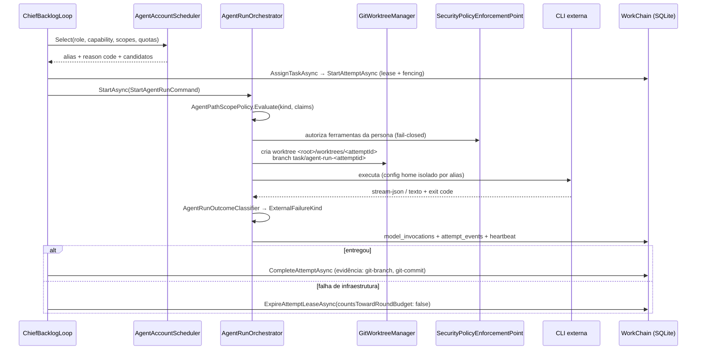
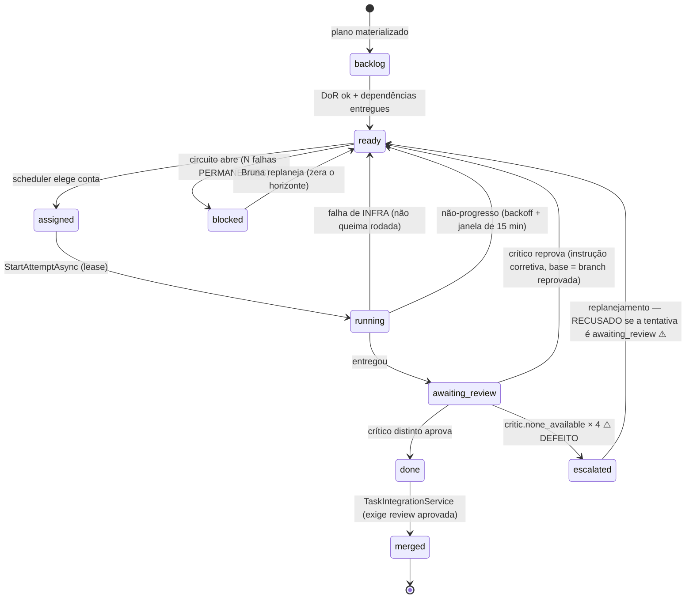

# 10 — Execution Plane

---

## 1. Anatomia de uma tentativa



### Invariantes verificadas em código

| Invariante | Onde |
|---|---|
| Nenhum card sai de um ciclo sem desfecho registrado | `ChiefBacklogLoopService:901-915` — `LogCardVanishedFromCycle` para o que sumir |
| Uma tentativa `running` por card | índice único `ux_work_attempts_one_active` |
| Uma worktree por tentativa | `Path.Combine(controlledRoot, "worktrees", attemptId)` |
| Colheita nunca destrói trabalho | `TryHarvestWorktreeAsync` comita as sobras na branch antes de remover a worktree; a **branch nunca é apagada** |
| Escopos não colidem | `HasLiveScopeConflict` + `attempt_scope_claims` |
| Lease com fencing | `agents.lease_fencing_token` + `lease_expires_at` (o CHECK exige os dois juntos ou nenhum) |
| Heartbeat | `attempt_workspaces.last_heartbeat_at` |

---

## 2. Taxonomia tipada — estado da refatoração (§24)

**PARCIAL.**

O que **existe e está correto**: `ExternalFailureKind` (enum fechado de 8 valores) declarado pelo
**adaptador do fornecedor**, com uma justificativa exemplar no próprio arquivo — *"a lista de
frases nunca fecha; reconhecer a frase é trabalho do adaptador, decidir o que fazer é trabalho do
núcleo, que não deveria conhecer fornecedor nenhum"*. `Unknown` é honesto e obrigatório.

O que **falta**:

| Item pedido no §24 | Existe? |
|---|---|
| `AgentFailureKind` / `ExternalFailureKind` | ✅ |
| `FailureOrigin` | ❌ — a origem (nossa vs. do fornecedor) é inferida do reason code |
| `ExecutionStage` | ❌ |
| `ReachedTaskExecution` | ⚠️ implícito em `ProducedOutput(snapshot)` |
| `Retryable` / `RetryAfter` | ⚠️ `RetryDelayAfterRun(snapshot)` existe; não é campo do contrato |
| `AgentExecutionOutcome` unificado | ❌ |

### Classificadores por substring que **sobrevivem** em caminho de decisão

```
ChiefBacklogLoopService.cs:2852   reason.Contains("quota")
ChiefBacklogLoopService.cs:2858   reason.Contains("authentication")
CardCircuitBreakerService.cs:212  reason.Contains("host_shutdown")
CardCircuitBreakerService.cs:213  reason.Contains("host_restart")
CardCircuitBreakerService.cs:219  reason.Contains("quota")
CardCircuitBreakerService.cs:220  reason.Contains("authentication_required")
CardCircuitBreakerService.cs:221  reason.Contains("account_model_unsupported")
CardCircuitBreakerService.cs:228  reason.Contains("Canceled"/"Cancelled"/"run.cancelled")
AgentRunOrchestrator.cs:2254      scope.Contains("frontend")
AgentRunOrchestrator.cs:2399      value.Contains("scope") / Contains("tool")
```

**Estas são exatamente as substring sobre o nosso PRÓPRIO código interno que o comentário do
`ExternalFailureKind` diz ter sido a origem do defeito de 1h40 em 03/08.** A refatoração foi feita
na **borda** (adaptador → sessão → resultado) e **não chegou ao circuito do card nem à decisão de
retry do chefe**.

**Achado `F-06` — HIGH, TECH DEBT.** A refatoração está pela metade, e a metade que falta é
justamente a que já causou o defeito uma vez.

Nota positiva: o commit `82aa5b9d`/OPS-052-A já corrigiu o elo em que "o tipo declarado pelo
adaptador não chegava a quem decide". O tipo agora chega; **quem decide ainda não o usa em todos
os pontos.**

---

## 3. Circuito por card (§25)

`CardCircuitBreakerPolicy` + `CardCircuitBreakerService`.

| Regra | Valor |
|---|---|
| Contagem | **DERIVADA do histórico de tentativas**, não incrementada em ganchos. Idempotente por construção — reprocessar dá o mesmo resultado, e um reinício não perde nem duplica |
| Limiar | `ConsecutiveFailureThreshold` (configurável pelo operador; default = histórico) |
| **O que NÃO conta** | Falha transitória, de infraestrutura, cancelamento, reinício do Host, cota, autenticação, modelo não suportado |
| **O que conta** | Falha **permanente** do executor: a tentativa chegou a executar e terminou mal |
| Horizonte | O **replanejamento** da Bruna zera o passado (`ReplannedAt`): "o card que a Bruna reescreveu é outro card do ponto de vista do enunciado, mesmo mantendo o id" |
| Reabertura por tempo | **Não existe.** Só o replanejamento fecha um circuito aberto |
| **Não-progresso** | Contagem independente da culpa: tentativa com zero token de saída soma; qualquer produção zera |
| Janela de silêncio | `NoProgressQuietPeriod = 15 min` — passada a janela, **UMA sondagem** é liberada. Se a parede caiu, o card volta sozinho; se continua, para por mais uma janela |
| Backoff de não-progresso | `NoProgressBackoff(n)` progressivo |
| Escalação | `EscalateUnreviewableTaskAsync` (revisão) / circuito aberto (trabalho) |

### A máquina de estados real



Os dois ⚠️ são o achado `F-12`, com conserto no working tree não commitado.

**Uma observação importante e favorável:** o desenho do circuito é dos melhores do produto. A
regra "tentativa sem token nunca chegou a julgar o enunciado e por isso não pune o card" é
sofisticada, o buraco que ela abriu foi identificado (14 tentativas em 1h40) e fechado com a
contagem de não-progresso, e o comentário no código documenta o raciocínio inteiro. Isso é
engenharia de verdade.

---

## 4. Isolamento e contenção

| Camada | Estado nesta instalação |
|---|---|
| Worktree por tentativa | ✅ **ativo** |
| Branch por tentativa | ✅ ativo, nunca apagada |
| Claims de path por card | ✅ ativo |
| Allowlist de ferramentas | ✅ ativo, fail-closed |
| Config home por conta | ✅ ativo |
| Crítico read-only | ✅ ativo (`--tools` sem Edit/Write/Bash) |
| **Contêiner** | ❌ **Disabled** por decisão registrada do proprietário |
| **Proxy de egresso** | ❌ inativo com o contêiner desligado |
| Atestação | `sandbox_attestations`; cada run sem contêiner gera log de aviso com o motivo declarado |

---

## 5. O que o Execution Plane ainda não provou

| Capacidade | Estado |
|---|---|
| Executar card documental, entregar, ser revisado, fechar fase | ✅ **E2E, 30 cards** |
| Executar card de **código**, compilar, testar, fazer merge | ❌ **nunca aconteceu** |
| `CodeDiagnosticsGate` sobre código real | ❌ |
| `code_graph_*` populado | ❌ 0 nós |
| `MergeReconciliationBackgroundService` em merge real | ❌ |
| Rollback / GMUD / SBOM | ❌ |

**Este é o vão entre "control plane maduro" e "fábrica de software".**
