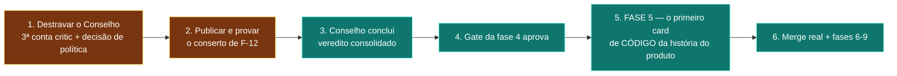

# 14 — Readiness level e estimativa

> Escala: **0** inexistente · **1** protótipo · **2** implementado parcial ·
> **3** implementado e testado · **4** provado em E2E · **5** operacional maduro.
>
> Não há média. Uma média entre 4 e 0 daria 2, e 2 não descreve nada.

---

## 1. Notas por eixo, com evidência

| Eixo | Nota | Evidência |
|---|---|---|
| **Core Control Plane** | **4** | 294 cards, 80.490 eventos de ledger, mutações idempotentes com receipt tipado, 3 fases fechadas ponta a ponta. Não chega a 5 porque a operação depende de scripts externos (`F-25`) |
| **Bruna** | **3** | Turno real via CLI, contrato de saída validado com reparo e degradação, `intent` classificado, 3 fases conduzidas sem clique humano. Não é 4 porque roda com governança degradada e sem saber (`F-04`) e não tem failover (`F-01`) |
| **Playbook** | **4** | 9 fases semeadas no banco, gates com critério objetivo, obrigações por fase, contrato de template documental. Fases 1–4 exercitadas de verdade |
| **Scheduler** | **4** | 10 filtros fail-closed, motivo por candidato, desempate determinístico, cota tipada com reeleição **provada em produção**. Não é 5 porque dois caminhos não o usam (`F-02`) |
| **Execution Plane** | **3** | Worktree por tentativa, claim de arquivo, allowlist de ferramenta, colheita sem perda. **Nunca executou card de código** — por isso não é 4 |
| **Recovery** | **4** | 28 provas + reinício do Host e morte de worker provados ao vivo, com zero circuito aberto após 50+ falhas de infraestrutura. É o eixo mais forte |
| **Council** | **2** | Política bem desenhada e testada, mas **nunca concluiu um ciclo**. Os 6 assentos produziram parecer e escalaram sem revisão |
| **Development (fase 5)** | **1** | Mecanismo existe (`ExecutivePhaseGuard`, `TaskIntegrationService`, `MergeReconciliation`), **nada rodou**. `code_graph_nodes` = 0 |
| **Testing (fase 6)** | **1** | `CodeDiagnosticsGate` existe; a exigência do gate é documental |
| **Release (fases 7-8)** | **1** | Gates são HITL; artefatos (GMUD, SBOM, rollback) são documentos |
| **Multi-project** | **2** | 27 projetos, isolamento por tenant, locks de escopo. Sem fairness, sem prioridade, sem cota por projeto, sem coordenador de recurso |
| **Observability** | **3** | Ledger, métricas medidas, reason codes fechados, heartbeat. Mas: inelegibilidade não chega à tela (`F-07`), causa de rejeição não classificada (`F-22`), custo real desconhecido (`F-26`) |
| **Security** | **3** | Segredos só no Keychain, config home por conta, worktree, claims, allowlist, crítico read-only. Contenção **desligada** (`F-19`) |

### Leitura honesta

O Poseidon é **um control plane maduro (4) acoplado a uma fábrica de software não iniciada (1)**.
A parte difícil de construir — durabilidade, idempotência, recuperação, taxonomia de falha,
gates determinísticos — está feita e provada. A parte que o cliente vê como "o produto" —
escrever, testar e entregar software — nunca aconteceu.

---

## 2. Bloqueadores

### Para um piloto utilizável (com o dono operando)

| # | Bloqueador | Achado | Esforço |
|---|---|---|---|
| 1 | O Conselho não pode concluir com 2 contas critic | `F-03` | 🟢 config (3ª conta critic) + 🟡 decisão de política |
| 2 | Cards escalados por falta de revisor não voltam | `F-12` | 🟢 **já commitado durante esta auditoria** (`e3c4025a`, `7ea4b60e`, `75971b37`) — falta publicar o binário e provar ao vivo |
| 3 | Sem coordenador de recurso pesado — a máquina trava | `F-20` | 🔴 |

### Para autonomia real (o dono ausente)

| # | Bloqueador | Achado |
|---|---|---|
| 1 | Chief sem failover | `F-01` |
| 2 | Três seletores de conta divergentes | `F-02` |
| 3 | Conselho estruturalmente impossível | `F-03` |
| 4 | Bruna com governança degradada e sem saber | `F-04` |
| 5 | Taxonomia tipada pela metade nos pontos de decisão | `F-06` |
| 6 | Card preso sem caminho de volta | `F-12` |
| 7 | Fase 5 nunca executada — a autonomia não tem o que provar | — |

---

## 3. Caminho crítico

### Até um piloto utilizável

O passo 5 é o **verdadeiro marco desconhecido**. Tudo até ali é engenharia de controle já
provada. A partir dali começa o risco não medido: escrever código que compila, passa em teste,
sobrevive a um crítico e faz merge.

### Até autonomia real

Piloto + `F-01`, `F-02`, `F-04`, `F-06`, `F-20`, `F-24` + um ciclo completo de 9 fases sem
intervenção humana fora dos gates HITL do próprio playbook.

---

## 4. Estimativa

**Premissas declaradas:**
- 1 pessoa (o proprietário) coordenando frota de agentes, no ritmo observado nas últimas semanas;
- cota disponível de pelo menos 2 provedores em paralelo;
- "pronto" = um projeto real percorre as 9 fases e entrega software que compila, tem teste verde
  e passa por revisão independente;
- **não inclui** modo servidor, multiusuário, cobrança, nem produto empacotado para terceiro.

### Até o piloto utilizável (fase 5 provada, um card de código entregue e mergeado)

| Cenário | Prazo | Premissa |
|---|---|---|
| **Melhor caso** | **3–5 dias** | O Conselho destrava com configuração; a fase 5 funciona de primeira; o card de código passa no crítico em 1–2 tentativas |
| **Provável** | **2–3 semanas** | A fase 5 revela a mesma classe de defeito que as fases 1–4 revelaram (gate documental, escopo de path, taxonomia) — só que agora sobre código, que é mais rico em modos de falha. Estimo 8–15 defeitos da mesma família |
| **Pior caso** | **6–10 semanas** | A taxa de aceite de primeira de **33%** se mantém ou piora sobre código. Com 73% do custo em retrabalho, cada card de código custa 3 tentativas. Somado ao teto de recurso da máquina (`F-20`), a esteira anda a 1–2 cards/hora e a fase 5 tem dezenas de cards |

### Até autonomia real (9 fases, dono ausente)

| Cenário | Prazo |
|---|---|
| **Melhor caso** | **6–8 semanas** |
| **Provável** | **3–4 meses** |
| **Pior caso** | **8–12 meses** |

**O que move a estimativa dentro dessa faixa** (em ordem de peso):

1. **A taxa de aceite de primeira.** 33% é o número mais preocupante da auditoria. Se subir para
   60%, o prazo provável cai perto do melhor caso. Se cair sobre código, vai para o pior.
   **É a métrica que eu acompanharia semanalmente.**
2. **Se a fase 5 funciona sem reescrita estrutural.** Se ela exigir repensar como o card de código
   recebe contexto (o `code_graph` está vazio), some 4–6 semanas.
3. **Capacidade da máquina.** Sem coordenador de recurso, o paralelismo real é ~4, não 7.
4. **Disponibilidade de cota.** A frota tem 2 provedores efetivamente operacionais (Claude e
   Antigravity). Codex intermitente, GLM cancelado, Kimi sem adapter.

**O que eu NÃO faria:** prometer prazo em cima do melhor caso. As fases 1–4 levaram ~20 horas de
relógio e cerca de 58 defeitos catalogados (`FINDINGS.jsonl` chega a OPS-058), com o dono
presente o tempo todo. A fase 5 é maior que as quatro anteriores somadas.
