# 16 — Mapa de fontes da verdade

> Um diagrama e uma tabela. Para responder "quem manda nisso?" sem abrir código.

---

## O mapa

```mermaid
flowchart TB
    subgraph CODIGO["CÓDIGO C# — recompilar para mudar"]
        PLAY["CanonicalWorkflowTemplates<br/><b>as 9 fases e os gates</b>"]
        PERS["CanonicalAgentDefinitions<br/><b>35 personas</b>"]
        COUNC["AgentCouncilPolicy<br/><b>assentos e consolidação</b>"]
        ROLES["AgentRoles<br/><b>4 papéis + escopo de path</b>"]
        EXEC["ExecutorCatalog + Factory<br/><b>quais CLIs existem</b>"]
        BRUNA["ChiefPersona (const)<br/><b>quem é a Bruna</b>"]
        SCHED["AgentAccountScheduler<br/><b>como se elege conta</b>"]
    end

    subgraph GIT["GIT — versionado, revisável"]
        GOV["governance/core.md<br/><b>a lei</b>"]
        MAN["governance/manifest.yaml<br/><b>o que é documento canônico</b>"]
        AGM["AGENTS.md / CLAUDE.md<br/><i>GERADOS, com checksum</i>"]
        BRD["docs/agents/bruna.md<br/>❌ DECORATIVO"]
        CODE["branches task/agent-run-*<br/><b>o código produzido</b>"]
        OPS["coordination/final-operation/<br/><b>estado da operação</b>"]
    end

    subgraph LOCAL["ARQUIVOS LOCAIS — fora do repo, do operador"]
        ACC["~/.harness/agent-accounts.json<br/><b>a frota</b>"]
        AVAIL["~/.harness/account-availability.json<br/><b>quem está de pé</b>"]
        ENV["~/.harness/poseidon.env<br/><b>runtime</b>"]
    end

    subgraph BANCO["SQLITE — ~/.harness-poseidon/harness.db"]
        WORK["work_tasks / work_attempts<br/>work_reviews / work_evidence"]
        WF["workflow_*_runs<br/><b>onde cada projeto está</b>"]
        AGENTS["agents / agent_definitions"]
        LEDGER["audit_ledger<br/><b>o que aconteceu</b>"]
        PROJ["projects<br/><b>modo de autonomia</b>"]
    end

    subgraph KEY["KEYCHAIN macOS"]
        SEC["credenciais<br/>keychain://poseidon/&lt;alias&gt;"]
    end

    subgraph DERIV["DERIVADOS — nunca fonte"]
        VEC["vector_embeddings (13)"]
        CG["code_graph_* (0)"]
        SNAP["context_snapshots (777)"]
        UI["painel"]
    end

    GOV --> AGM
    MAN --> AGM
    PLAY -->|semeia| WF
    PERS -->|semeia| AGENTS
    ACC --> SCHED
    AVAIL --> SCHED
    ENV --> SCHED
    SEC --> EXEC
    WORK --> LEDGER
    WORK --> DERIV
    AGM -->|lido pela CLI| CODE

    classDef code fill:#4c1d95,stroke:#a78bfa,color:#fff
    classDef git fill:#0f766e,stroke:#5eead4,color:#fff
    classDef local fill:#78350f,stroke:#fcd34d,color:#fff
    classDef db fill:#1e293b,stroke:#64748b,color:#e2e8f0
    classDef bad fill:#7f1d1d,stroke:#fca5a5,color:#fff
    class PLAY,PERS,COUNC,ROLES,EXEC,BRUNA,SCHED code
    class GOV,MAN,AGM,CODE,OPS git
    class ACC,AVAIL,ENV local
    class WORK,WF,AGENTS,LEDGER,PROJ db
    class BRD bad
```

---

## A tabela

| Conceito | Fonte da verdade | Onde | Derivados | Quem lê em runtime |
|---|---|---|---|---|
| A lei | `governance/core.md` | Git | `AGENTS.md`, `CLAUDE.md` (checksum) | CLI externa na worktree |
| O que é documento canônico | `governance/manifest.yaml` | Git | `context_snapshots` | `ContextBundleBuilder`, linter |
| As 9 fases e os gates | `CanonicalWorkflowTemplates.cs` | **código** | `workflow_*_definitions` | `WorkflowPhaseDriver`, `PhaseGatePolicy` |
| Onde cada projeto está | `workflow_phase_runs` | banco | painel | `WorkflowPhaseDriver` |
| Personas | `CanonicalAgentDefinitions.cs` | **código** | `agent_definitions`, CRUD | `ChiefTeamManager`, chief loop |
| Instância de profissional | `agents` | banco | painel | chief loop |
| Papéis e escopo de arquivo | `AgentRoles` + `AgentPathScopePolicy` | **código** | `allowedPathScopes` no JSON | `AgentRunOrchestrator` |
| Executores suportados | `ExecutorCatalog` + `ExternalAgentExecutorFactory` | **código** | — | scheduler |
| A frota | `~/.harness/agent-accounts.json` | local | `AgentAccountRegistry` | scheduler |
| Quem está de pé | `~/.harness/account-availability.json` | local | painel | scheduler, recovery |
| Runtime (auto-dispatch, roots, contenção) | `~/.harness/poseidon.env` | local | `AgentRunSettings` | Host |
| Credenciais | **Keychain do macOS** | SO | `credentialRef` (opaco) | `AccountProfileProvisioner` |
| Persona da Bruna | `ChiefPersona` (const) | **código** | ❌ `docs/agents/bruna.md` **não é lido** | `BuildPrompt` |
| Modo de autonomia | `projects` | banco | painel | `PhaseGatePolicy` |
| Convocação do Conselho | `AgentCouncilPolicy` | **código** | — | `WorkflowPhaseDriver` |
| Trabalho e evidência | `work_tasks/attempts/reviews/evidence` | banco | painel, métricas | tudo |
| O que aconteceu | `audit_ledger` (encadeado) | banco | — | reconciliador |
| Código produzido | **Git** (`task/agent-run-*`) | Git | worktrees | crítico, merge |
| Estado da operação de validação | `coordination/final-operation/STATE.json` | Git | — | supervisor |
| Modelo/effort por papel | ❌ **não existe fonte efetiva** | — | `agent_definitions.default_effort`, `agents.effort`, `provider_models` | **ninguém** |
| Memória conversacional do modelo | **fornecedor** (`SessionId` da CLI) | externo | `conversation_messages` (do produto) | CLI |
| Índice semântico | `vector_embeddings` — **derivado** | banco | — | `RagContextProvider` |

---

## As três regras que este mapa deixa claras

**1. Invariante de segurança mora em código.** Papéis, escopo de path, quem pode ser crítico,
o que é gate — nada disso é editável por operador. É a escolha certa: essas regras não devem
depender de um arquivo de configuração que alguém edita às três da manhã.

**2. Capacidade e economia moram em arquivo local.** A frota, a disponibilidade e o runtime
vivem em `~/.harness/`, fora do repositório, sem segredo. Trocar conta, papel ou concorrência é
edição de JSON + restart. Também é a escolha certa.

**3. Duas coisas estão no lugar errado.** O **playbook** e a **persona da Bruna** são conteúdo,
não invariante de segurança, e estão em código compilado. O dono não consegue ajustar o processo
da fábrica nem o comportamento da diretora sem um ciclo de build e publicação. É a maior fonte de
atrito operacional identificada nesta auditoria — e é o que faz `docs/agents/bruna.md` existir
sem ser lido: alguém tentou colocá-lo no lugar certo e a ligação nunca foi feita.
