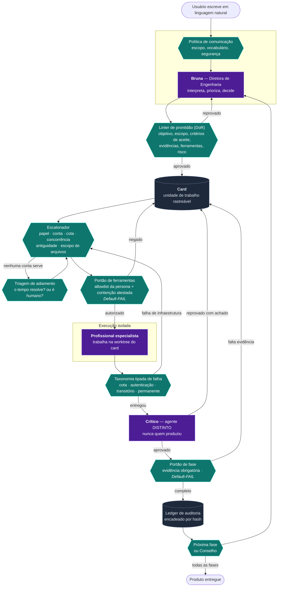
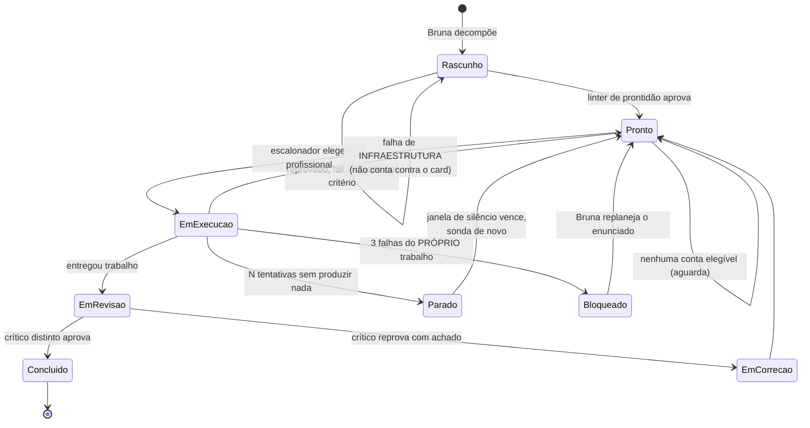
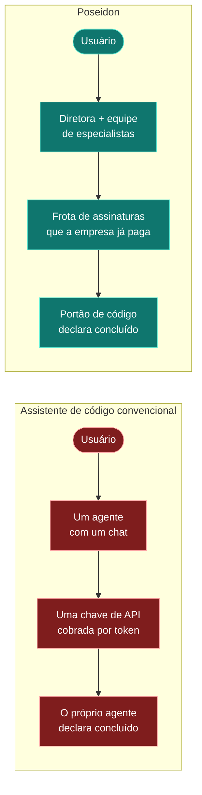
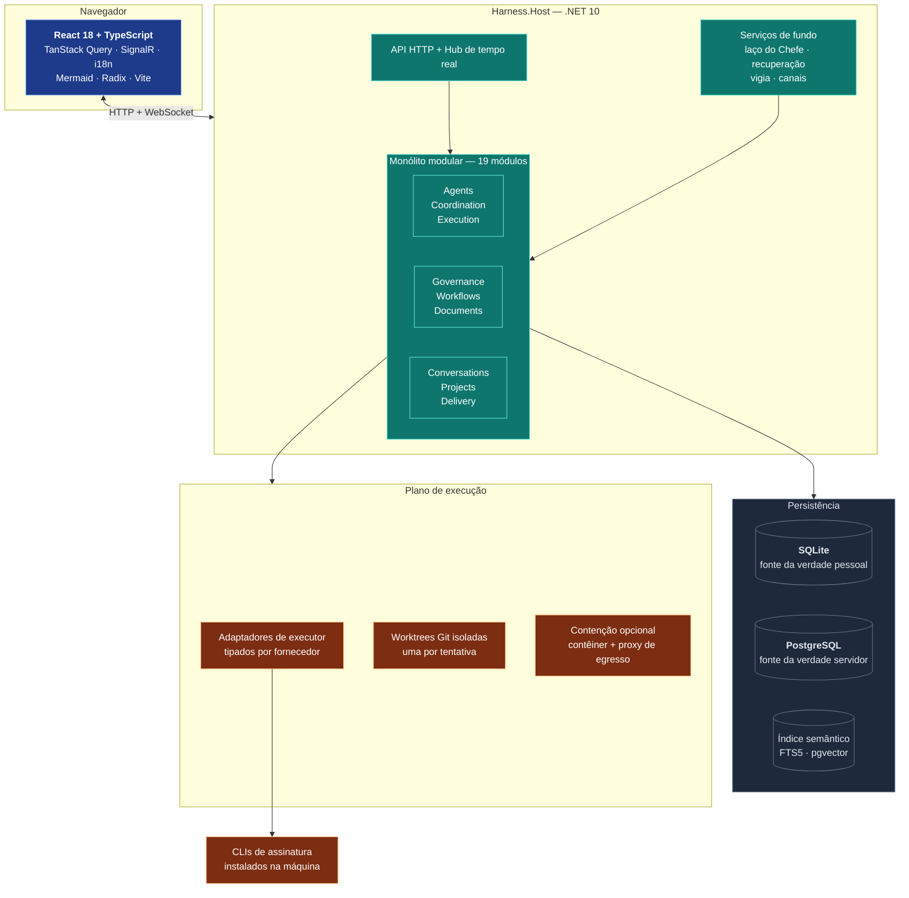
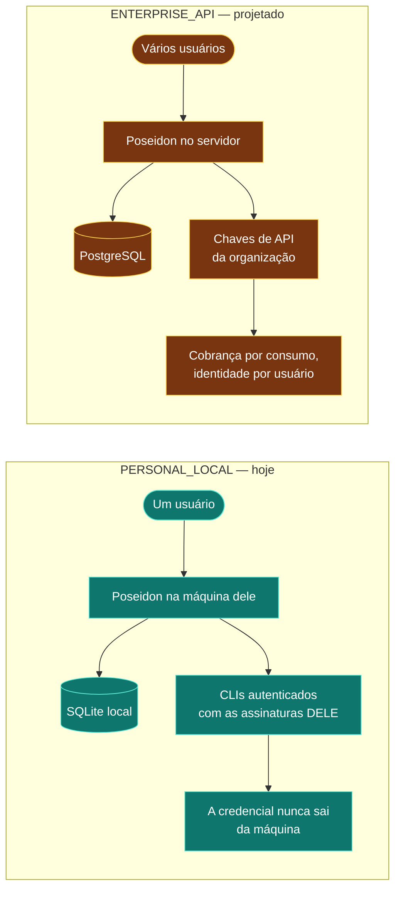
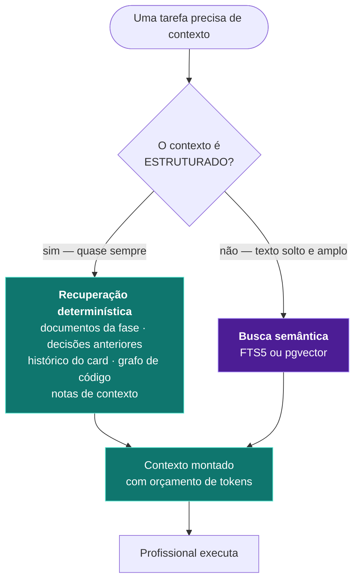
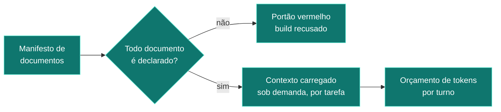

# 18 — Visão para gestão

> Escrito para quem não vai abrir código. Sem jargão interno, sem esconder problema.

---

## O que é o Poseidon

A maioria das ferramentas de IA para programação é **um assistente com um chat**: você pergunta,
ele responde, e você decide se aquilo presta.

O Poseidon é outra coisa. É uma **empresa de engenharia de software operada por IA**:

- uma **diretora** (a Bruna) recebe o pedido em português e o decompõe em trabalho;
- ela **contrata especialistas** de um quadro de 35 perfis (Product Owner, Arquiteto, Tech Lead,
  QA, Segurança, DBA, DevOps…), cada um com filosofia, entregáveis e — o que é raro — **limites
  explícitos do que não pode fazer**;
- cada tarefa vira um **card rastreável**, executado numa cópia isolada do repositório;
- todo trabalho passa por **um segundo profissional, de conta diferente**, que revisa;
- e no fim, **quem declara "pronto" não é a IA: é o código**, avaliando evidência objetiva.

A diferença comercial é essa última linha. Um assistente convencional pergunta ao modelo se
terminou. O Poseidon pergunta a um portão determinístico, que exige evidência e reprova quando
ela falta.

Há uma segunda diferença, econômica: o Poseidon orquestra **as assinaturas de IA que a empresa já
paga** (Claude, Codex, Antigravity), em vez de consumir API cobrada por token.

---

## Como ele trabalha, em nove passos

```
1  Triagem       → esta demanda tem valor? Construir, comprar ou recusar?
2  Descoberta    → o que exatamente precisa existir, e como se prova?
3  Arquitetura   → como vamos fazer, e o que cada escolha custa?
4  Planejamento  → em que pedaços, em que ordem, com que risco?
   ↳ CONSELHO    → seis especialistas criticam o plano antes de custar código
5  Desenvolvimento → construir
6  Testes        → provar
7  Homologação   → o dono aceita (obrigatoriamente humano)
8  Release       → publicar com plano de volta (obrigatoriamente humano)
9  Sustentação   → manter
```

Cada fase só fecha com **documento produzido, revisado por outro agente e evidência anexada**.
As fases 7 e 8 exigem aprovação humana por regra, não por precaução.

---

## Onde ele está hoje — o fato central

| Fase | Estado |
|---|---|
| 1 · Triagem | ✅ **Concluída** em 12,6 minutos |
| 2 · Descoberta | ✅ **Concluída** em 28 minutos |
| 3 · Arquitetura | ✅ **Concluída** — 19 tarefas entregues e revisadas |
| 4 · Planejamento | ⚠️ **Travada** — os documentos ficaram prontos, o Conselho não conseguiu concluir |
| 5 a 9 | ❌ **Nunca executadas** |

**O fato mais importante desta auditoria, dito sem rodeio:**

> O Poseidon já provou que sabe **planejar** software: recebeu um pedido em português, produziu
> requisitos, arquitetura e plano, com 30 tarefas entregues e revisadas por segundo par de olhos,
> em cerca de 20 horas.
>
> **Ele ainda não escreveu uma linha de código de produto.** A fase que constrói nunca foi
> alcançada. O repositório do projeto de validação contém apenas documentos.

Isso não significa que a construção não vai funcionar — o mecanismo está implementado e coberto
por testes. Significa que ela **não foi demonstrada**, e que é aí que mora o risco não medido.

---

## Por que a fase 4 travou

Vale contar, porque explica bem como o sistema pensa.

O Conselho é um grupo de seis especialistas que critica o plano antes de a construção começar —
o momento em que corrigir ainda é barato. Os seis pareceres **foram produzidos com sucesso**.

Aí esbarrou numa regra do próprio produto: **nenhum trabalho é aprovado por quem o fez**. Como só
uma conta de IA estava disponível para o papel de crítico, ela escreveu os seis pareceres — e
então não sobrou ninguém para revisá-los, porque a única outra conta com esse papel estava sem
cota.

**A regra agiu corretamente.** O problema é o tamanho da equipe: com duas contas de crítico, e
uma delas obrigatoriamente ocupada escrevendo, sobra uma. E o sistema, em vez de esperar a cota
voltar, marcou as tarefas como impedidas em 15 minutos — e depois não conseguiu retomá-las
sozinho.

Há duas correções: uma é **configuração** (habilitar uma terceira conta como crítico, dois
minutos) e outra é uma **decisão de arquitetura** (se o parecer de um crítico precisa mesmo ser
criticado por outro). Ambas estão detalhadas no documento de recomendações.

---

## O que já está comprovado

| Capacidade | Prova |
|---|---|
| Entender um pedido em português e virar plano de trabalho | 3 fases inteiras, 30 tarefas |
| Escolher sozinho qual profissional e qual conta executa | eleição por papel, cota, concorrência e antiguidade |
| Trabalhar em isolamento, sem tocar no que não deve | uma cópia do repositório por tentativa, com escopo de arquivos declarado |
| **Exigir revisão de um segundo profissional** | 29 tarefas revisadas por conta diferente |
| **Impedir que a IA declare o próprio trabalho pronto** | verificado nos três níveis: tarefa, fase e projeto. **Nenhuma brecha encontrada** |
| Sobreviver a falha de infraestrutura | 3 reinícios do sistema com trabalho em andamento — nenhuma tarefa punida |
| Sobreviver a assinatura sem cota | detecta o motivo, lê o horário de volta declarado pelo fornecedor, e troca de conta sozinho |
| Auditar tudo | 80.490 eventos registrados em trilha encadeada |

---

## O que existe mas não foi provado

| Capacidade | Situação |
|---|---|
| **Escrever código de produto** | implementada e testada, **nunca executada** |
| Testar, homologar e publicar | as fases existem; hoje exigem **documentos**, não execução medida de suíte, pentest ou rollback |
| Concluir um Conselho | nunca aconteceu |
| Continuar trabalhando se a conta da diretora acabar | **não continua** — há uma única conta com esse papel e o sistema não a substitui |
| Rodar em máquina de cliente | não há controle de consumo de recursos: vários agentes podem disparar compilações simultâneas e travar a máquina |

---

## Os 5 maiores riscos

**1. A diretora é ponto único de falha.**
Só uma conta pode exercer o papel de direção, e o mecanismo que a escolhe não verifica cota.
Se ela esgota, o produto para. É a situação real de hoje.
*Correção: pequena — cerca de 40 linhas de código, reaproveitando um componente que já existe.*

**2. A fase de construção nunca rodou.**
Todo o valor comercial depende dela. As fases 1 a 4 revelaram cerca de 58 defeitos; a fase 5 é
maior que as quatro anteriores somadas.
*Correção: não é correção — é execução e descoberta.*

**3. Sete em cada dez reais gastos são retrabalho.**
Apenas 33% do trabalho é aceito na primeira tentativa. Não há hoje como saber se a causa é
contexto insuficiente, critério de revisão severo ou enunciado mal escrito.
*Correção: classificar a causa da reprovação — pequena, e transforma a métrica mais cara em
informação acionável.*

**4. Não há controle de consumo de máquina.**
O sistema limita quantas tarefas correm ao mesmo tempo, mas não quantas compilações pesadas.
Hoje isso é contido por disciplina do operador.
*Correção: média. Bloqueia instalação em cliente.*

**5. Regras de comportamento estão dentro do programa.**
O processo de nove fases e a personalidade da diretora são código compilado. Ajustar qualquer um
dos dois exige recompilar e republicar o sistema — não é uma configuração que o dono edite.
*Correção: média. É atrito, não defeito.*

---

## Caminho até um piloto utilizável

```
1. Destravar o Conselho          (configuração + uma decisão de arquitetura)
2. Fazer tarefas impedidas voltarem sozinhas  (correção já escrita, falta publicar)
3. Conselho conclui e a fase 4 fecha
4. FASE 5 — a primeira linha de código escrita pela frota    ← o marco que importa
5. Fases 6 a 9 com um produto real
```

| Cenário | Prazo | Premissa |
|---|---|---|
| **Melhor caso** | 3 a 5 dias | O Conselho destrava com configuração e a construção funciona de primeira |
| **Provável** | 2 a 3 semanas | A construção revela a mesma classe de defeito que o planejamento revelou — só que sobre código, que tem mais modos de falha |
| **Pior caso** | 6 a 10 semanas | A taxa de aceite de 33% se mantém sobre código, e cada tarefa custa três tentativas |

## Caminho até autonomia real (o dono ausente)

| Cenário | Prazo |
|---|---|
| **Melhor caso** | 6 a 8 semanas |
| **Provável** | **3 a 4 meses** |
| **Pior caso** | 8 a 12 meses |

**Premissas:** uma pessoa coordenando, no ritmo das últimas semanas; ao menos dois fornecedores
de IA com cota em paralelo; "pronto" significa um projeto real percorrendo as nove fases e
entregando software que compila, tem teste verde e passou por revisão independente. **Não inclui**
versão de servidor, multiusuário, cobrança ou empacotamento para venda.

---

## O que impede chamar de produto pronto hoje

Em uma frase: **o Poseidon é hoje uma diretoria de engenharia que planeja muito bem e ainda não
construiu nada.**

A parte tecnicamente difícil — durabilidade, recuperação de falhas, governança, trilha de
auditoria, portões que a IA não consegue burlar — está feita e provada em campo. É a parte que
normalmente falta nos concorrentes.

A parte que o cliente enxerga como "o produto" — escrever, testar e entregar software — está
implementada, coberta por testes, e **nunca foi demonstrada de ponta a ponta**.

O caminho entre esses dois estados é curto em número de passos e incerto em duração, e a
próxima decisão que importa não é técnica: é **destravar o Conselho e deixar a fase 5 rodar**,
para transformar a maior incógnita do projeto em dado medido.

---

## Uma nota sobre honestidade da documentação

Os dois documentos de apresentação — reproduzidos **na íntegra** como Anexo A e Anexo B ao final
deste arquivo — descrevem corretamente **como o sistema foi projetado**, e a leitura do código
confirma o desenho. Quatro afirmações precisavam de ajuste antes de irem a um cliente, e **as
correções já estão aplicadas nos anexos abaixo**:

| Onde | O que dizia | O que a medição mostrou |
|---|---|---|
| Anexo A (fluxo) | "as fases de construção e entrega estão implementadas e **em validação**" | Estão implementadas e **nunca executadas**. "Em validação" sugere que estão rodando |
| Anexo B (arquitetura) | "1.682 testes unitários" | 1.646 (medido em `STATE.json`) |
| Anexo B | "**29 cards** entregues e revisados" | 30 entregues — e vale acrescentar que **6 estão impedidos** |
| Anexos A e B | "reeleição automática por cota — **em produção**" | Correto para Claude e Codex; **não vale para Antigravity**, que não classifica falha |

Foi acrescentado também, aos dois, o ponto que é melhor dizer antes de o cliente perguntar: a
diretora depende hoje de uma única conta.

---
---

# ANEXO A — Documento de apresentação: o fluxo do núcleo

> Reprodução integral de `01-fluxo-do-core.md`, com as correções de medição já aplicadas.
> Este é o material voltado ao cliente; o corpo deste arquivo é o material voltado ao gestor.

> Como um pedido em linguagem natural vira software entregue, e **quem decide o quê** ao longo do caminho.

---

## A ideia em uma frase

A maioria dos assistentes de código é **um agente com um chat**. O Poseidon é uma **empresa de engenharia**: uma diretora que recebe o pedido, decompõe em trabalho, contrata profissionais, exige revisão por um segundo par de olhos e só declara pronto quando um **portão de código** — não o julgamento de um modelo — autoriza.

A consequência prática, e é ela que se vende: **o modelo nunca é a autoridade final sobre o próprio trabalho.**

---

## O fluxo completo



**Roxo = probabilístico (modelo de IA) · Verde = determinístico (código) · Cinza = estado durável**

---

## Quem decide o quê

Esta é a tabela que responde a pergunta mais importante que um comprador técnico faz — *"e quando a IA errar?"*

| Etapa | Natureza | Quem decide |
|---|---|---|
| Interpretar o pedido do usuário | **Probabilística** | Modelo (Bruna) |
| Validar o que ela pode dizer e fazer | Determinística | Código — política de comunicação |
| Aprovar um card para execução | Determinística | Código — linter de prontidão |
| Escolher qual profissional executa | Determinística | Código — escalonador por papel, cota, antiguidade |
| Autorizar ferramentas e contenção | Determinística | Código — *Default-FAIL* |
| Produzir o trabalho | **Probabilística** | Modelo (especialista) |
| Classificar por que algo falhou | Determinística | Código — adaptador tipado por fornecedor |
| Julgar a qualidade do trabalho | **Probabilística** | Modelo (crítico distinto) |
| Decidir se a fase pode fechar | Determinística | Código — portão com evidência |
| Decidir se o projeto terminou | Determinística | Código — portão de conclusão |
| Manter a fábrica viva | Script | Supervisor + launcher |

> **O ponto de venda:** o modelo opina, propõe e produz. **O código decide.** Toda transição de estado que importa passa por uma regra determinística, auditável e testada.

---

## O ciclo de vida de um card



**A distinção que quase ninguém faz:** falhar por cota do fornecedor e falhar por trabalho ruim são coisas diferentes. O Poseidon separa as duas — a primeira devolve o card à fila sem puni-lo; só a segunda abre o circuito e exige replanejamento.

---

## As perguntas que este tipo de sistema precisa responder

| Pergunta | Resposta do Poseidon |
|---|---|
| *Quem garante que a IA não aprova o próprio trabalho?* | Invariante de código: o crítico é sempre uma conta **diferente** da que produziu. Não é convenção — é recusado no despacho. |
| *E se o modelo disser que fez algo e não tiver feito?* | Afirmação de efeito exige **efeito durável correspondente**. Sem o registro, a fala é recusada. |
| *Como sei que terminou de verdade?* | Um portão de conclusão em código avalia eixos objetivos. O modelo **não pode** declarar conclusão. |
| *E quando o fornecedor de IA cair ou acabar a cota?* | O adaptador traduz para tipo (`cota`, `autenticação`, `transitório`), o sistema lê o horário de reset declarado, espera e reelege sozinho. Cota nunca vira problema do usuário. |
| *O que impede um agente de mexer onde não deve?* | Cada card carrega escopo de arquivos; a execução acontece em *worktree* isolada; ferramentas passam por allowlist da persona. |
| *Como eu audito o que aconteceu?* | Ledger encadeado por hash, evidência por card, e cada decisão registra o motivo tipado. |
| *E se travar e ninguém perceber?* | Vigia determinístico compara o tempo sem entrega contra a **mediana histórica do próprio projeto** e faz a Bruna avisar. |

---

## Diferença para os concorrentes



Os três eixos que sustentam a diferença:

**1. Economia.** O concorrente consome API cobrada por token. O Poseidon orquestra **as assinaturas que a empresa já paga** — e sabe eleger entre várias contas, respeitando cota e janela de cada uma.

**2. Governança.** O concorrente entrega um agente produtivo e confiável *na média*. O Poseidon entrega **processo**: card com critério de aceite, revisão por par distinto, portão com evidência, trilha auditável. É a diferença entre um desenvolvedor talentoso e um departamento com controles.

**3. Autoridade.** O concorrente pergunta ao modelo se terminou. O Poseidon pergunta ao **código**. Isso não é detalhe filosófico: é o que impede um relatório final otimista sobre um trabalho incompleto.

---

## Nota de honestidade para a apresentação

*Revisada em 2026-08-03 pela auditoria macro, com os números medidos no banco. Ver
`00-RESUMO-EXECUTIVO.md`.*

Este documento descreve o **núcleo que existe e roda**. Para não haver surpresa numa pergunta do cliente:

- O fluxo das fases está exercitado de ponta a ponta até o **Planejamento** (fases 1 a 3 fechadas; a 4 com os documentos prontos). As fases de construção e entrega estão **implementadas e cobertas por testes, e ainda não foram executadas** — nenhuma linha de código de produto foi escrita pela frota até agora. Se a pergunta vier, esta é a resposta.
- A frota multi-conta, os portões, o ledger, a taxonomia de falha e o vigia estão em produção e cobertos por testes automatizados. A **reeleição automática por cota** foi provada em produção para Claude Code e Codex; o adaptador da Antigravity ainda não classifica falha por tipo.
- Índice semântico e memória vetorial estão **arquitetados e integrados**, com uso ainda incipiente — 13 documentos indexados. A recuperação estruturada é que sustenta o trabalho hoje, e isso é escolha de projeto, não lacuna.
- A garantia que sustenta o discurso — **o modelo não declara o próprio trabalho pronto** — foi auditada nos três níveis (card, fase e projeto) e **nenhuma brecha foi encontrada**.
- Um ponto aberto, dito antes que o cliente pergunte: a **diretora depende hoje de uma única conta**. Se a assinatura dela esgota, a operação para. O mecanismo de múltiplas contas por papel existe; a direção ainda não o usa.


---
---

# ANEXO B — Documento de apresentação: arquitetura

> Reprodução integral de `02-arquitetura.md`, com os números medidos já aplicados.

> Tecnologias, fronteiras, e a diferença entre o modo pessoal e o modo servidor.

---

## Visão macro



---

## Stack, por camada

| Camada | Tecnologia | Por que |
|---|---|---|
| Interface | React 18, TypeScript, Vite | Compilada **dentro do binário** — não há servidor de front separado para instalar |
| Estado e sincronia | TanStack Query + SignalR | O quadro atualiza por evento, não por recarga de página |
| API | .NET 10, ASP.NET Core | Monólito modular: 19 módulos com fronteiras explícitas, um processo só |
| Persistência pessoal | SQLite | Zero serviço obrigatório: o produto roda sem instalar banco |
| Persistência servidor | PostgreSQL | Mesmo domínio, mesma migração, outro adaptador |
| Busca semântica | FTS5 (SQLite) / pgvector (Postgres) | Índice **derivado** — nunca fonte da verdade |
| Execução | Git worktrees + CLIs de assinatura | Isolamento por tentativa; a IA trabalha num clone, não no repositório |
| Contenção | Docker + proxy de egresso *(opcional)* | Configurável por instalação |
| Auditoria | Ledger encadeado por hash | Cada evento aponta para o anterior |

**Uma decisão que vale destacar numa apresentação técnica:** é um **monólito modular**, não microsserviços. A fronteira entre módulos é de compilação, não de rede. Isso mantém o produto instalável com um duplo-clique e ainda assim organizado — e permite extrair um módulo para serviço no dia em que houver razão medida para isso.

---

## Modo pessoal × modo servidor



| | Pessoal *(construído)* | Servidor *(projetado)* |
|---|---|---|
| Instalação | Duplo-clique, sem serviço externo | Implantação gerenciada |
| Banco | SQLite no diretório do usuário | PostgreSQL |
| Identidade | Perfil local | Multiusuário por organização |
| Modelos de IA | **Assinaturas que o usuário já paga** | Chaves de API da organização |
| Credenciais | Só no chaveiro do sistema, nunca em disco do produto | Cofre da organização |
| Custo marginal | Zero — a assinatura já está paga | Por consumo |

**O ponto comercial mais forte, e o mais delicado:** no modo pessoal, o Poseidon usa as assinaturas que o cliente **já tem**. Não há custo por token. Isso muda a proposta de "mais uma ferramenta que consome créditos" para "o orquestrador do que você já paga".

> **Cuidado jurídico que deve ser verificado antes de vender o modo servidor:** usar credenciais de assinatura pessoal de terceiros dentro de um produto hospedado tem restrição contratual em alguns fornecedores. O desenho de dois modos existe justamente para separar essas realidades — o modo servidor usa chave de API da organização, não assinatura pessoal.

---

## RAG, embeddings e memória

A pergunta aparece em toda apresentação. A resposta honesta do Poseidon é **contraintuitiva e defensável**:



**Por que a maior parte do contexto NÃO passa por embeddings:** num sistema de engenharia, o contexto relevante quase sempre é **conhecido por estrutura**, não por similaridade. Quando um agente vai escrever a modelagem de dados, o que ele precisa não é "os cinco trechos mais parecidos" — é o PRD daquela demanda, os ADRs daquela fase e o esquema atual. Isso é uma consulta, não uma busca vetorial.

Embeddings entram onde a estrutura não alcança: encontrar decisões antigas relacionadas, achar trabalho anterior parecido, recuperar conhecimento sem endereço conhecido.

**Estado atual, para não haver surpresa:** a interface de índice vetorial está implementada nos dois bancos e integrada ao produto. O volume indexado ainda é pequeno — a maior parte do valor tem vindo da recuperação estruturada. Isso é uma escolha de projeto, e é defensável em uma apresentação: *"não usamos busca vetorial onde uma consulta responde melhor"*.

---

## Governança da informação



Nada de "carregar tudo e torcer". Cada documento canônico é declarado num manifesto com dono, validade e checksum; o contexto de cada tarefa é montado a partir do que aquela tarefa exige, dentro de um orçamento. Um documento fora do manifesto **reprova a verificação** — foi assim que se evitou a erosão silenciosa da base de conhecimento.

---

## Resiliência

| Risco | Mecanismo | Estado |
|---|---|---|
| Processo morre no meio da execução | Recuperação de tentativas órfãs a cada 2 min | Em produção — **provado ao vivo** (3 reinícios com trabalho em voo, zero card punido) |
| Fornecedor sem cota | Tipo declarado + horário de reset + reeleição automática | Em produção para Claude Code e Codex — **provado ao vivo** em 03/08 13:18Z. Antigravity ainda não classifica falha por tipo |
| Agente trava sem morrer | Teto de silêncio dentro do run + vigia com limiar aprendido | Em produção |
| Trabalho repetido contra a mesma parede | Circuito por card + parada por não-progresso com sondagem | Em produção |
| Reinício do sistema | Estado durável; nada relevante vive em memória | Em produção |
| Operação para e ninguém percebe | Diretora avisa na transição para "parado" | Em produção |

---

## Números reais desta instalação

*Medidos no banco em 2026-08-03 pela auditoria macro, não estimados.
Ver `00-RESUMO-EXECUTIVO.md` e `12-ESTADO-ATUAL-DO-E2E.md`.*

- **30 projetos** na solution: 19 módulos de domínio, 9 de hospedagem e persistência, 7 suítes de teste
- **1.646** testes unitários, **307** de integração, **28** de recuperação, **783** de frontend — **2.764 no total**, todos verdes
- Fases 1 a 3 do processo completas de ponta a ponta; fase 4 com os três documentos prontos e o portão aguardando o Conselho
- **30 cards** entregues e revisados por par distinto no projeto de validação; **6** impedidos no Conselho
- Mediana real de entrega por tarefa: **5,8 minutos**
- Custo medido: **US$ 302,96** em 963 invocações — dos quais **73% é retrabalho**, com taxa de aceite de primeira de **33%**
- **80.490** eventos no ledger encadeado de auditoria

> **Ressalva de medição:** o adaptador da Antigravity ainda não reporta consumo, e ela executou
> os seis pareceres do Conselho. O custo real é maior que os US$ 302,96 acima.
