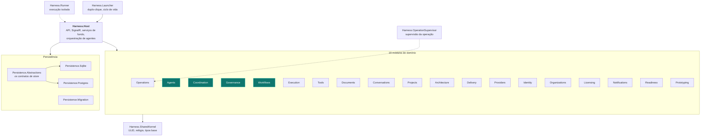

# 19 — Mapa dos 30 projetos da solution

> `Harness.sln` — **30 projetos**: 9 de infraestrutura/hospedagem, 19 módulos de domínio,
> 7 suítes de teste. Todos compilam num só processo: é **monólito modular**, não microsserviços —
> a fronteira entre módulos é de compilação, não de rede.

---

## Visão de dependência

---

## 1. Hospedagem e infraestrutura (9)

| Projeto | O que é | Por que existe |
|---|---|---|
| **`Harness.Host`** | O produto. API HTTP + hub SignalR + ~20 serviços de fundo + toda a orquestração de agentes | É onde vivem `ChiefBacklogLoopService`, `AgentRunOrchestrator`, `WorkflowPhaseDriver` e os canais. **O maior e mais crítico** |
| **`Harness.Launcher`** | O executável de duplo-clique | Sobe/derruba o Host, resolve porta, abre o navegador. É o que faz o produto instalável sem serviço externo |
| **`Harness.Runner`** | Executor isolado de tentativas | Permite rodar trabalho fora do processo do Host (`runner_attempts`, `runner_inbox/outbox_messages`, `runner_checkpoints`) |
| **`Harness.OperationSupervisor`** | Supervisor determinístico da operação de validação | Impede que a instância integradora declare fim por conta própria: a saída dela é sempre `YIELD` e quem decide é o `CompletionGate` |
| **`Harness.SharedKernel`** | Tipos transversais: ULID, relógio, identificadores | Evita que cada módulo invente o seu. ULID dá ordenação temporal total |
| **`Harness.Persistence.Abstractions`** | **Os contratos de persistência** (`IWorkChainStore`, `IWorkBoardStore`, …) | É a fronteira que permite trocar SQLite por Postgres sem tocar em domínio. Também guarda os **validadores de mutação** — regras que valem nos dois bancos |
| **`Harness.Persistence.Sqlite`** | Implementação SQLite | Fonte da verdade do **modo pessoal**. Zero serviço obrigatório |
| **`Harness.Persistence.Postgres`** | Implementação PostgreSQL | Mesmo domínio, mesma migração, outro adaptador. Base do **modo servidor** |
| **`Harness.Persistence.Migration`** | Migrações versionadas | `schema_migrations`; roda no boot por hosted service |

---

## 2. Os 19 módulos de domínio

### Núcleo da fábrica (4) — é aqui que o produto acontece

| Módulo | Arquivos | O que significa para o projeto |
|---|---|---|
| **`Agents`** (52) | O maior. Contas, escalonador, catálogo de executores, adaptadores de CLI externa, provisionamento de perfil isolado, executor da Bruna | **Sem ele não há frota.** `AgentAccountScheduler`, `ExecutorCatalog`, `ExternalAgentExecutorFactory`, `ConversationChiefAgentExecutor` |
| **`Coordination`** (47) | A cadeia de trabalho: cards, tentativas, reviews, circuito por card, taxonomia MAST, política do Conselho, DoR | **É o coração do controle.** `WorkChainAggregate`, `CardCircuitBreakerPolicy`, `AgentCouncilPolicy`, `CardReadinessEvaluator` |
| **`Governance`** (32) | Manifesto de documentos, montagem de contexto com orçamento, política de escopo de path, memória/RAG, ledger, juízes de avaliação | **É o que impede erosão silenciosa** da base de conhecimento e o que monta o que o agente vê |
| **`Workflows`** (15) | Motor de fases, objetivos, gates | **É o playbook em execução.** `PhaseGatePolicy` e os três modos de autonomia |

### Execução e ferramentas (2)

| Módulo | Arquivos | Significado |
|---|---|---|
| **`Execution`** (21) | Abstração de sandbox: inventário de recursos, plano de processo, sessão | A camada de **contenção opcional**. Hoje `Disabled` por decisão do dono |
| **`Tools`** (10) | `SecurityPolicyEnforcementPoint`, `ToolCallBroker`, `ToolExecutionPolicy` | **O portão de ferramentas.** Define o que cada persona pode executar, fail-closed |

### Produto e conteúdo (4)

| Módulo | Arquivos | Significado |
|---|---|---|
| **`Documents`** (15) | Ciclo de vida de documento, conformidade de template, exportação | Garante que um entregável documental **tem as seções exigidas, na ordem exigida** — o gate que quebrou um laço de recusa em 03/08 |
| **`Projects`** (14) | Projeto, atividade, **`StatusDigest`** | O `StatusDigest` é literalmente o que a Bruna recebe como contexto do projeto em cada turno |
| **`Conversations`** (11) | Conversas, mensagens, vínculo de canal | A porta de entrada humana |
| **`Architecture`** (21) | Baselines, descobertas, elementos, relações, padrões, propostas, visões, **auto-mapa** | Modela a arquitetura **do projeto que está sendo construído** — e também se auto-mapeia |

### Gestão e negócio (5)

| Módulo | Arquivos | Significado |
|---|---|---|
| **`Delivery`** (21) | Métricas de entrega, previsões, relatórios diários e executivos, projeção de aprovação | A camada de **gestão** — DORA, forecast honesto, relatório para o gestor |
| **`Providers`** (10) | Catálogo de provedores/modelos, `CapacityManager`, coletor de cota, `ModelRouter` | **Onde deveria morar a decisão de modelo.** Hoje o roteador devolve o modelo preferido, que ninguém informa (`F-05`) |
| **`Operations`** (13) | `CompletionGate`, estado/achados/métricas da operação, `HostResourcePolicy` | O que decide se uma **operação** acabou — não um card, a operação inteira |
| **`Readiness`** (8) | `ReadinessEvaluator` | Avaliação de prontidão (do produto, não do card) |
| **`Notifications`** (6) | Notificações | Fila de avisos ao dono |

### Multiusuário e comercialização (4) — construídos para o modo servidor

| Módulo | Arquivos | Significado |
|---|---|---|
| **`Identity`** (9) | Perfil local | Hoje: um perfil. Amanhã: identidade por usuário |
| **`Organizations`** (9) | Organização | Base do multi-tenant real |
| **`Licensing`** (9) | Licença assinada, revogação | **Comercialização** — licença criptograficamente assinada e revogável |
| **`Prototyping`** (6) | Protótipos | Geração de protótipo antes da construção |

> **Leitura de gestão:** `Identity`, `Organizations` e `Licensing` são investimento no **modo
> servidor**, que ainda não existe. São ~27 arquivos parados esperando uma decisão comercial.
> Não é desperdício — é opção comprada. Mas vale saber que estão lá e não estão em uso.

---

## 3. As 7 suítes de teste

| Suíte | Testes | O que protege |
|---|---|---|
| **`Harness.UnitTests`** | 1.646 | Políticas puras: scheduler, circuito, gates, Conselho, escopo de path, DoR |
| **`Harness.IntegrationTests`** | 307 | Fluxos com banco real |
| **`Harness.RecoveryTests`** | 28 | **Recuperação**: checkpoint, órfãos, falha transitória de provedor, reinício. É a suíte com melhor razão valor/tamanho |
| **`Harness.ArchitectureTests`** | — | Fronteiras entre módulos. **É aqui que caberia a trava contra `Contains` em caminho de decisão** (`R-18`) |
| **`Harness.ContractTests`** | — | Contratos entre backend e frontend |
| **`Harness.ConcurrencyTests`** | — | Concorrência e locks |
| **`Harness.OmpRpcFakeServer`** | — | Servidor falso para testar integração sem depender de rede |

Frontend: **783** testes (fora da solution .NET).
**Total: 2.764 testes**, baseline verde em 03/08 11:25Z, `mandatoryGatesFailed: 0`.

---

## 4. Onde está o peso — e o que isso diz

| Módulo | Arquivos | Leitura |
|---|---|---|
| Agents | 52 | Frota multi-conta é a aposta central, e o investimento reflete isso |
| Coordination | 47 | Controle de trabalho é a segunda aposta |
| Governance | 32 | Terceira: contexto e regra |
| Execution / Architecture / Delivery | 21 cada | Camadas de apoio maduras |
| Documents / Workflows / Projects | 14-15 | Suficientes |
| Operations / Conversations / Tools / Providers | 6-13 | **Providers com 10 arquivos é sintomático**: a decisão de modelo/effort é o eixo menos desenvolvido, e é exatamente onde está o achado `F-05` |
| Identity / Organizations / Licensing / Readiness / Prototyping / Notifications | 6-9 | Investimento em futuro, parado |

**O desenho é coerente com a proposta.** O peso está em orquestrar uma frota de assinaturas com
governança — que é a diferença que o produto vende. O que está subdesenvolvido (`Providers`,
`Notifications`) coincide com os achados de governança de configuração e observabilidade.
