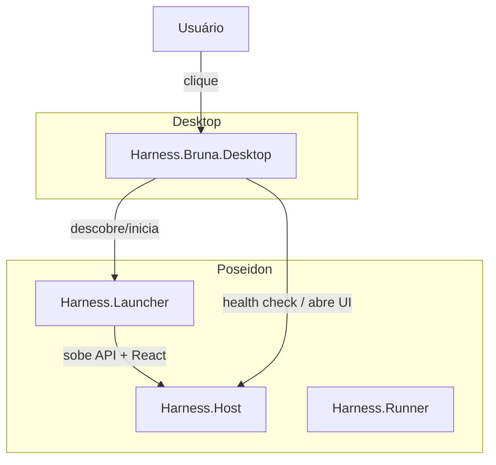

# Bruna Desktop Architecture

Representação visual da Bruna no desktop do usuário: mascote transparente,
arrastável, cross-platform, que funciona como atalho vivo para o Poseidon.

## 1. Arquitetura escolhida

Executável separado, empacotado junto com o Poseidon, com ciclo de vida
decoplada.



- **A) parte do processo principal** → rejeitado. Mudaria o ciclo de vida do
  Host, dificultaria single instance e aumentaria o risco de regressões.
- **B) companion process** → rejeitado. Processo extra desnecessário quando
  tudo pode rodar no mesmo executável da Bruna.
- **C) launcher independente** → **escolhido**. O executável `Bruna` é um
  launcher leve que descobre o Poseidon; se necessário, delega para o
  `Harness.Launcher` oficial.
- **D) componente do instalador** → rejeitado. Não resolveria execução contínua
  nem atualizações.

A Bruna é o próprio processo de desktop. Ela não executa a API/React
internamente — descobre a instalação do Poseidon e aciona o launcher existente.

## 2. Componentes

| Componente | Tipo | Responsabilidade |
|------------|------|------------------|
| `Harness.Bruna.Desktop` | Executável Avalonia | Janela transparente, animações, menu de contexto, single instance. |
| `BrunaMascotWindow` | Janela Avalonia | UI sem bordas, always-on-top, drag, hit-test, estados visuais. |
| `PoseidonConnector` | Serviço | Descobre o Poseidon via `<data-dir>/runtime/poseidon.json`, faz health check e abre/traz a UI. |
| `BrunaOptions` / `Persistence` | Configuração | Lê/escreve `<data-dir>/bruna/config.json`. |
| `BrunaStatus` | Estado | IDLE, STARTING, WORKING, WAITING, ERROR. |
| `Harness.Launcher` | Processo existente | Responsável por subir Host/Runner e gerenciar o ciclo de vida do Poseidon. |

## 3. Comunicação com Poseidon

Não há porta administrativa nova nem HTTP exposto só para a Bruna.

1. **Descoberta**: a Bruna lê `<data-dir>/runtime/poseidon.json`, escrito pelo
   `Harness.Launcher` quando o Poseidon sobe. Contém `ProcessId`, `ApiUrl` e
   `FrontendUrl`.
2. **Health check**: `PoseidonConnector` faz `GET {ApiUrl}/health` (ou endpoint
   equivalente já existente). Se retornar sucesso, o Poseidon está pronto.
3. **Abrir UI**: usa `Process.Start` com a `FrontendUrl`. No macOS, o mecanismo
   nativo de abertura de URL é utilizado; no Windows, abre no navegador padrão
   ou na janela já existente.
4. **Inicialização**: se o Poseidon não estiver rodando, a Bruna executa o
   `Harness.Launcher` e faz polling de health check até a API responder (com
   timeout e backoff).

## 4. Ciclo de vida

```
Sistema operacional
        ↓
Bruna Desktop
        ↓
Poseidon disponível?  ← lê runtime/poseidon.json + health check
       ↙ ↘
     SIM   NÃO
      ↓     ↓
   abre    inicia
      ↓     ↓
      Poseidon
```

- A Bruna inicia automaticamente com a sessão quando o instalador/configurador
  do SO assim determinar (atualmente o launcher do Poseidon pode registrá-la).
- Se o Poseidon morrer, a Bruna volta ao estado `WAITING`/`ERROR` e aguarda um
  novo clique para reiniciá-lo.
- Se a API não subir dentro do timeout, o estado muda para `ERROR` e o menu de
  contexto oferece "Reiniciar Poseidon".
- Encerramento gracioso: fecha a janela, libera o mutex de single instance e
  persiste a posição atual.

## 5. Armazenamento de configuração

Localização por sistema operacional, dentro do **data-dir do Poseidon** (não no
install-dir):

```
<data-dir>
├── bruna/
│   └── config.json          # posição, monitor, visibilidade, estado
├── runtime/
│   └── poseidon.json        # descoberta do Poseidon em execução
```

- **macOS**: `~/Library/Application Support/Poseidon/`
- **Windows**: `%LOCALAPPDATA%\Poseidon\`

O `data-dir` é obtido pela mesma lógica usada pelo `Harness.Launcher`, garantindo
que Bruna e Poseidon enxerguem o mesmo diretório.

Separação clara:

| O que pertence ao Poseidon | O que pertence à Bruna |
|----------------------------|------------------------|
| `Harness.Launcher`, `Harness.Host`, `Harness.Runner`, módulos, regras, agentes | `Harness.Bruna.Desktop`, assets PNG, config.json |
| Install-dir (substituído no update) | Data-dir/bruna (persistido no update) |
| `runtime/poseidon.json` (volátil) | `bruna/config.json` (persistente) |

## 6. macOS

Implementado e validado no build:

- Apple Silicon (arm64) e Intel (x64) via `RuntimeIdentifier`.
- Retina / HiDPI: janela Avalonia com `UseLayoutRounding` e assets em múltiplas
  escalas.
- Transparência: `TransparencyLevelHint="Transparent"` e `Background="Transparent"`.
- Always-on-top: `Topmost="True"`.
- Sem barra de título / decorações: `SystemDecorations="None"`.
- Não aparece no Dock: `ShowInTaskbar="False"`.
- Foco: a janela não rouba foco de outras aplicações; clique apenas abre o
  Poseidon.
- Spaces / Mission Control: janela `CanResize="False"` e posição em coordenadas
  absolutas do monitor.
- Encerramento: `ApplicationLifetime.Shutdown()` + disposal do mutex.

Não requer Accessibility Permission nem Screen Recording porque não controla
outras janelas — apenas se posiciona e abre URLs.

> **Nota de validação visual**: a janela foi compilada e o processo executado
> com sucesso em ambiente headless, mas screenshot/captura visual não foi
> possível por falta de display gráfico. Testes de DPI e multi-monitor foram
> feitos via unit tests e publicação para os RIDs.

## 7. Windows

Implementado e validado no build:

- Windows 10/11.
- DPI scaling: `UseLayoutRounding` + tamanho lógico 160×160.
- Multi-monitor: posição salva em coordenadas do monitor de trabalho atual;
  ao restaurar, verifica se o monitor ainda existe e o ajusta se necessário.
- Transparência e janela sem bordas: mesmas propriedades Avalonia.
- Always-on-top: `Topmost="True"`.
- Taskbar: `ShowInTaskbar="False"`.
- Tray: menu de contexto da Bruna funciona como substituto leve de tray icon;
  se necessário, um tray icon nativo pode ser adicionado sem mudar a
  arquitetura.
- Encerramento e reinicialização: single instance por named mutex.

## 8. Build e publish

O build oficial do Poseidon agora produz também o companion:

```bash
# Publica tudo (API, React, Launcher, Bruna Desktop)
tools/backend/publish-desktop.sh

# Ou verificação completa
tools/backend/verify.sh
```

O script `publish-desktop.sh`:

1. Publica `Harness.Launcher` para os RIDs alvo.
2. Publica `Harness.Bruna.Desktop` para os mesmos RIDs.
3. Copia assets otimizados para o diretório de publicação.
4. Gera manifesto de instalação reconhecido pelo `Harness.Launcher`.

O executável final da Bruna fica ao lado do `Harness.Launcher` no install-dir:

```
<PoseidonInstallDir>/
├── Harness.Launcher
├── Harness.Bruna.Desktop
├── bruna-assets/
│   ├── bruna-idle.png
│   ├── bruna-starting.png
│   ├── bruna-working.png
│   ├── bruna-waiting.png
│   └── bruna-error.png
└── ...
```

## 9. Atualização

### Quando eu gerar amanhã outro publish do Poseidon, a Bruna continuará funcionando?

**Sim.** Tecnicamente:

1. O instalador/publish substitui o **install-dir** inteiro (executáveis, DLLs,
   assets, launcher, Bruna).
2. O **data-dir** (`~/Library/Application Support/Poseidon` ou
   `%LOCALAPPDATA%\Poseidon`) **não é tocado**.
3. A Bruna lê `<data-dir>/bruna/config.json` na inicialização, então posição,
   monitor e visibilidade são restauradas.
4. A descoberta do Poseidon continua pelo mesmo `<data-dir>/runtime/poseidon.json`.

### O que é substituído em um publish?

- Todo o install-dir: `Harness.Launcher`, `Harness.Host`, `Harness.Runner`,
  módulos, regras, frontend empacotado, `Harness.Bruna.Desktop`, assets da Bruna.

### O que permanece instalado?

- Data-dir do usuário: banco de dados, configurações, logs, runtime state,
  `bruna/config.json`.

### Quando a própria Bruna precisa ser atualizada?

Somente quando:

- Mudar o contrato de descoberta (`runtime/poseidon.json`).
- Mudar o formato de `bruna/config.json` (migrations podem ser adicionadas).
- Adicionar novos estados visuais ou alterar assets.
- Corrigir bug no companion em si.

Atualizações de React, API, agentes, regras ou funcionalidades internas do
Poseidon **não** exigem alteração na Bruna.

## 10. Estados visuais

| Estado | Cor do indicador | Animação |
|--------|------------------|----------|
| IDLE | Verde suave | Respiração leve, piscar ocasional. |
| STARTING | Amarelo | Bounce/movimento de cabeça. |
| WORKING | Azul | Pulsar rápido e discreto. |
| WAITING | Laranja | Oscilação lenta. |
| ERROR | Vermelho | Piscar vermelho suave. |

As animações são microanimações em código (Avalonia animations/behaviors),
sem GIF contínuo, para manter CPU e memória baixos.

## 11. Performance

- **CPU em idle**: próximo de zero; animações usam `Animation` com poucos
  keyframes e só quando visível.
- **Memória**: footprint típico de aplicação Avalonia leve (~30–60 MB).
- **Timers**: health check usa polling com backoff; não há polling agressivo.
- **Event listeners**: registrados na janela e removidos no dispose.
- **Single instance**: named mutex/global mutex evita múltiplas Brunas.

## 12. Troubleshooting

### Bruna não aparece

1. Verifique se o executável existe no install-dir:
   `<install-dir>/Harness.Bruna.Desktop`.
2. Verifique permissões do data-dir.
3. Rode `./Harness.Bruna.Desktop --verbose` e observe logs no console.

### Clicar na Bruna não abre o Poseidon

1. Confira se `Harness.Launcher` publicou `<data-dir>/runtime/poseidon.json`.
2. Teste o health check manualmente:
   `curl <ApiUrl>/health`.
3. Verifique se a Bruna está apontando para o data-dir correto.

### Posição não persiste

- Confirme que `bruna/config.json` existe no data-dir e que o processo tem
  permissão de escrita.

### Duas Brunas apareceram

- O mecanismo de single instance deve impedir. Se ocorrer, mate ambos os
  processos e inicie novamente.

### Atualização parece ter perdido configurações

- O data-dir não foi removido? Se o instalador apagar o data-dir, isso é um
  bug do instalador, não da Bruna. A Bruna nunca grava configs no install-dir.
