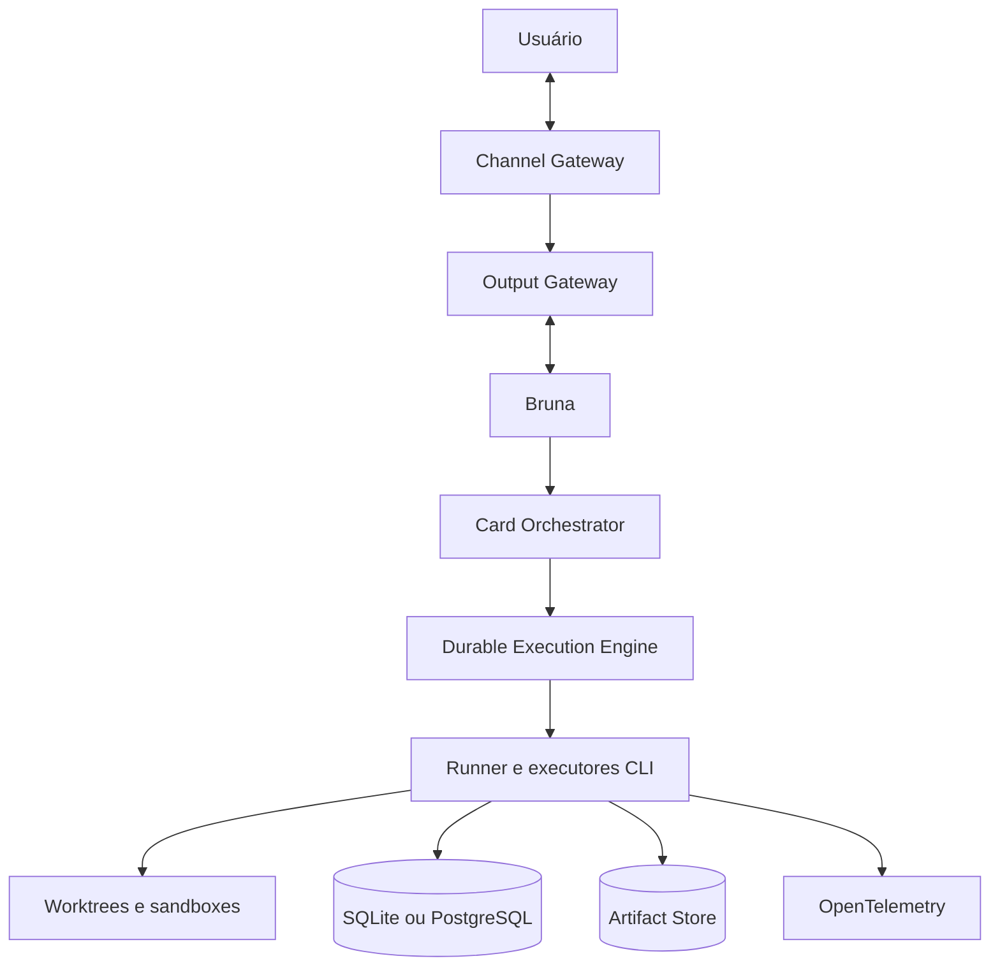

# Visão geral da arquitetura

Poseidon é um monólito modular .NET com planos lógicos separados e dois modos de
persistência.

## Planos

- Control Plane: Bruna, Card Orchestrator, engine durável, Capacity Manager, Model
  Router, governança documental e Security PEP.
- Execution Plane: Runner, executores Codex, Claude Code, Antigravity, OmpRpc e
  kimi-code, isolados por worktree, sandbox e ScopeClaim.
- Data Plane: SQLite pessoal ou PostgreSQL servidor, índices vetoriais derivados,
  artifact store, outbox e ledger append-only.
- Knowledge Plane: memória em camadas, RAG híbrido e Context Builder server-side.
- Integration Plane: canais, catálogo de providers e MCP.
- Observability Plane: OpenTelemetry, Collector, Tempo, Prometheus, Loki, Grafana e
  Langfuse.
- Security Plane: capability tokens, PEP, isolamento, redação e gates Default-FAIL.

## Topologia

No modo pessoal, Host e Runner são processos locais e SQLite é a fonte da verdade.
Docker é usado apenas para sandboxes e observabilidade opcional. No modo servidor,
PostgreSQL é a fonte da verdade e os serviços de artefatos e observabilidade rodam
em containers. O migrador SQLite para PostgreSQL sustenta o upgrade.

O motor durável próprio é o workflow engine oficial. Redis não faz parte do
baseline; vetores nunca são fonte da verdade.
