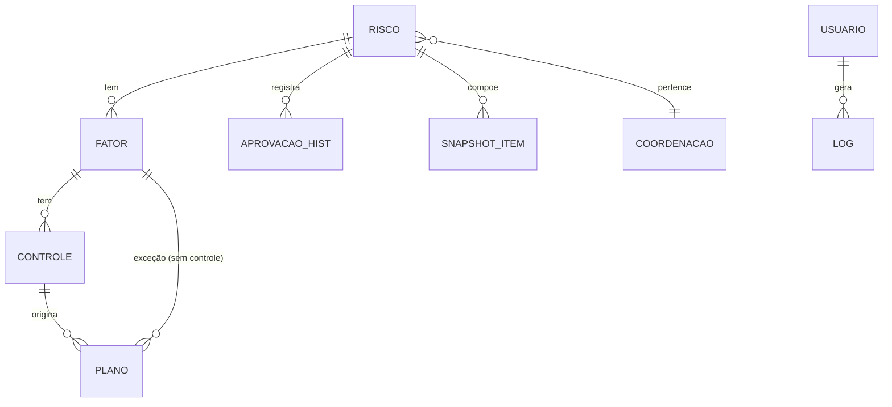
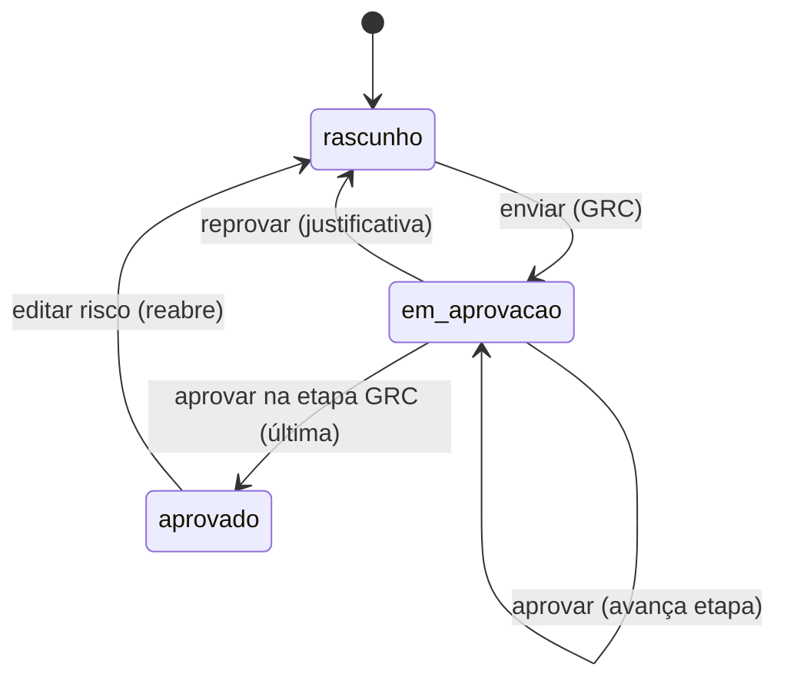

# Prisma — Especificação Técnica do MVP
### Sistema de Acompanhamento de Riscos Corporativos · TrensRJ / GRC

**Versão:** 3.0 (build-ready) · **Data:** 04/08/2026
**Aderência normativa:** ISO 31000:2018 · COSO ERM 2017 · Contrato de Permissão nº 01/2026
**Base validada:** Documento de Entendimento v1.1 (aprovado pela GRC)
**Modo de desenvolvimento:** build assistido por IA · **Prazo-alvo:** 20/08/2026

---

## 0. Sobre este documento

Esta especificação é a **fonte única de verdade** para construir o Prisma. Foi escrita para ser consumida por um **agente de IA** e revisada por pessoas: as regras estão em linguagem precisa, os cálculos em **pseudocódigo determinístico** e os comportamentos esperados em **casos de teste verificáveis**.

**Marcadores de decisão:**
- 🔒 **Fechado** — validado com a GRC; construir exatamente como descrito.
- 🟡 **Default adotado** — proposta que vale se não houver objeção; não bloqueia.
- 🟢 **Diretriz de arquitetura** — não implementar agora, mas não impedir no desenho.

**Prioridade de corretude:** os cálculos de **criticidade** (§5) e do **ITRC** (§6) são o núcleo estratégico e não admitem ambiguidade. Onde houver conflito de interpretação, valem o pseudocódigo (§5–6) e a suíte de testes (§16).

**Princípios de construção:**
1. **Fidelidade às regras** acima de conveniência de implementação.
2. **Rastreabilidade:** toda ação que altera risco/aprovação/ITRC é auditável (§11).
3. **Escopo por perfil por padrão** (negativa por padrão): ninguém vê ou faz além do seu escopo (§7).
4. **Imutabilidade do indicador:** fechamentos do ITRC não mudam depois (§6.3).
5. **Simplicidade de UX:** público de baixíssima familiaridade digital (§14).

---

## 1. Visão e objetivo

O Prisma substitui a planilha de gestão de riscos por um sistema que **organiza** (riscos, fatores, controles, planos), **acompanha** o tratamento e **calcula** o **ITRC** — indicador estratégico ligado às Parcelas A e B do Contrato de Permissão. Ele dá à GRC rastreabilidade ponta a ponta e um número auditável para o reporte à Diretoria e ao Conselho.

Não há migração: após a transição não existem riscos ativos; a matriz nasce do zero no sistema.

---

## 2. Glossário de domínio

Termos usados com sentido preciso. **O agente de IA não deve reinterpretar estes termos.**

| Termo | Definição |
|---|---|
| **Risco** | Evento que pode afetar objetivos da Companhia. Raiz da hierarquia. Código `R-nº`. |
| **Fator de risco** | Causa que origina o risco. Código `FR-nº`. Carrega a **probabilidade**. |
| **Controle** | Mitigação existente sobre um fator. Tem **peso (1–3)** e histórico de **testes**. |
| **Plano de ação** | Ação para criar/melhorar um controle. Pendura no controle (ou, na exceção, direto no fator). |
| **Impacto** | Severidade do risco (1–4), no nível do risco. |
| **Probabilidade / Vulnerabilidade** | Chance/exposição (1–4), avaliada **por fator**. |
| **Criticidade** | Nível do risco (1–4) resultante do cruzamento Impacto × Probabilidade via **tabela de consulta**. |
| **Risco inerente** | Criticidade sem considerar o efeito dos controles. |
| **Risco residual** | Criticidade após o efeito dos controles (via eficácia testada e peso). |
| **ITRC** | Índice de Tratamento de Riscos Contratuais: % de riscos ativos "em dia". |
| **Em dia** | Risco cujos **todos** os planos estão no prazo. |
| **Aderência** | Verificação de que o risco está completo segundo ISO 31000 / COSO ERM. Não bloqueia. |
| **Snapshot** | Fotografia imutável do ITRC no fechamento mensal (dia 28). |
| **Cadeia de aprovação** | Sequência Coordenador → Gerente → Diretor → Gestão de Riscos. |
| **Escopo** | Conjunto de riscos que um perfil enxerga (por diretoria/gerência/coordenação). |

**Níveis (escala 1–4):** 1 = Baixo, 2 = Médio, 3 = Alto, 4 = Crítico.

---

## 3. Escopo do MVP e volumes

**🔒 Dentro do MVP:** parametrização; cadastro de riscos/fatores/controles/planos; matriz de calor (inerente e residual); verificação de aderência; cálculo e fechamento do ITRC; dashboard executivo; cadeia de aprovação; notificações (digest); trilha de auditoria; controle de acesso por perfil.

**Fora do MVP:** integração automática com ERP/Oracle; mapeamento de processos (BPMN); modelo de maturidade GRC; indicadores adicionais (ex.: eficiência de monitoramento de controles); aprovação segregada (ver 🟢 em §8.2).

**Volumes de referência** (ordem de grandeza esperada, para dimensionar UI e paginação): ~16 riscos, ~120 fatores, ~100 controles, 200+ planos de ação por ciclo. O sistema deve exibir com conforto muitos itens aninhados por risco.

---

## 4. Modelo de dados

### 4.1 Diagrama de entidades



Hierarquia: **Risco → Fator de risco → Controle (peso 1–3) → Plano de ação**. O controle pendura no fator; o plano pendura no controle. **🔒 Exceção:** um fator pode ter **plano diretamente, sem controle mapeado**; nesse caso o plano pendura no fator.

### 4.2 Entidades e campos

**Risco**
| Campo | Tipo | Obrig. | Regras |
|---|---|---|---|
| `id` | uuid | sim | Imutável. |
| `codigo` | string | sim | Padrão `R-nº` (R-1, R-2…), **sem zero à esquerda**, único. |
| `descricao` | string | sim | O risco em si. |
| `categoria` | enum | sim | `Estratégico`\|`Operacional`\|`Financeiro`\|`Conformidade`\|`Reputacional`. |
| `dono` | string | sim | Responsável pelo risco. |
| `diretoria` | string | sim | Define escopo/aprovação. |
| `gerencia` | string | sim | idem. |
| `coordenacao` | string | sim | idem. |
| `objetivo` | string | 🟡 | Objetivo estratégico afetado. |
| `impacto` | int(1–4) | sim | Nível do risco (§5.2). |
| `estrategia` | enum | sim | `Evitar`\|`Reduzir`\|`Compartilhar`\|`Aceitar` (COSO). |
| `ativo` | bool | sim | Ver §4.5 (default `true`). |
| `aprov` | Aprovacao | sim | Estado da cadeia (§8). |
| `fatores` | Fator[] | sim | ≥ 0 (aderência exige ≥ 1). |
| `criadoEm`,`atualizadoEm` | datetime | sim | |

**Fator**
| Campo | Tipo | Obrig. | Regras |
|---|---|---|---|
| `id` | uuid | sim | |
| `codigo` | string | sim | Padrão `FR-nº`, sem zero à esquerda. |
| `descricao` | string | sim | Causa do risco. |
| `probInerente` | int(1–4) | sim | Probabilidade/vulnerabilidade do fator (§5.3). |
| `controles` | Controle[] | — | ≥ 0. |
| `planos` | Plano[] | — | Planos **diretos** do fator (exceção). |

**Controle**
| Campo | Tipo | Obrig. | Regras |
|---|---|---|---|
| `id` | uuid | sim | |
| `descricao` | string | sim | |
| `tipo` | enum | 🟡 | `Preventivo`\|`Detectivo`\|`Corretivo`. |
| `peso` | int(1–3) | sim | 1 baixa, 2 média, 3 alta importância. |
| `testes` | int(≥0) | sim | Qtd. de testes realizados. |
| `eficazes` | int(≥0) | sim | Qtd. de testes eficazes. **Invariante: `eficazes ≤ testes`.** |
| `planos` | Plano[] | — | ≥ 0. |

**Plano de ação**
| Campo | Tipo | Obrig. | Regras |
|---|---|---|---|
| `id` | uuid | sim | |
| `nome` | string | sim | |
| `responsavel` | string | sim | |
| `estrategia` | enum | 🟡 | Estratégia COSO do plano. |
| `dataProgramada` | date | sim | Base do cálculo de prazo (§6.2). |
| `status` | enum | sim | `Não iniciado`\|`Em andamento`\|`Concluído`. "Atrasado"/"Concluído com atraso" são **derivados** (§6.2). |
| `dataRealizada` | date | não | Preenchida na conclusão. |
| `evidencia` | text/anexo | não | Inserida pelo ponto focal/coordenador/GRC. |
| `vinculo` | ref | sim | `controleId` (padrão) **ou** `fatorId` (exceção). |

**Aprovacao** (objeto embutido no risco)
`{ status: "rascunho"|"em_aprovacao"|"aprovado", etapa: 0..3, historico: RegistroAprov[] }`
**RegistroAprov:** `{ nivel, quem, quando, acao: "enviou"|"aprovou"|"reprovou"|"editou (reabriu)", justificativa }`.

**SnapshotITRC** (§6.3): `{ competencia (YYYY-MM), valor, numerador, denominador, faixaSemaforo, apuradoPor, aprovadoPor, dataFechamento, itens: [{riscoId, emDia, exigeAcao}] }`. **Imutável.**

**Usuário:** `{ id, nome, email, perfil, diretoria, gerencia, coordenacao, senhaHash }`. Autenticação própria (§14).

**LogAuditoria** (§11): `{ id, autor, acao, alvo, quando }`. **Sem IP. Imutável.**

**Notificacao** (§10): `{ id, destinatario, tipo, modo: "digest"|"imediato", payload, quando, lida }`.

### 4.3 Invariantes (o sistema deve garantir sempre)

1. `eficazes ≤ testes` em todo controle.
2. `impacto ∈ [1,4]`, `probInerente ∈ [1,4]`, `peso ∈ [1,3]`.
3. Código de risco (`R-nº`) e de fator (`FR-nº`) únicos, sem zero à esquerda.
4. Um snapshot de ITRC, uma vez gravado, **nunca** é alterado.
5. Log de auditoria e histórico de aprovação são **append-only** (nunca editados/apagados).
6. Risco só sai da matriz por **encerramento explícito** (`ativo=false`), nunca por exclusão silenciosa de um risco aprovado.
7. Um plano pertence a **exatamente um** pai (um controle **ou** um fator).

### 4.4 Constantes de domínio (anexo normativo)

```
NIVEIS      = {1:"Baixo", 2:"Médio", 3:"Alto", 4:"Crítico"}
CATEGORIAS  = ["Estratégico","Operacional","Financeiro","Conformidade","Reputacional"]
ESTRATEGIAS = ["Evitar","Reduzir","Compartilhar","Aceitar"]     # COSO
TIPO_CTRL   = ["Preventivo","Detectivo","Corretivo"]
PESOS       = [1,2,3]
CADEIA      = ["coordenador","gerente","diretor","grc"]         # ordem de aprovação
SEMAFORO    = {verde:">=90", amarelo:"75..90", vermelho:"<75"}  # %
LIMIAR_RESIDUAL = 0.70                                          # corte da média
```

### 4.5 Estados do risco

- **Ativo** (`ativo=true`): entra na matriz quando a atividade começa.
- **Encerrado** (`ativo=false`): só por ação explícita e auditável. Encerrar ≠ excluir.

---

## 5. Metodologia de avaliação (validada)

**🔒 Escala 1–4** para impacto e probabilidade. Classificação sempre pelo **pior cenário** aplicável entre as dimensões.

### 5.1 Como ler
Impacto é do **risco**. Probabilidade é de cada **fator**. A criticidade de um fator é `CRIT[impacto][prob]`. A criticidade do **risco** é a **pior** entre seus fatores (§5.6).

### 5.2 Critérios de IMPACTO (pior caso entre dimensões)
| Nível | Segurança | Financeiro / evento | Operacional | Legal / evento |
|---|---|---|---|---|
| **Crítico (4)** | Risco de morte | ≥ R$ 1,5 MM | Colapso; inviabiliza ativo e/ou continuidade | Perda de licença ou ≥ R$ 0,5 MM |
| **Alto (3)** | Lesão grave / múltiplas vítimas | R$ 0,5–1,5 MM | ≥ 15% do PAX do ramal, sem nova grade | R$ 0,2–0,5 MM |
| **Médio (2)** | Lesão leve | R$ 0,2–0,5 MM | ≥ 10% do PAX do ramal | R$ 0,1–0,2 MM |
| **Baixo (1)** | Sem risco de morte | até R$ 0,2 MM | até 10% do PAX | até R$ 0,1 MM |

### 5.3 Critérios de PROBABILIDADE / VULNERABILIDADE (por fator)
Dimensões: histórico do evento, normativos internos, controles, plano de transição/contingência.
| Nível | Síntese |
|---|---|
| **Crítico (4)** | Recorrente, fora da tolerância; ausência/baixa eficácia de controles; normativo ausente; planos ausentes/mal implementados. |
| **Alto (3)** | Recorrente no limite da tolerância; falhas significativas nos controles; normativo parcial; planos com melhorias a fazer. |
| **Médio (2)** | Pontual, abaixo da tolerância; controles com falhas simples; planos implementados. |
| **Baixo (1)** | Sem histórico significativo; controles eficazes; normativo aplicado; planos implementados. |

### 5.4 Criticidade — TABELA DE CONSULTA (🔒)
A criticidade **não** é produto numérico; é o cruzamento fixo abaixo (validado com a GRC):

| Impacto ↓ / Prob → | Baixo (1) | Médio (2) | Alto (3) | Crítico (4) |
|---|---|---|---|---|
| **Crítico (4)** | Médio | Alto | Crítico | Crítico |
| **Alto (3)** | Médio | Alto | Alto | Crítico |
| **Médio (2)** | Baixo | Médio | Alto | Alto |
| **Baixo (1)** | Baixo | Baixo | Médio | Médio |

```
# CRIT[impacto][prob] -> nível (1..4)
CRIT = {
  1: {1:1, 2:1, 3:2, 4:2},   # Impacto Baixo
  2: {1:1, 2:2, 3:3, 4:3},   # Impacto Médio
  3: {1:2, 2:3, 3:3, 4:4},   # Impacto Alto
  4: {1:2, 2:3, 3:4, 4:4},   # Impacto Crítico
}
```

### 5.5 Risco inerente × residual (🔒)
O residual é calculado **por fator**, a partir da eficácia **testada** dos controles, ponderada pelo peso:

```
function mediaFator(fator):
    somaPeso = Σ c.peso            for c in fator.controles
    if somaPeso == 0: return 0.0
    somaPond = Σ ((c.testes > 0 ? c.eficazes / c.testes : 0) * c.peso)  for c in fator.controles
    return somaPond / somaPeso

function probResidualFator(fator):
    m = mediaFator(fator)
    if m >= LIMIAR_RESIDUAL:  return max(1, fator.probInerente - 1)   # reduz 1 nível
    else:                     return fator.probInerente               # mantém
```

**🔒 No sistema, a redução é sempre de 1 nível.** Reduções maiores, quando definidas em análise da GRC, são exceção editada manualmente no risco. Controles sem testes contribuem com **0 no numerador** e mantêm seu **peso no denominador**.

### 5.6 Consolidação no risco
```
function criticidade(risco, modo):   # modo ∈ {"inerente","residual"}
    if risco.fatores vazio: return CRIT[risco.impacto][1]
    melhor = 0
    for f in risco.fatores:
        prob = (modo == "residual") ? probResidualFator(f) : f.probInerente
        melhor = max(melhor, CRIT[risco.impacto][prob])
    return melhor    # pior (máxima) criticidade entre os fatores
```

### 5.7 Exemplo resolvido
Risco com `impacto = 4` (Crítico) e um fator com `probInerente = 4`, dois controles:
- C1: `peso 3`, `testes 6`, `eficazes 5` → ponderação = (5/6)·3 = 2,50
- C2: `peso 2`, `testes 4`, `eficazes 2` → ponderação = (2/4)·2 = 1,00
- média = (2,50 + 1,00) / (3 + 2) = 3,50 / 5 = **0,70** → ≥ 0,70 → **reduz 1**: prob 4 → 3.
- Inerente = `CRIT[4][4]` = **Crítico**. Residual = `CRIT[4][3]` = **Crítico** (aqui a queda de prob não muda a faixa; é o esperado).

---

## 6. ITRC — indicador estratégico

### 6.1 Definições
- **`planosDoRisco(r)`** = todos os planos do risco: os dos controles **e** os diretos dos fatores (exceção).
- **Plano no prazo:** `status=Concluído` com `dataRealizada ≤ dataProgramada`; **ou** não concluído com `dataProgramada ≥ hoje`.
- **Plano atrasado:** não concluído com `dataProgramada < hoje`; **ou** `Concluído` com `dataRealizada > dataProgramada` (**concluído fora do prazo = atraso**).
- **🔒 Risco "em dia":** tem ≥ 1 plano **e TODOS** os seus planos estão no prazo.
- **Exige ação:** `ativo=true` **e** `estrategia ≠ Aceitar` **e** possui ≥ 1 plano.

### 6.2 Fórmula e pseudocode (🔒)
```
function statusPlano(p, hoje):
    if p.status == "Concluído":
        if p.dataRealizada != null and p.dataRealizada > p.dataProgramada: return "Concluído com atraso"
        return "Concluído"
    if p.dataProgramada < hoje: return "Atrasado"
    return p.status                                   # Não iniciado | Em andamento

function planoEmDia(p, hoje):
    return statusPlano(p, hoje) not in {"Atrasado", "Concluído com atraso"}

function exigeAcao(r):
    return r.ativo and r.estrategia != "Aceitar" and planosDoRisco(r).length > 0

function riscoEmDia(r, hoje):
    P = planosDoRisco(r)
    return P.length > 0 and all(planoEmDia(p, hoje) for p in P)

function calcITRC(riscos, hoje):
    den = [r for r in riscos if exigeAcao(r)]
    num = [r for r in den   if riscoEmDia(r, hoje)]
    valor = den.length == 0 ? 0 : (num.length / den.length) * 100
    return { valor, numerador: num.length, denominador: den.length }
```

**Fora do ITRC** (nem numerador, nem denominador): risco `Aceitar` e risco **sem controle e sem plano**.

### 6.3 Fechamento e imutabilidade (🔒)
- Fechamento mensal no **dia 28** (competência `YYYY-MM`). Gera um **SnapshotITRC** com o valor, numerador/denominador, faixa e a lista de riscos que o compuseram.
- **O snapshot é imutável:** edições posteriores nos riscos **não** alteram competências fechadas. A série histórica é preservada.
- 🟡 Gatilho: apuração **automática** no dia 28 + trava; **publicação** após validação da GRC (o *quando/quem valida* é decisão da GRC).

### 6.4 Semáforo e meta
🟢 ≥ 90% · 🟡 75%–90% · 🔴 < 75%. **🔒 Sem meta numérica** por ora (campo `meta` opcional/configurável, exibido se preenchido).

### 6.5 Exemplo resolvido (dataset de referência §15)
Com o dataset de referência (7 riscos; `hoje = 2026-07-28`):
- **Exigem ação (denominador):** R-1, R-2, R-3, R-5, R-7 e R-4 = **6** (R-6 é `Aceitar` → fora).
- **Em dia (numerador):** R-2, R-4, R-7 = **3** (R-1, R-3, R-5 têm plano vencido).
- **ITRC = 3 / 6 × 100 = 50,0% → faixa Vermelho.**

---

## 7. Perfis, escopo e permissões

### 7.1 Perfis (🔒)
| Perfil | Escopo | Papel |
|---|---|---|
| **Gestão de Riscos** | Todos | **Cadastra** risco/fator/controle/plano (demanda das áreas); parametriza; aval final; acompanha tudo. |
| **Diretor** | Sua diretoria | Aprova o **conjunto** (risco/fator/controle/plano) da diretoria (nível final da área). |
| **Gerente** | Suas coordenações | Aprova o **conjunto** das coordenações sob a sua gerência. |
| **Coordenador** | Sua coordenação | Aprova o **conjunto** da coordenação; indica ponto focal; insere evidências se não houver ponto focal. |
| **Ponto Focal** | Sua coordenação | **Insere evidências** de controles/planos. **Não cadastra.** Opcional; sem ele, o coordenador acumula. |

### 7.2 Escopo de visibilidade
```
function noEscopo(usuario, risco):
    switch usuario.perfil.escopo:
      "todos":       return true
      "diretoria":   return risco.diretoria  == usuario.diretoria
      "gerencia":    return risco.gerencia    == usuario.gerencia
      "coordenacao": return risco.coordenacao == usuario.coordenacao
```
Toda listagem/consulta é filtrada por `noEscopo`. Painel, matriz, ITRC e pendências refletem **apenas** o escopo do usuário (a GRC vê o consolidado).

### 7.3 Matriz de permissões (capability × perfil)
`✓` = pode; `escopo` = pode dentro do seu escopo; `etapa` = pode quando é a vez dele na cadeia; `—` = não.

| Capacidade | GRC | Diretor | Gerente | Coordenador | Ponto Focal |
|---|---|---|---|---|---|
| Cadastrar/editar/excluir risco, fator, controle, plano | ✓ | — | — | — | — |
| Enviar para aprovação | ✓ | — | — | — | — |
| Aprovar / Reprovar (com justificativa) | etapa (grc) | etapa (diretoria) | etapa (gerência) | etapa (coordenação) | — |
| Inserir evidência (controle/plano) | escopo | — | — | escopo | escopo |
| Ver riscos / matriz / ITRC / pendências | ✓ | escopo | escopo | escopo | escopo |
| Parametrizar metodologia / restaurar | ✓ | — | — | — | — |
| Ver Auditoria e Notificações (GRC) | ✓ | — | — | — | — |

> **Regra 🔒:** o **cadastro é exclusivo da GRC**. Coordenador/Gerente/Diretor **apenas aprovam**; Ponto Focal **apenas evidencia**.

---

## 8. Cadeia de aprovação (🔒)

### 8.1 Máquina de estados


Ordem das etapas: `CADEIA = [coordenador, gerente, diretor, grc]`. `aprov.etapa` é o índice da etapa corrente enquanto `status = em_aprovacao`.

**Tabela de transições**
| Origem | Ação | Ator autorizado | Guarda | Destino / efeito |
|---|---|---|---|---|
| `rascunho` | enviar | Gestão de Riscos | — | `em_aprovacao`, `etapa=0`; log "enviou" |
| `em_aprovacao` | aprovar | perfil == `CADEIA[etapa]` **e** no escopo | — | se `etapa==3` → `aprovado`; senão `etapa++`; log "aprovou" |
| `em_aprovacao` | reprovar | perfil == `CADEIA[etapa]` **e** no escopo | `justificativa` não vazia | `rascunho`, `etapa=0`; log "reprovou" + justificativa |
| `aprovado` | editar risco | Gestão de Riscos | — | `rascunho` (reabre); log "editou (reabriu)" |

Mapeamento perfil→etapa: Coordenador=`coordenador`, Gerente=`gerente`, Diretor=`diretor`, Gestão de Riscos=`grc`. Ponto Focal não aprova.

### 8.2 Regras
- **🔒 A aprovação é do conjunto:** risco + fatores + controles + planos.
- **🔒 Reprovar** exige **justificativa obrigatória** e devolve o risco ao **início** da cadeia.
- **🔒 Editar** um risco já aprovado **recomeça** a cadeia (volta a `rascunho`).
- **🔒 Evidências:** ponto focal (ou coordenador, se não houver ponto focal) insere evidências; **não** altera classificações nem status de aprovação.
- **🔒 Acompanhamento:** a GRC é notificada de **toda** movimentação (via digest — §10).
- **🟢 Evolução prevista (não implementar agora, não impedir):** o modelo de aprovação deve ser desenhado de forma que, no futuro, **alterações pontuais** (ex.: mudança de um controle, inclusão de um novo plano) possam seguir um **fluxo de aprovação segregado**, sem obrigar a reaprovação de todo o risco.

---

## 9. Aderência (não bloqueia)

**🔒 A verificação de aderência avisa e registra pendência, mas nunca bloqueia o cadastro.** O controle é feito pela GRC.

```
function aderencia(r):   # retorna lista de pendências (vazia = aderente)
    p = []
    if r.dono vazio:                 p.add("Dono do risco não definido")
    if r.objetivo vazio:             p.add("Sem vínculo a objetivo estratégico")
    if r.estrategia ∉ ESTRATEGIAS:   p.add("Estratégia de resposta não classificada")
    if r.fatores vazio:              p.add("Risco sem fator de risco")
    for f in r.fatores:
        # exceção: fator com plano direto e sem controle é VÁLIDO
        if f.controles vazio and f.planos vazio and r.estrategia != "Aceitar":
            p.add("Fator "+f.codigo+" sem controle nem plano")
        for c in f.controles:
            if c.planos vazio and r.estrategia != "Aceitar":
                p.add("Controle de "+f.codigo+" sem plano de ação")
    return p
```

**Central de pendências (§12)** separa por responsabilidade:
- **Para ação (da GRC):** cadastros incompletos (saída de `aderencia`).
- **Acompanhamento (externo):** planos atrasados sob responsáveis de outras áreas.

---

## 10. Notificações (🔒 modelo definido)

**Canal:** e-mail, a partir da caixa **`controlesinternoseriscos@trensrio.com.br`** (já existe). Dois modos:

**A. Resumo diário (digest)** — 🟡 default **08:00 America/Sao_Paulo**, configurável por usuário. Consolida por pessoa desde o último resumo:
- Aprovadores: "N riscos aguardando sua aprovação" (lista + link).
- Donos/responsáveis: planos que vencem em ≤ 7 dias e planos vencidos.
- GRC: movimentação da cadeia (enviado, aprovado por X, reprovado, evidência inserida) + aderência pendente.

**B. Alerta imediato** — só para o crítico:
- **Reprovação** → operacional/GRC (com a justificativa).
- **Risco parado** → plano vencido sem movimentação (> 7 dias) ou risco travado na mesma etapa além do limite (🟡 > 5 dias úteis) → GRC.
- **Fechamento do ITRC (dia 28)** → GRC + diretoria.

**Gatilho → destinatário → modo**
| Evento | Destinatário | Modo |
|---|---|---|
| Risco enviado / avançou na cadeia | próximo aprovador | digest |
| Sua vez de aprovar | aprovador da etapa | digest |
| Reprovação | operacional/GRC | **imediato** |
| Aprovação final (aval GRC) | dono do risco | digest |
| Plano a vencer (D-7) / vencido | responsável + coordenação | digest |
| Risco parado / plano vencido sem ação | GRC | **imediato** |
| Qualquer movimentação da cadeia | GRC | digest |
| Evidência inserida | GRC | digest |
| Fechamento do ITRC (dia 28) | GRC + diretoria | **imediato** |

**Templates** (🟡, ajustáveis): ver §17-anexo. A GRC **sempre** recebe o digest de movimentação (não desligável).

---

## 11. Trilha de auditoria

- **🔒 Tela** visível **apenas à Gestão de Riscos** com as **últimas ações**: quem fez, o quê, quando (cadastro, edição, aprovação, reprovação, encerramento, fechamento do ITRC, inserção de evidência).
- **🔒 Sem captura de IP.** Registro **imutável** (append-only).
- Busca por usuário, ação ou item.
- 🟡 Retenção: 5 anos (ajustável), alinhado ao ciclo de auditoria/contrato.

---

## 12. Telas (inventário de UI)

Todas as telas respeitam o **escopo** do perfil (§7.2). Design para **baixíssima familiaridade digital**: fluxos guiados, poucos campos por tela, rótulos do negócio, estados vazios explicativos, confirmação clara de ações irreversíveis.

| Tela | Objetivo | Componentes-chave | Visível a |
|---|---|---|---|
| **Painel** | Visão executiva | ITRC (valor + semáforo/sinaleiro), KPIs (ativos, críticos residuais, sua fila de aprovação, em aprovação), distribuição por criticidade residual, fila de aprovação, pendências (ação × acompanhamento) | todos (escopo) |
| **Matriz de calor** | Ver riscos por criticidade | Grade 4×4 (Impacto × Probabilidade) via `CRIT`; alternância inerente/residual; chips clicáveis | todos (escopo) |
| **Riscos** | Listar e abrir riscos | Tabela (código, risco, inerente, residual, estado de aprovação); busca; ficha de detalhe | todos (escopo) |
| **Ficha do risco** | Detalhe completo | Hierarquia aninhada Fator→Controle(peso/testes)→Plano; inerente→residual (com média); stepper da cadeia; evidências por plano; ações por perfil (enviar/aprovar/reprovar/editar) | todos (escopo); ações por permissão |
| **Planos de ação** | Acompanhar execução | Kanban por status (Não iniciado, Em andamento, Atrasado, Concluído com atraso, Concluído) | todos (escopo) |
| **Aprovações** | Fila pessoal | Riscos aguardando **a vez** do usuário na cadeia | perfis aprovadores |
| **Aderência** | Pendências | Duas colunas: para ação (GRC) × acompanhamento (externo) | todos (escopo) |
| **Auditoria** | Trilha de ações | Tabela de últimas ações; busca | **GRC** |
| **Notificações** | Resumo da GRC | Digest agrupado por dia da movimentação | **GRC** |
| **Editor de risco** | Cadastro/edição | Abas Identificação / Análise / Fatores›Controles›Planos; medidor de aderência ao vivo | **GRC** |

---

## 13. Operações do sistema (comandos e consultas)

Cada operação valida **autenticação** e **autorização** (matriz §7.3) antes de executar. Toda operação que altera estado grava **log de auditoria** (§11).

**Comandos (alteram estado)**
- `cadastrarRisco / editarRisco / excluirRisco` — GRC. Editar risco aprovado → reabre cadeia (§8).
- `cadastrar/editar/remover Fator | Controle | Plano` — GRC.
- `enviarParaAprovacao(riscoId)` — GRC; `rascunho → em_aprovacao`.
- `aprovar(riscoId)` / `reprovar(riscoId, justificativa)` — aprovador da etapa, no escopo.
- `inserirEvidencia(planoId, texto)` — ponto focal/coordenador/GRC, no escopo.
- `encerrarRisco(riscoId)` / `reativarRisco(riscoId)` — GRC (`ativo` toggle, auditado).
- `fecharITRC(competencia)` — automático dia 28 (ou GRC); grava snapshot imutável.
- `parametrizar(...)` / `restaurarExemplo()` — GRC.

**Consultas (respeitam escopo)**
- `listarRiscos(filtro)`, `obterRisco(id)`, `matriz(modo)`, `itrcAtual()`, `historicoITRC()`, `filaAprovacao()`, `pendencias()`, `auditoria(filtro)` (GRC), `notificacoes()` (GRC).

---

## 14. Requisitos não funcionais

- **🔒 Autenticação própria (sem SSO):** login por e-mail corporativo + senha; política de senha; provisionamento de usuários pela GRC; perfis e unidade (diretoria/gerência/coordenação) por usuário.
- **🟡 Hospedagem:** preferência **nuvem**, on-premise se necessário; **build agnóstico de provedor** (nada amarrado a serviços específicos).
- **🔒 Sem integrações externas** no MVP.
- **E-mail transacional** pela caixa `controlesinternoseriscos@trensrio.com.br`.
- **UX:** simplicidade para baixíssima familiaridade digital (ver §12).
- **🔒 LGPD:** sem dados pessoais sensíveis vinculados a riscos; tratar como **segurança da informação** (controle de acesso, logs imutáveis).
- **Desempenho/volume:** suportar com conforto os volumes de §3 (muitos itens aninhados por risco; paginação/expansão na ficha).
- **Persistência:** dados versionáveis; snapshots e logs em armazenamento append-only.
- **Fuso/datas:** cálculos de prazo e fechamento em **America/Sao_Paulo**.

---

## 15. Dataset de referência (para validar o build)

Sete riscos, `hoje = 2026-07-28`. Serve para conferir criticidade, residual e o **ITRC esperado = 50,0% (3/6)**.

| Risco | Impacto | Fator (probIner) | Controles (peso · efic/testes) | Plano (prazo · status) | Estratégia | Inerente | Residual | Em dia? |
|---|---|---|---|---|---|---|---|---|
| **R-1** | 4 | FR-24 (4) | C(3·5/6), C(2·2/4) | 2026-06-20 · Em and. | Reduzir | Crítico | Crítico | **Não** (vencido) |
| **R-2** | 4 | FR-84 (3) | C(3·5/5) | 2026-08-15 · Em and. | Reduzir | Crítico | Alto | **Sim** |
| **R-3** | 4 | FR-31 (3) | C(2·1/4) | 2026-05-31 · Em and. | Reduzir | Crítico | Crítico | **Não** (vencido) |
| **R-4** | 3 | FR-5 (3) | C(3·6/6) | 2026-10-01 · Em and. | Reduzir | Alto | Alto | **Sim** |
| **R-5** | 2 | FR-12 (3) | C(1·0/2) | 2026-04-30 · Não inic. | Reduzir | Alto | Alto | **Não** (vencido) |
| **R-6** | 2 | FR-47 (2) | — | — | **Aceitar** | Médio | Médio | fora do ITRC |
| **R-7** | 3 | FR-10 (3) | C(2·2/3) | 2026-08-30 · Em and. | Reduzir | Alto | Alto | **Sim** |

Conferência rápida do residual de R-2: média = (5/5)·3 / 3 = 1,0 ≥ 0,7 → prob 3→2 → `CRIT[4][2]` = Alto. ✔
Conferência do ITRC: denominador = {R-1,R-2,R-3,R-4,R-5,R-7} = 6; numerador = {R-2,R-4,R-7} = 3 → **50,0%**. ✔

O dataset também deve semear estados de aprovação variados (ex.: um em cada etapa da cadeia, um aprovado, um reprovado) para exercitar §8.

---

## 16. Critérios de aceite / suíte de testes

Formato Given/When/Then. **Todos devem passar.**

### 16.1 Criticidade (tabela)
- **T1** Impacto Crítico × Prob Baixo → **Médio** (não Baixo; a tabela é mais conservadora que o produto).
- **T2** Impacto Alto × Prob Médio → **Alto**.
- **T3** Impacto Baixo × Prob Crítico → **Médio**.

### 16.2 Residual
- **T4** Fator com 1 controle peso 3, 5/5 eficazes → média 1,0 → reduz 1 nível.
- **T5** Fator com controles peso 3 (5/6) e peso 2 (2/4) → média = 3,5/5 = **0,70** → **reduz** (limite inclusivo).
- **T6** Fator com controle peso 2 (1/4) → média = 0,5·2/2 = 0,25 → **mantém**.
- **T7** Fator sem controle → média 0 → mantém a probabilidade inerente.
- **T8** Controle sem testes (testes=0) → contribui 0 no numerador e conta o peso no denominador.

### 16.3 ITRC
- **T9** Risco com 3 planos, 1 atrasado → **fora** do numerador (regra "todos no prazo").
- **T10** Plano `Concluído` com `dataRealizada > dataProgramada` → conta como **atraso** (derruba o risco no mês).
- **T11** Risco `Aceitar` → fora do numerador **e** do denominador.
- **T12** Risco sem controle e sem plano → fora do numerador **e** do denominador.
- **T13** 0 riscos que exigem ação → ITRC = 0% (sem divisão por zero).
- **T14** Dataset de referência (§15) → **ITRC = 50,0% (3/6)**.
- **T15** Fechado o mês, editar um risco **não** altera o snapshot daquela competência.

### 16.4 Perfis, escopo e cadeia
- **T16** Ponto Focal tenta cadastrar risco → **negado**. Só a GRC cadastra.
- **T17** Gerente enxerga/aprova apenas as coordenações da sua gerência; um risco de outra gerência **não** aparece.
- **T18** Aprovar avança a etapa; aprovar na etapa `grc` → `aprovado`.
- **T19** Reprovar **sem justificativa** → **bloqueado**; com justificativa → volta a `rascunho`, etapa 0, registra motivo.
- **T20** Editar risco **aprovado** → volta a `rascunho` (recomeça a cadeia).
- **T21** Aprovador só age quando é a **sua vez** (perfil == etapa corrente); fora disso, ação indisponível.

### 16.5 Aderência e evidências
- **T22** Risco sem classificação de controle → grava, aparece na central de pendências; **nunca** bloqueia.
- **T23** Fator com plano direto e **sem** controle → **não** gera pendência "sem controle" (exceção válida).
- **T24** Ponto Focal insere evidência em um plano → registrado e auditado; não altera aprovação nem classificações.

### 16.6 Auditoria e imutabilidade
- **T25** Toda ação de cadastro/edição/aprovação/reprovação/encerramento/fechamento/evidência gera log com autor, ação, alvo e timestamp; **sem IP**.
- **T26** Log e histórico de aprovação são append-only (tentativa de editar/apagar → negada).

---

## 17. Pontos abertos, defaults e anexos

**Nada trava o núcleo do sistema.** Itens residuais, todos com default:

| # | Item | Situação |
|---|---|---|
| 1 | Textos finais dos e-mails/digest | 🟡 templates propostos (abaixo), ajustáveis |
| 2 | Meta numérica do ITRC | 🔒 sem meta; campo configurável |
| 3 | Gatilho do fechamento (automático × manual) | 🟡 automático dia 28 + trava; publica após validação |
| 4 | Retenção da auditoria | 🟡 5 anos, ajustável |
| 5 | Hospedagem (provedor / território) | 🟡 agnóstico; nuvem preferencial |
| 6 | Limiar de "risco parado" para alerta imediato | 🟡 > 5 dias úteis / plano > 7 dias vencido |

**Templates de e-mail (🟡):**
- *Digest de aprovação:* "Olá, {nome}. Há {N} risco(s) aguardando a sua aprovação no Prisma: {lista}. Acesse para aprovar ou reprovar."
- *Reprovação (imediato):* "O risco {codigo} foi reprovado por {nível} com a justificativa: \"{justificativa}\". Ele voltou ao início para ajuste."
- *Prazo (digest):* "{N} plano(s) sob sua responsabilidade vencem em até 7 dias e {M} estão vencidos: {lista}."

**Já validado (não reabrir):** hierarquia aninhada + exceção plano-sem-controle; escala 1–4; tabela de criticidade; residual por peso/testes (corte 0,7, reduz 1 nível); ITRC "todos os planos no prazo"; "aceitar"/sem plano fora; conclusão fora do prazo = atraso; 5 perfis com escopo; só a GRC cadastra; ponto focal evidencia; cadeia de aprovação com reprovação justificada e reinício na edição; aprovação do conjunto (com evolução prevista para segregação); snapshot imutável; aderência não bloqueia; trilha sem IP; caixa de e-mail; sem SSO; sem integrações; sem dados LGPD sensíveis; notificações por digest com alerta imediato para o crítico.

---

*Referência: este documento operacionaliza o Documento de Entendimento v1.1 aprovado pela GRC. Em caso de divergência entre texto e pseudocódigo, prevalece o pseudocódigo (§5–6) e a suíte de testes (§16).*
