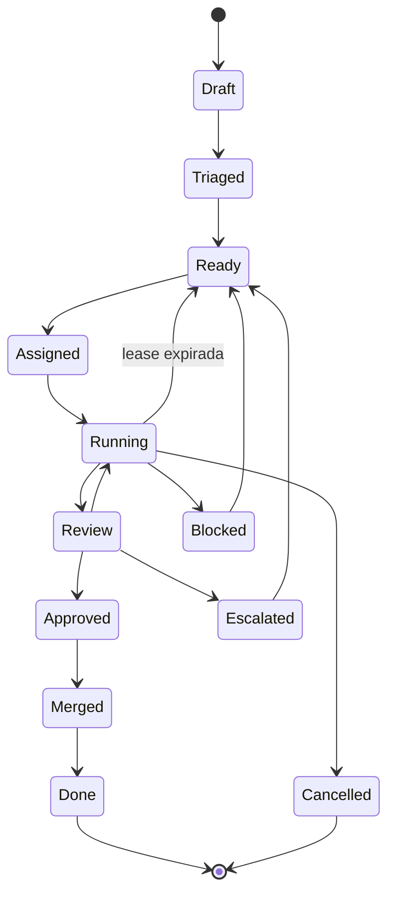

# Máquina de estados do card

## Condições

- `Draft → Triaged`: triagem completa e origem conhecida.
- `Triaged → Ready`: requisitos, DoR, dependências e risco completos.
- `Ready → Assigned`: lease, conta, agente e capability adquiridos.
- `Assigned → Running`: primeiro heartbeat válido.
- `Running → Review`: submissão e evidências persistidas.
- `Review → Approved`: revisor distinto aprova todos os checks.
- `Approved → Merged`: coordenador integra com gates verdes.
- `Merged → Done`: projeções e efeitos reconciliados.

`Blocked` exige causa e condição de saída. Lease expirada reenfileira com novo
fencing token. Reprovação retorna a `Running`; excesso de ciclos vai a `Escalated`.
Cancelamento preserva ledger e invalida tentativas ativas.

Toda transição valida estado anterior, versão, ator, capabilities e evidência e é
gravada no ledger append-only.
