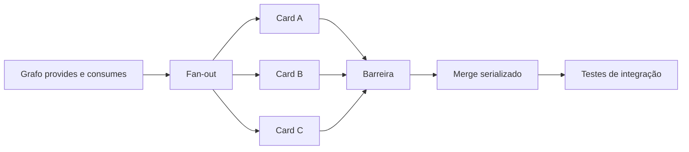

# Paralelismo

## Planejamento

Cards declaram recursos produzidos em `provides`, recursos necessários em
`consumes`, paths e exclusões. O orquestrador constrói um grafo acíclico,
identifica fan-out seguro e cria barreiras de fan-in.

## Isolamento

Cada tentativa usa worktree local efêmera, sandbox e ScopeClaim de paths. O PEP
limita ferramentas e recursos. Tentativas concorrentes com claims incompatíveis
não iniciam. Heartbeat, lease e fencing impedem que executor antigo publique
resultado.

## Integração

Submissões aprovadas entram em fila serializada. O coordenador verifica revisão
distinta, fencing vigente, base atualizada, ausência de conflito e gates. Falha no
fan-in não invalida artefatos úteis, mas mantém a integração bloqueada.

Contenção é medida antes de introduzir cache distribuído. Valkey só pode ser
avaliado no modo servidor quando houver necessidade comprovada.
