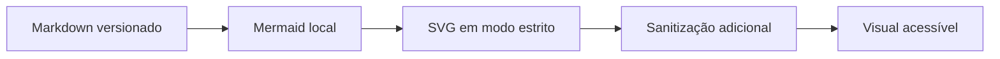

# Evidência — renderização local de Mermaid

## Escopo

Fatia `HML-DOCS-001`, origem `human_directed_maintenance`.

O leitor de documentos reconhece blocos `mermaid`, carrega o motor somente
quando necessário, usa `securityLevel: strict` e sanitiza novamente o SVG antes
de inseri-lo no DOM. Não há CDN nem chamada de rede para renderização.

Blocos C4 compatíveis com a sintaxe Mermaid usam o mesmo caminho. PlantUML,
C4-PlantUML e Graphviz preservam a fonte rotulada quando não há motor local;
essa limitação é explícita e não é apresentada como renderização concluída.

## Provas determinísticas

- `DocMarkdown` mantém GFM, tabelas, código e fonte opcional.
- `MermaidDiagram` possui estado de carregamento, visual acessível e fallback.
- `sanitizeMermaidSvg` remove scripts, `foreignObject`, handlers inline e links
  externos.
- Testes unitários cobrem SVG, sanitização e fallback de PlantUML.
- O E2E HTTP real abre este documento e exige um SVG visível, axe-core verde,
  console limpo e assets sem erro.

Nenhuma aprovação humana, Release Candidate ou GNG é inferida por esta
evidência.
