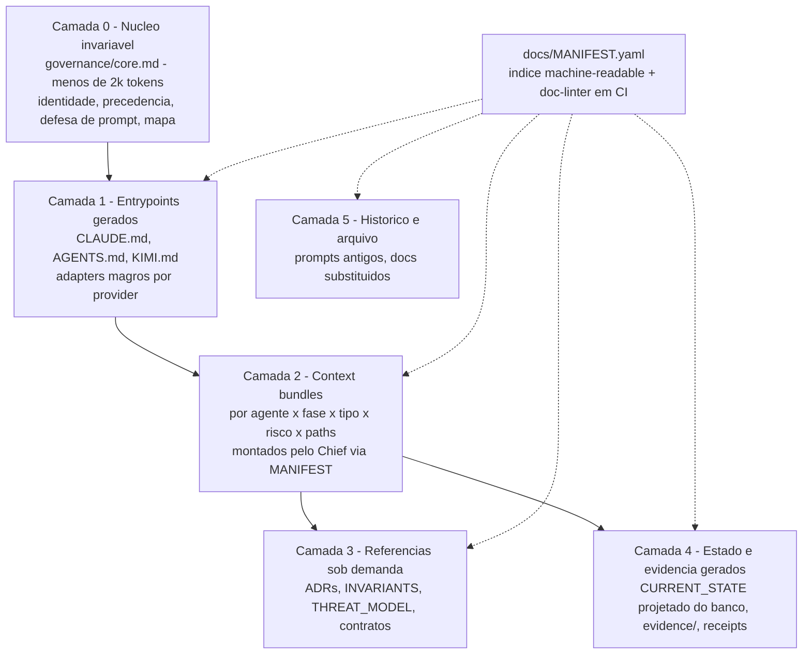

# 04 — SÍNTESE E PROPOSTA MACRO (SOMENTE PLANEJAMENTO — NADA FOI IMPLEMENTADO)
Consolida: 04-EXECUTIVE-SYNTHESIS, 04-PROPOSED-DOCUMENT-ARCHITECTURE, 04-PROPOSED-FILE-CATALOG, 04-PROPOSED-INDEXING-MAP, 04-CONTEXT-ASSEMBLY-DESIGN, 04-PROPOSED-CAPABILITIES, 04-OPTIONS-COMPARISON, 04-RECOMMENDED-ROADMAP, 04-OPEN-QUESTIONS, SOURCES.

## 1. Síntese executiva

O Poseidon tem um PRODUTO com loop engineering acima da média (gates, evidência, watchdog, progresso calculado) e um PROCESSO DE CONSTRUÇÃO com governança documental abaixo da média: a fonte de verdade vive fora do Git, não há entrypoint de agente versionado, o grafo documental tem zero arestas, existem fontes concorrentes e nenhuma memória de aprendizado. A proposta não adiciona documentos — adiciona **uma fonte canônica versionada, um índice machine-readable, adapters gerados por provider, receipts de contexto e um pipeline de aprendizado com gate**, ancorados no enforcement mecânico que já existe em `tools/backend/`.

## 2. Glossário (separações essenciais; completo por demanda)

Persona = quem o agente é (tom, papel, limites) ≠ Skill = como fazer algo (procedimento carregável). Memória = conhecimento recuperável com procedência ≠ Regra = norma com precedência e enforcement ≠ Estado = fato operacional autoritativo (banco) ≠ Evidência = prova imutável de um resultado. Regra escrita ≠ enforcement (só hook/CI/policy tornam a regra real). STATE.md ≠ fonte operacional quando o banco é autoritativo — é **Generated Projection**. Entrypoint ≠ enciclopédia: entrypoint é o menor texto que dá identidade, precedência e ponteiros. Source of Truth = onde se edita; tudo o mais é projeção, adapter ou índice. Learning Candidate = aprendizado observado ainda sem autoridade; Promoted Learning = aprendizado que passou pelo gate e virou norma/skill versionada.

## 3. Arquitetura documental proposta (camadas 0–5)

Alternativa comparada: manter só prompts externos melhorados (status quo com versionamento). Rejeitada: resolve L1 mas não L2/L3/L5/L8, e não escala para múltiplos providers — o custo do modelo em camadas é majoritariamente pago uma vez (scripts de geração + linter).

## 4. Canônico versus provider-specific

| Artefato | Papel | Editável? |
|---|---|---|
| `governance/core.md` | **Canônico** (norma raiz: identidade do repo, precedência, defesa de prompt, regras invioláveis, mapa de 1 nível) | Sim (única edição manual de norma raiz) |
| `governance/rules/*.md` | Canônico por tema (git, segredos, testes, coordenação Codex/Kimi) | Sim |
| `governance/prompts/*` | Canônico: prompts de missão v1.x/v3 **importados do ~/Downloads e versionados** | Sim (novas versões, nunca sobrescrever) |
| `CLAUDE.md`, `AGENTS.md`, `KIMI.md` (raiz) | **Gerados** por script a partir do canônico + manifest (header "GERADO — edite governance/") | Não (CI falha se editado) |
| `docs/MANIFEST.yaml` | Índice; metadados manuais + campos calculados (checksum, tokens, verificação) | Parcial |
| `CURRENT_STATE.md` | **Projeção gerada** do banco/Git quando o produto estiver operando o próprio repo; até lá, manual com linter (sem paths absolutos) | Transitório |
| StatusDigest, bundles, receipts | Injetados pelo runtime | Não (somente banco) |
| Evidence, ADRs | Somente Git, imutáveis após aprovação | Append-only |

Precedência normativa declarada na Camada 0: instrução de runtime validada > política de segurança > core.md > rules do tema > bundle da fase/tarefa > referência. Conflito entre documentos = defeito detectado pelo linter (duas normas sobre o mesmo tema em arquivos distintos sem `supersedes`).

## 5. MANIFEST.yaml (esquema mínimo por entrada)

`id, path, title, category, authority(canonical|adapter|generated|evidence|historical), scope(repo|backend|frontend|module:X), audience(human|agent|both), providers[], agents[], workflows[], phases[], taskTypes[], riskTiers[], pathGlobs[], loadPolicy(always|entry|bundle|on-demand|never), priority, tokenEstimate, owner, status(active|draft|deprecated|superseded), version, lastVerifiedAt, reviewDueAt, supersedes, dependencies[], related[], enforcedBy[], checksum, containsSecrets(false!), generated, sourceOfTruth`.

Mecânica: (a) doc-linter em CI (evolução do conceito `harness-audit` do ECC, reimplementado): todo `.md` fora de allowlist precisa de entrada no manifest (órfão = build falha); links quebrados falham; `reviewDueAt` vencido = warning stale; checksum divergente em `generated` = falha; duas entradas `canonical` com mesmo tema/escopo sem supersedes = conflito. (b) Receipt: a cada turno montado, o runtime grava `(turnId, docIds[], checksums[], tokens, truncados[])` — habilita medir uso, reproduzir turno e auditar tokens.

## 6. Montagem de contexto pelo Chief (algoritmo)

Ordem determinística: 1 núcleo (sempre) → 2 organização → 3 projeto → 4 workflow/fase → 5 persona do agente → 6 skills relevantes (por taskType, metadado primeiro) → 7 constraints por pathGlobs dos claims → 8 StatusDigest → 9 critérios de aceite da tarefa → 10 tools/permissões → 11 evidências pertinentes → 12 stop conditions → 13 budget. Budget de tokens por turno com truncamento do fim para o começo da prioridade (nunca truncar 1, 9, 12, 13); item truncado registrado no receipt; cache por checksum; fallback: bundle mínimo (1+8+9+12+13) com aviso. Verificação pré-turno: checklist mecânico de itens obrigatórios presentes (Default-FAIL: turno não inicia sem eles). Adherence eval periódico: golden prompts com regra plantada e verificação de obediência.

## 7. Catálogo proposto (mínimo; nomes do enunciado avaliados)

Criar: `governance/core.md`, `governance/rules/{git,secrets,testing,coordination}.md`, `governance/prompts/*`, `docs/MANIFEST.yaml`, adapters gerados `CLAUDE.md`/`AGENTS.md`/`KIMI.md`, `docs/INDEX.md` (gerado do manifest, para humanos). Consolidar: THREAT_MODEL único em `docs/security/` com supersedes. Converter: CURRENT_STATE em projeção (fase posterior). **Não criar**: GUARDRAILS/CONSTRAINTS/QUALITY/RELIABILITY/TOOLS/SKILLS/PERSONAS/WORKFLOWS/MEMORY.md como arquivos avulsos — cada um ou já existe no produto (personas=AgentDefinition, workflows=WorkflowDefinition, tools=catálogo) ou entra como rule temática; arquivos-título vazios são o começo do sprawl.

## 8. Funcionalidades avaliadas (decisão resumida; detalhe nos docs 02/03)

Build: doc-linter+manifest (P0), receipts (P0), hashline/stale-patch no executor (P0), stale-doc detector (P1), learning pipeline candidate→promoted com gate (P1), evaluator fresh-context Default-FAIL no processo de construção (P1), adherence evals (P2). Adapter/sidecar: OmpRpcAgentExecutor para LSP/DAP (P1). Adaptar: prompt defense (P0), review P0–P3 no critic (P1), hooks de escopo de git (P0). Inspiração: advisor, stream rules, checkpoint/rewind, Hindsight. Rejeitar: importação estrutural do ECC; browser/CDP por ora; qualquer rotação de credencial para burlar cota.

## 9. Opções

| | A — Mínima | B — Equilibrada (RECOMENDADA) | C — Avançada |
|---|---|---|---|
| Escopo | Canônico+adapters gerados, manifest+linter, prompts versionados, THREAT_MODEL único, hooks de git/segredo, prompt defense | A + bundles+receipts no Chief, hashline no executor, evaluator fresh-context, stale-doc detector, formato P0–P3 | B + OmpRpc (LSP/DAP), advisor, learning pipeline completo, adherence evals, telemetria de tokens |
| Esforço | 2–4 dias de agente | +1–2 semanas | +3–6 semanas |
| Risco | Baixo | Médio (toca Chief/executor) | Médio-alto (dependência omp, custo advisor) |
| Resolve | L1–L5, L7 | + L3 completo, L6, falso-DONE | + L8, debug profundo |
| Tokens | Neutro | Economia (bundles + hashline) | Economia maior − custo do advisor |

**Recomendação inequívoca: Opção B**, com o primeiro incremento de C sendo o `OmpRpcAgentExecutor` (maior redução de falso-DONE por unidade de esforço). A é insuficiente porque deixa o loop sem verificação independente; C inteiro agora compete com o GNG-3..GNG-6 do produto.

## 10. Roadmap (planejamento; nada implementado)

- **P0 (gate: linter verde no CI + adapters gerados + zero fonte externa):** importar prompts para `governance/prompts/`; criar core.md + rules; gerar adapters; MANIFEST+linter; consolidar THREAT_MODEL; hooks (escopo git add, pre-commit secret scan). Rollback: remover geração, manter canônico.
- **P1 (gate: receipt registrado em 100% dos turnos + patch stale rejeitado em teste + evaluator ativo):** bundles+receipts; hashline; fresh-context evaluator no processo; stale-doc detector; PoC OmpRpc. Rollback: flag por funcionalidade.
- **P2 (gate: primeiro Promoted Learning com evidência + adherence eval baseline):** learning pipeline; advisor opcional; telemetria/aderência. Migração documental sempre com `supersedes`, nunca deleção.

## 11. Métricas (coleta mecânica, sem autoavaliação de LLM)

Dos receipts: retrieval precision/recall aproximados (entregue vs. referenciado na saída), tokens por tarefa, cache hit. Do linter/CI: órfãos, stale, conflitos, links quebrados. Do ledger/Git: first-pass success, edit success e stale-patch rejection rate, retrabalho (tentativas por tarefa aceita), falso-DONE (tarefa "concluída" reaberta por gate/humano), erros repetidos (assinatura de erro recorrente), handoff recovery (retomadas sem intervenção), duplicated work (claims sobrepostos bloqueados), custo por tarefa aceita, escalations humanas, loops até aceite. Do critic: reviewer disagreement, distribuição P0–P3.

## 12. Aprendizado seguro

Pipeline: observação → evidência → candidate (arquivo em `governance/learning/candidates/`, status draft no manifest) → deduplicação (checksum/semelhança) → revisão (humano ou critic independente) → eval (golden test que o aprendizado deve passar) → shadow (aplicado em bundle de um projeto de teste) → aprovação → versionamento → promoção (vira rule/skill com owner) → monitoramento → rollback/depreciação com supersedes. **Nunca autopromover**: candidate jamais entra em bundle normativo.

## 13. Perguntas abertas ao responsável

**Bloqueadoras:** (1) Autoriza importar os prompts de `~/Downloads` para `governance/prompts/` no próximo ciclo (pré-requisito de tudo)? (2) Qual THREAT_MODEL é o vigente — `docs/security/` (07-18) ou `docs/backend/security/` (07-19)? (3) O doc-linter roda no `verify.sh` existente ou em workflow de CI dedicado? **Importantes:** (4) Opção B confirmada? (5) O evaluator fresh-context do PROCESSO usa qual modelo/conta (independência do executor)? (6) `KIMI.md` — confirmar o mecanismo real de auto-load do Kimi Code antes de gerar o adapter. **Adiáveis:** advisor, telemetria completa, política de retenção da Camada 5.

## 14. Fontes (acesso 19/07/2026; catálogo completo no doc 02)

Anthropic engineering (effective-harnesses-for-long-running-agents; harness design mar/2026; anthropics/cwc-long-running-agents), OpenAI (harness engineering; unrolling the Codex agent loop; long-horizon com Plan/Implement/Documentation.md), GitHub Blog 24/02/2026 (multiagente como sistema distribuído), Addy Osmani abr/2026 (event log append-only; budgets), arXiv 2606.25447 / 2606.12882 / 2605.21516, repositórios fixados: affaan-m/ECC `0071fa5c`, can1357/oh-my-pi `39c95e5e` (v16.3.4), mateusdomi/harness-poseidon develop `bed4d8ce`.

---
**FIM DA MISSÃO DE PESQUISA. Nenhum arquivo foi criado, alterado ou commitado no Poseidon. Aguardando revisão e autorização humana.**
